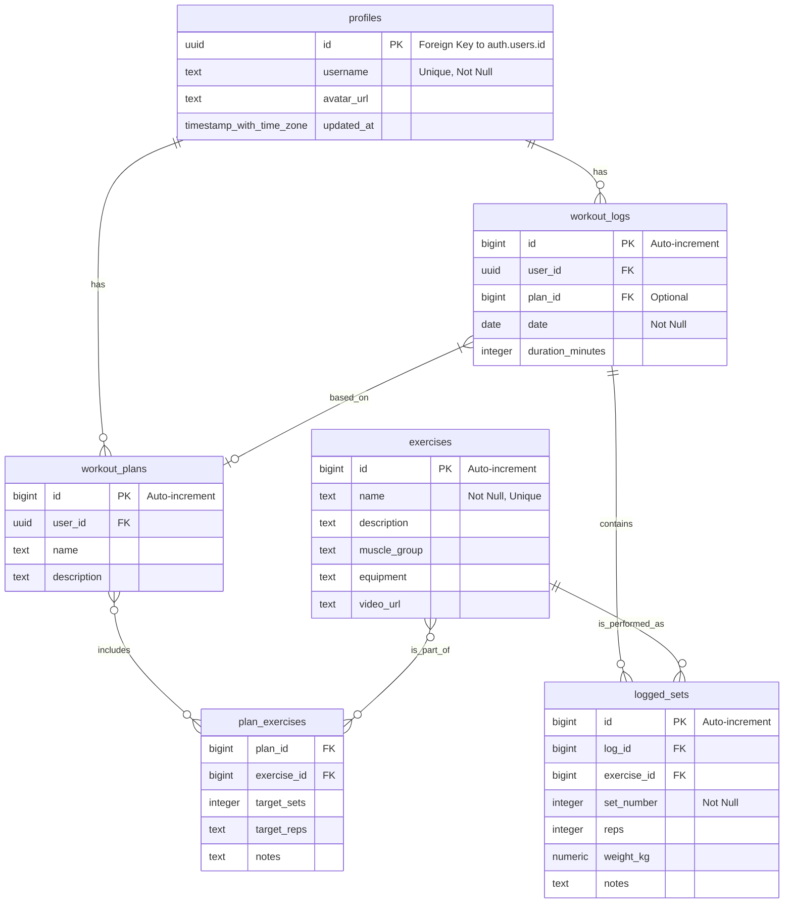

好的，根据我之前为您生成的《训练计划网页产品需求文档 (PRD)》，我现在为您生成一份实体关系图 (ERD) 文档。

-----

## 训练计划网页实体关系图 (ERD) 文档

**文档版本:** 1.0
**创建日期:** 2025年7月4日
**最后更新:** 2025年7月4日
**作者:** Gemini

### 1\. 引言

本ERD文档旨在可视化训练计划网页应用程序的数据库结构，展示各个实体（表）之间的关系及其属性。它将作为数据库设计和开发的基础，确保数据的一致性、完整性和可扩展性。

### 2\. 实体关系图 (ERD)

#### 2.1 实体 (Entities) 及其属性

以下是应用程序中主要的实体及其对应的属性，这些属性直接来源于产品需求文档中定义的数据库模式。

**1. profiles (用户档案)**

  * **id** (Primary Key, UUID, Foreign Key to auth.users.id): 用户唯一标识符
  * **username** (Text, Unique, Not Null): 用户名
  * **avatar\_url** (Text): 头像URL
  * **updated\_at** (Timestamp with time zone): 更新时间

**2. exercises (训练动作)**

  * **id** (Primary Key, Bigint, Auto-increment): 动作唯一标识符
  * **name** (Text, Not Null, Unique): 动作名称
  * **description** (Text): 动作描述
  * **muscle\_group** (Text): 肌肉群 (例如: 'chest', 'back', 'legs')
  * **equipment** (Text): 器械 (例如: 'barbell', 'dumbbell')
  * **video\_url** (Text): 演示GIF/视频的URL

**3. workout\_plans (训练计划)**

  * **id** (Primary Key, Bigint, Auto-increment): 训练计划唯一标识符
  * **user\_id** (UUID, Foreign Key to profiles.id): 关联的用户ID
  * **name** (Text): 计划名称 (例如: "推力日")
  * **description** (Text): 计划描述

**4. plan\_exercises (计划-动作关联)**

  * **plan\_id** (Foreign Key to workout\_plans.id): 关联的训练计划ID
  * **exercise\_id** (Foreign Key to exercises.id): 关联的训练动作ID
  * **target\_sets** (Integer): 目标组数
  * **target\_reps** (Text): 目标次数范围 (例如: "8-12")
  * **notes** (Text): 备注

**5. workout\_logs (训练日志)**

  * **id** (Primary Key, Bigint, Auto-increment): 训练日志唯一标识符
  * **user\_id** (UUID, Foreign Key to profiles.id): 关联的用户ID
  * **plan\_id** (Bigint, Foreign Key to workout\_plans.id, Optional): 关联的训练计划ID (可选)
  * **date** (Date, Not Null): 训练日期
  * **duration\_minutes** (Integer): 训练时长 (分钟)

**6. logged\_sets (已记录的组)**

  * **id** (Primary Key, Bigint, Auto-increment): 已记录组唯一标识符
  * **log\_id** (Bigint, Foreign Key to workout\_logs.id): 关联的训练日志ID
  * **exercise\_id** (Bigint, Foreign Key to exercises.id): 关联的训练动作ID
  * **set\_number** (Integer, Not Null): 组数
  * **reps** (Integer): 次数
  * **weight\_kg** (Numeric): 重量 (公斤)
  * **notes** (Text): 备注

#### 2.2 实体关系 (Relationships)

以下是各实体之间的关系：

  * **profiles** **一对多** **workout\_plans**: 一个用户可以有多个训练计划。 (`profiles.id` -\> `workout_plans.user_id`)
  * **profiles** **一对多** **workout\_logs**: 一个用户可以有多个训练日志。 (`profiles.id` -\> `workout_logs.user_id`)
  * **workout\_plans** **多对多** **exercises** (通过 **plan\_exercises** 关联表): 一个训练计划可以包含多个动作，一个动作也可以属于多个训练计划。
      * `workout_plans.id` -\> `plan_exercises.plan_id`
      * `exercises.id` -\> `plan_exercises.exercise_id`
  * **workout\_logs** **一对一** **workout\_plans** (可选): 一个训练日志可以关联一个训练计划，但不是强制性的（例如，用户可以进行一个非计划内的训练）。 (`workout_logs.plan_id` -\> `workout_plans.id`)
  * **workout\_logs** **一对多** **logged\_sets**: 一个训练日志包含多个已记录的组。 (`workout_logs.id` -\> `logged_sets.log_id`)
  * **exercises** **一对多** **logged\_sets**: 一个动作可以被记录在多个组中 (在不同的日志中)。 (`exercises.id` -\> `logged_sets.exercise_id`)

#### 2.3 视觉化 ERD (概念图)

### 3\. 约束与索引 (补充说明)

  * **主键 (Primary Keys - PK):** 确保每条记录的唯一性。
  * **外键 (Foreign Keys - FK):** 维护实体之间的引用完整性，确保数据的一致性。
  * **唯一性约束 (Unique):** 例如 `profiles.username` 和 `exercises.name`，确保这些字段的值是唯一的。
  * **非空约束 (Not Null):** 强制某些字段必须有值，例如 `exercises.name`、`workout_logs.date`、`logged_sets.set_number`。
  * **行级安全 (RLS):** 在 `profiles`、`workout_plans`、`workout_logs` 和 `logged_sets` 等表中，将通过Supabase的RLS策略实现数据访问控制，确保用户只能访问和修改自己的数据。例如，`CREATE POLICY "Users can only see their own logs." ON workout_logs FOR SELECT USING (auth.uid() = user_id);`。
  * **索引:** 为了优化查询性能，将在常用的查询字段上创建索引，例如 `workout_logs.user_id` 和 `workout_logs.date`。

### 4\. 数据流 (High-Level)

1.  **用户注册/登录:** `auth.users` 表由Supabase自动管理，`profiles` 表与 `auth.users` 通过ID关联。
2.  **动作库填充:** 外部API数据通过脚本或SvelteKit API路由插入 `exercises` 表。
3.  **创建训练计划:** 用户在前端创建计划，数据通过 `/api/plans` API端点写入 `workout_plans` 和 `plan_exercises` 表。
4.  **记录训练:** 用户记录完成的训练，数据通过 `/api/logs` API端点写入 `workout_logs` 和 `logged_sets` 表。
5.  **数据展示:** 前端通过 `GET /api/plans`、`GET /api/logs` 等API端点获取数据，用于显示个人数据面板、能力分析图表、训练计划和进度追踪。

-----