```mermaid
graph LR
    subgraph "内部模块依赖"
        A[ReleaseForm模块] --> B[Excel解析引擎]
        A --> C[工作流引擎]
        A --> D[文件管理模块]
        A --> E[用户权限模块]
        B --> F[配置管理模块]
        
        subgraph "桥接层"
            G[ExcelParserBridgeService]
            H[ParseResultToReleaseformModelConverter]
            I[ModelConverter]
        end
        
        A --> G
        G --> H
        G --> I
    end
    
    subgraph "外部库依赖"
        J[MyBatis Plus] --> K[数据库操作]
        L[Spring Boot] --> M[依赖注入]
        N[Jackson/Fastjson] --> O[JSON处理]
        P[Hutool] --> Q[工具类]
        R[Lombok] --> S[代码生成]
        T[Apache POI] --> U[Excel读写]
    end
    
    A --> J
    A --> L
    A --> N
    A --> P
    A --> R
    B --> T
```

# 团队空间迁移


## 团队空间文件迁移功能总结

### 1. 功能概述

团队空间文件迁移功能是将团队空间中的文件和文件夹迁移到管控文件系统中，实现从非正式存储向正式文档管理的转换。

### 2. 核心组件

### 2.1 主要实体类

- **`TeamSpaceFileEntity`**: 团队空间文件实体
- **`DocumentManageEntity`**: 管控文件实体
- **`TransferRecordEntity`**: 迁移记录实体
- **`TransferErrorRecordEntity`**: 迁移错误记录实体

### 2.2 关键模型

- **`TeamSpaceFileAndDocumentFileModel`**: 迁移请求模型
- **`TeamSpaceTransferStepEnum`**: 迁移步骤枚举

### 3. 迁移流程

### 3.1 迁移步骤（TeamSpaceTransferStepEnum）

1. **START**: 开始迁移
2. **CREATE_DOCUMENT**: 创建管控文件记录
3. **BACKUP_FILE**: 备份文件到ectype桶
4. **COPY_TO_COMPANY**: 复制文件到company桶
5. **DELETE_SOURCE**: 删除team桶源文件
6. **DELETE_RECORD**: 删除团队空间记录
7. **COMPLETED**: 完成迁移

### 3.2 存储桶迁移策略

- **team桶**: 团队空间原始文件存储
- **ectype桶**: 备份文件存储（防止迁移失败时数据丢失）
- **company桶**: 管控文件正式存储

### 4. 核心功能特性

### 4.1 异步并发处理

- 使用`CompletableFuture`实现异步迁移
- 文件和文件夹分别处理，提高效率
- 设置最大迁移文件数限制（MAX_TRANSFER_FILES = 50）

### 4.2 错误处理与补偿机制

- **补偿操作**: 当迁移步骤失败时，自动回滚已完成的操作
- **错误记录**: 记录失败的文件和具体失败步骤
- **人工干预**: 对于补偿失败的情况，标记为需要人工处理

### 4.3 权限继承

- 迁移后的管控文件自动继承目标文件夹的权限
- 包括部门权限（`DocumentAssociationDepartmentEntity`）
- 包括用户权限（`DocumentAssociationUserEntity`）

### 5. 迁移记录管理

### 5.1 迁移记录（TransferRecord）

- 记录迁移的基本信息（用户、时间、状态）
- 统计迁移结果（总文件数、成功数、失败数）
- 记录迁移耗时

### 5.2 错误记录（TransferErrorRecord）

- 详细记录失败文件的信息
- 记录失败的具体步骤和原因
- 支持重试机制
- 标记补偿状态（成功/失败/无需补偿）

### 6. 文件夹处理逻辑

### 6.1 递归处理

- 先处理文件夹内的所有文件
- 再递归处理子文件夹
- 采用深度优先遍历

### 6.2 空文件夹清理

- 迁移完成后检查源文件夹是否为空
- 自动删除空的团队空间文件夹

### 7. 安全保障措施

### 7.1 数据备份

- 迁移前先备份到ectype桶
- 确保源文件安全

### 7.2 原子性操作

- 每个文件的迁移都是原子性的
- 失败时自动回滚，保证数据一致性

### 7.3 限流控制

- 限制单次迁移的最大文件数量
- 防止系统过载

### 8. 监控与审计

### 8.1 操作日志

- 记录每个迁移步骤的详细日志
- 便于问题排查和审计

### 8.2 状态跟踪

- 实时跟踪迁移进度
- 提供迁移状态查询接口

### 9. 使用场景

1. **文档正式化**: 将团队协作文件转为正式管控文档
2. **权限管理**: 统一文档权限管理
3. **存储优化**: 整合分散的文件存储
4. **合规要求**: 满足文档管理合规性要求

这个迁移功能设计考虑了数据安全、系统性能、错误处理等多个方面，是一个相对完善的文件迁移解决方案。


# SIG客户需求

```mermaid
graph TD
    A[SIG客户邮件] --> B[邮件监控服务<br/>MonitorEmailService]
    B --> C{邮件类型识别}
    C -->|Release表单| D[Release表单解析<br/>SigmastarTemplateListener]
    C -->|断联邮件| E[断联处理<br/>DisconnectTemplateListener]
    C -->|上传完成| F[上传完成处理]
    
    D --> G[模板内容解析<br/>CommonTemplateContent]
    G --> H[邮件信息保存<br/>EmailTemplateInfoEntity]
    H --> I[工作流创建<br/>CustomerEmailFlowService]
    
    E --> J[程序断联日志<br/>ProgramExpireLogEntity]
    J --> K[程序文件禁用<br/>ProgramFileService]
    
    I --> L[FTP文件同步<br/>syncTemplateFile]
    L --> M[MinIO存储管理]
    
    N[定时任务<br/>@Scheduled] --> B
    
    style A fill:#e1f5fe
    style B fill:#f3e5f5
    style D fill:#e8f5e8
    style E fill:#fff3e0
    style G fill:#f1f8e9
    style I fill:#e3f2fd
```

# SIG客户需求实现模块梳理

### 1. 模块主要功能和职责

SIG客户程序模块（`sigprogram`）是一个独立的业务模块，主要负责处理SIG客户的程序Release表单邮件自动化处理。该模块包含以下核心功能：

- **邮件自动识别与处理**：通过Exchange邮件服务自动监控和解析客户邮件
- **Release表单解析**：智能解析Excel格式的Release表单，提取程序信息
- **程序/IC型号禁用管理**：处理断联邮件，自动禁用相关程序和IC型号
- **文件上传管理**：支持程序文件的FTP上传和MinIO存储管理
- **工作流集成**：与PLM工作流引擎集成，实现审批流程自动化

### 2. 关键执行流程和算法

### 2.1 邮件监控与解析流程

```
定时任务触发 → 连接Exchange邮件服务 → 获取新邮件 → 邮件类型识别 → 分类处理

```

**核心算法特点**：

- 使用`@Scheduled`定时任务，每5分钟执行一次（7:00-23:00）
- 通过`MessageId`去重，避免重复处理
- 支持多邮箱监控配置

### 2.2 Release表单解析算法

```
Excel文件读取 → 模板类型检测 → 分区域数据提取 → 结构化数据组装 → 验证与保存

```

**解析策略**：

- 使用EasyExcel + 监听器模式（`SigmastarTemplateListener`）
- 处理器链模式处理不同类型数据行
- 支持FT/CP两种模板类型的自动识别

### 2.3 断联处理算法

```
断联邮件识别 → 提取型号信息 → 查询影响范围 → 批量禁用操作 → 记录日志

```

### 3. 核心数据模型和对象

### 3.1 邮件相关实体

- **`EmailTemplateInfoEntity`**: 邮件主体信息
    - 存储邮件内容、附件、处理状态等
    - 支持JSON格式存储复杂数据结构
    - 包含客户代码、项目类型、处理状态等关键字段

### 3.2 程序断联实体

- **`ProgramExpireLogEntity`**: 程序断联日志
    - 记录断联类型（IC/PROGRAM）
    - 跟踪影响的文件和数量
    - 处理状态管理

### 3.3 模板内容模型

- **`CommonTemplateContent`**: 通用模板内容
    - 包含Release表单的所有字段（130+个字段）
    - 支持FT/CP两种站点的不同字段
    - 内置校验码生成逻辑（MD5+业务键）

### 3.4 监听器和解析器

- **`SigmastarTemplateListener`**: 主要的Excel解析监听器
- **`DisconnectTemplateListener`**: 断联邮件处理监听器
- **`TemplateTypeDetector`**: 模板类型检测器

### 4. 模块依赖关系

### 4.1 内部模块依赖

- **工作流引擎**：`FlowEngineService`、`FlowTaskService`
- **文档管理**：`ProgramFileService`、`DocumentFlowTaskInfoEntity`
- **FTP服务**：`FtpAccountService`、`FtpFileService`
- **用户管理**：`UserProvider`

### 4.2 外部库依赖

- **EasyExcel**：Excel文件解析
- **Exchange Web Services**：邮件服务连接
- **MinIO Client**：对象存储管理
- **MyBatis Plus**：数据访问层
- **Spring Scheduling**：定时任务
- **Hutool**：工具类库

### 4.3 基础设施依赖

- **数据库表**：
    - `email_info`：邮件信息存储
    - `dms_program_expire_log`：断联日志
    - `document_flow_task_info`：工作流任务信息
- **存储服务**：
    - MinIO存储桶（`emailtask`）
    - FTP服务器（多地域支持）
- **消息服务**：
    - Exchange邮件服务
    - 内部消息通知

### 5. 架构特点与设计模式

### 5.1 设计模式应用

- **监听器模式**：Excel解析使用ReadListener
- **处理器链模式**：邮件内容分类处理
- **策略模式**：不同模板类型的解析策略
- **工厂模式**：FTP服务的多实例管理

### 5.2 容错与可靠性

- **异常隔离**：单个邮件处理失败不影响整体流程
- **幂等性保证**：通过MessageId和Verification去重
- **状态管理**：完整的处理状态跟踪
- **重试机制**：FTP上传失败自动重试

### 5.3 扩展性设计

- **模板类型可扩展**：新增模板类型只需添加对应监听器
- **多客户支持**：通过客户代码区分不同客户需求
- **多站点支持**：FT/CP站点的统一处理框架

该模块体现了良好的模块化设计和业务抽象，通过事件驱动和异步处理实现了高效的邮件自动化处理能力。


# 文件失效功能


## 1. 模块主要功能和职责

**DMS系统文件失效功能模块**主要负责：

- **文件有效性检查**：定期检查系统中的文件是否在存储介质（MinIO）中真实存在
- **失效文件记录**：记录检查过程中发现的失效文件信息
- **失效文件管理**：提供失效文件的查询、统计和处理功能
- **多类型文件支持**：支持管控文件、程序文件、团队空间文件三种类型的检查

## 2. 关键执行流程和算法

### 2.1 定时检查流程

```
定时任务(每天凌晨2点) → 分页查询文件 → 多线程并行检查 → MinIO存储验证 → 记录失效日志

```

### 2.2 核心算法特点

- **分页处理**：每次处理500条记录，避免内存溢出
- **多线程并行**：使用10个线程的线程池并行检查，提高效率
- **批量操作**：批量保存失效文件日志，减少数据库IO
- **去重机制**：检查现有日志避免重复记录
- **文件路径策略**：优先使用FilePath，备用MD5构建路径

### 2.3 检查逻辑

1. 从数据库分页查询文件信息
2. 使用MinIO客户端检查文件是否存在
3. 如果文件不存在，创建失效日志记录
4. 批量保存失效日志到数据库
5. 支持设置最大检查数量限制

## 3. 核心数据模型

### 3.1 InvalidFileLogEntity（失效文件日志实体）

```
- id: 主键ID
- fileId: 文件ID
- fileName: 文件名称
- filePath: 文件路径
- fileType: 文件类型（管控文件/程序文件/团队空间文件）
- checkTime: 检测时间
- errorMessage: 错误信息
- status: 处理状态（0:未处理 1:已处理）
- handleTime: 处理时间
- handleUser: 处理人
- remark: 备注

```

### 3.2 InvalidFileLogQueryParam（查询参数模型）

```
- fileName: 文件名称过滤
- fileType: 文件类型过滤
- status: 处理状态过滤
- startTime/endTime: 时间范围过滤
- 继承分页参数

```

## 4. 模块依赖关系

### 4.1 内部模块依赖

- **DocumentManageService**：管控文件数据服务
- **ProgramFileService**：程序文件数据服务
- **TeamSpaceFileService**：团队空间文件数据服务
- **InvalidFileLogService**：失效文件日志数据服务

### 4.2 外部库依赖

- **MinIO客户端**：文件存储检查
- **MyBatis Plus**：数据库ORM操作
- **Spring Task**：定时任务调度
- **线程池**：并发处理支持

### 4.3 技术栈

- **并发控制**：ExecutorService + CountDownLatch
- **数据库**：MySQL + MyBatis Plus
- **对象存储**：MinIO
- **日志**：SLF4J + Logback
- **Web框架**：Spring Boot + Spring MVC

## 5. 功能特性

### 5.1 性能优化

- 分页查询避免大数据量内存占用
- 多线程并行处理提高检查效率
- 批量数据库操作减少IO次数
- 线程安全的计数器和集合

### 5.2 管理功能

- 支持手动触发检查
- 提供统计信息（总数、已处理、未处理、按类型统计）
- 支持单个和批量处理失效文件
- 提供详细的查询和过滤功能

### 5.3 容错机制

- 异常处理和日志记录
- 线程池优雅关闭
- 数据库操作事务支持
- 重复日志检查避免数据冗余

这个模块设计合理，具有良好的扩展性和维护性，能够有效地监控和管理系统中的文件有效性问题。


# **ReleaseForm解析模块优化功能梳理**


**1. 🎯 主要功能和职责**

**ReleaseForm解析模块**是一个**配置驱动的Excel模板解析系统**，主要负责：

- **📄 Excel模板解析**：将不同客户的ReleaseForm Excel模板解析为标准化的业务数据模型
- **🔄 渐进式迁移**：支持新老客户并存，通过API路径分离实现平滑过渡
- **⚙️ 配置驱动**：通过YAML配置文件定义字段映射、验证规则和业务逻辑，无需硬编码
- **🔗 版本兼容**：提供ERP程序版本查询接口，支持版本兼容性处理
- **🌉 桥接适配**：通过桥接层连接Excel解析引擎和ReleaseForm业务系统

**2. 🔄 关键执行流程**

## **2. 关键执行流程和算法**

**2.1 主要执行流程**


**2.2 核心算法**

**2.2.1 版本识别算法**

**核心算法流程**：

1. **🚪 路由分发**：根据API路径自动区分新老客户
1. **📋 配置加载**：动态加载客户专属的YAML配置文件
1. **🔍 字段映射**：按配置规则将Excel数据映射到业务模型字段
1. **✅ 数据验证**：执行必填字段检查、格式验证、业务规则验证
1. **🔄 模型转换**：将解析结果转换为标准业务模型
1. **💾 数据持久化**：保存到数据库并启动工作流

1. 1. **🚪 路由分发**：根据API路径自动区分新老客户
2. 1. **📋 配置加载**：动态加载客户专属的YAML配置文件
3. 1. **🔍 字段映射**：按配置规则将Excel数据映射到业务模型字段
4. 1. **✅ 数据验证**：执行必填字段检查、格式验证、业务规则验证
5. 1. **🔄 模型转换**：将解析结果转换为标准业务模型
6. 1. **💾 数据持久化**：保存到数据库并启动工作流

**3. 📊 核心数据模型**


**核心数据对象说明**：

- **🗃️ ReleaseformEntity**：数据库实体，存储ReleaseForm的完整信息
- **📋 ReleaseformModel**：业务模型，包含所有业务逻辑相关字段
- **🆕 NewCustomerProgramTemplateModel**：新客户增强模型，提供类型安全和验证功能
- **📤 ParseResultDTO**：解析结果传输对象，承载Excel解析的原始数据

**4. 🔗 模块依赖关系**


**主要依赖说明**：

**内部模块依赖**

：

- **📊 Excel解析引擎**：V0.3动态解析引擎，支持配置驱动解析
- **🔄 工作流引擎**：处理ReleaseForm的审批流程
- **📁 文件管理模块**：处理Excel文件上传和存储
- **👥 用户权限模块**：获取当前用户信息
- **⚙️ 配置管理模块**：管理客户配置文件

**外部库依赖**

：

- **MyBatis Plus**：数据库ORM框架
- **Spring Boot**：核心框架，提供依赖注入和自动配置
- **Jackson/Fastjson**：JSON序列化/反序列化
- **Apache POI**：Excel文件读写操作
- **Hutool**：Java工具库，简化开发
- **Lombok**：减少样板代码

**5. 🎨 核心特性总结**

**✨ 配置驱动架构**

：

- 通过YAML配置文件定义解析规则
- 支持字段映射、验证规则、业务逻辑配置
- 新客户接入只需添加配置文件，无需修改代码

**🔄 渐进式迁移**

：

- 新老客户API完全分离，互不影响
- 支持平滑过渡，降低系统风险
- 提供降级机制，确保系统稳定性

**🛡️ 增强的数据处理**

：

- 类型安全的字段访问
- 内置数据验证功能
- 详细的错误日志和调试信息

**🔌 ERP系统集成**

：

- 提供程序版本查询接口
- 支持版本兼容性处理
- 无需登录认证的白名单接口

这个模块通过配置驱动和渐进式迁移的设计，实现了高度的灵活性和可扩展性，能够快速适应不同客户的需求变化。


# **ReleaseForm解析模块优化功能梳理**


**1. 🎯 主要功能和职责**

**ReleaseForm解析模块**是一个**配置驱动的Excel模板解析系统**，主要负责：

- **📄 Excel模板解析**：将不同客户的ReleaseForm Excel模板解析为标准化的业务数据模型
- **🔄 渐进式迁移**：支持新老客户并存，通过API路径分离实现平滑过渡
- **⚙️ 配置驱动**：通过YAML配置文件定义字段映射、验证规则和业务逻辑，无需硬编码
- **🔗 版本兼容**：提供ERP程序版本查询接口，支持版本兼容性处理
- **🌉 桥接适配**：通过桥接层连接Excel解析引擎和ReleaseForm业务系统

**2. 🔄 关键执行流程**

## **2. 关键执行流程和算法**

**2.1 主要执行流程**


**2.2 核心算法**

**2.2.1 版本识别算法**

**核心算法流程**：

1. **🚪 路由分发**：根据API路径自动区分新老客户
1. **📋 配置加载**：动态加载客户专属的YAML配置文件
1. **🔍 字段映射**：按配置规则将Excel数据映射到业务模型字段
1. **✅ 数据验证**：执行必填字段检查、格式验证、业务规则验证
1. **🔄 模型转换**：将解析结果转换为标准业务模型
1. **💾 数据持久化**：保存到数据库并启动工作流

1. 1. **🚪 路由分发**：根据API路径自动区分新老客户
2. 1. **📋 配置加载**：动态加载客户专属的YAML配置文件
3. 1. **🔍 字段映射**：按配置规则将Excel数据映射到业务模型字段
4. 1. **✅ 数据验证**：执行必填字段检查、格式验证、业务规则验证
5. 1. **🔄 模型转换**：将解析结果转换为标准业务模型
6. 1. **💾 数据持久化**：保存到数据库并启动工作流

**3. 📊 核心数据模型**


**核心数据对象说明**：

- **🗃️ ReleaseformEntity**：数据库实体，存储ReleaseForm的完整信息
- **📋 ReleaseformModel**：业务模型，包含所有业务逻辑相关字段
- **🆕 NewCustomerProgramTemplateModel**：新客户增强模型，提供类型安全和验证功能
- **📤 ParseResultDTO**：解析结果传输对象，承载Excel解析的原始数据

**4. 🔗 模块依赖关系**



**主要依赖说明**：

**内部模块依赖**

：

- **📊 Excel解析引擎**：V0.3动态解析引擎，支持配置驱动解析
- **🔄 工作流引擎**：处理ReleaseForm的审批流程
- **📁 文件管理模块**：处理Excel文件上传和存储
- **👥 用户权限模块**：获取当前用户信息
- **⚙️ 配置管理模块**：管理客户配置文件

**外部库依赖**

：

- **MyBatis Plus**：数据库ORM框架
- **Spring Boot**：核心框架，提供依赖注入和自动配置
- **Jackson/Fastjson**：JSON序列化/反序列化
- **Apache POI**：Excel文件读写操作
- **Hutool**：Java工具库，简化开发
- **Lombok**：减少样板代码

**5. 🎨 核心特性总结**

**✨ 配置驱动架构**

：

- 通过YAML配置文件定义解析规则
- 支持字段映射、验证规则、业务逻辑配置
- 新客户接入只需添加配置文件，无需修改代码

**🔄 渐进式迁移**

：

- 新老客户API完全分离，互不影响
- 支持平滑过渡，降低系统风险
- 提供降级机制，确保系统稳定性

**🛡️ 增强的数据处理**

：

- 类型安全的字段访问
- 内置数据验证功能
- 详细的错误日志和调试信息

**🔌 ERP系统集成**

：

- 提供程序版本查询接口
- 支持版本兼容性处理
- 无需登录认证的白名单接口

这个模块通过配置驱动和渐进式迁移的设计，实现了高度的灵活性和可扩展性，能够快速适应不同客户的需求变化。

## 📋 ReleaseForm模板解析算法详细说明


### 1. 🔍 算法总体架构

ReleaseForm模板解析算法采用**分层处理架构**，包含以下核心组件：


### 2. 🎯 核心解析算法详解

### 2.1 动态边界识别算法

**算法目标**：自动识别Excel中数据区域的起始和结束位置，无需硬编码行号。

```java
/**
 * 动态边界识别算法核心逻辑
 */
public class DynamicBoundaryDetection {

    // 1. 扫描起始标识文本
    public int findStartRow(Sheet sheet, String startRowMarker) {
        for (int i = 0; i <= sheet.getLastRowNum(); i++) {
            Row row = sheet.getRow(i);
            if (row != null && containsMarkerText(row, startRowMarker)) {
                return i;
            }
        }
        throw new ParseException("未找到起始标识: " + startRowMarker);
    }

    // 2. 扫描结束标识文本
    public int findEndRow(Sheet sheet, String endRowMarker, int startRow) {
        if (endRowMarker == null) {
            return findLastNonEmptyRow(sheet, startRow);
        }

        for (int i = startRow + 1; i <= sheet.getLastRowNum(); i++) {
            Row row = sheet.getRow(i);
            if (row != null && containsMarkerText(row, endRowMarker)) {
                return i;
            }
        }
        return sheet.getLastRowNum();
    }

    // 3. 计算实际数据边界
    public DataBoundary calculateDataBoundary(ParseRuleEntity rule,
                                            int markerStartRow,
                                            int markerEndRow) {
        int dataStartRow = markerStartRow + rule.getDataStartOffsetOrDefault();
        int dataEndRow = markerEndRow + rule.getDataEndOffsetOrDefault();
        int headerRow = markerStartRow + rule.getHeaderRowOffsetOrDefault();

        return new DataBoundary(dataStartRow, dataEndRow, headerRow);
    }
}

```

### 2.2 智能表头检测算法

**算法目标**：自动识别表格的列结构，生成字段映射关系。

```java
/**
 * 智能表头检测算法
 */
public class SmartHeaderDetection {

    // 1. 检测有效列数
    public int detectValidColumns(Sheet sheet, int headerRow, int maxScanColumns) {
        Row row = sheet.getRow(headerRow);
        if (row == null) return 0;

        int validColumns = 0;
        int emptyCount = 0;
        int threshold = rule.getEmptyColumnsThresholdOrDefault();

        for (int col = 0; col < Math.min(maxScanColumns, row.getLastCellNum()); col++) {
            Cell cell = row.getCell(col);
            if (cell != null && !isEmptyCell(cell)) {
                validColumns = col + 1;
                emptyCount = 0;
            } else {
                emptyCount++;
                if (emptyCount >= threshold) {
                    break; // 连续空列超过阈值，停止扫描
                }
            }
        }

        return validColumns;
    }

    // 2. 生成列映射关系
    public Map<String, Integer> generateColumnMapping(Sheet sheet,
                                                    int headerRow,
                                                    int validColumns,
                                                    boolean preserveSpaces) {
        Row headerRowObj = sheet.getRow(headerRow);
        Map<String, Integer> mapping = new HashMap<>();

        for (int col = 0; col < validColumns; col++) {
            Cell cell = headerRowObj.getCell(col);
            String columnName = extractColumnName(cell, col, preserveSpaces);
            mapping.put(columnName, col);
        }

        return mapping;
    }

    // 3. 列名标准化处理
    private String extractColumnName(Cell cell, int colIndex, boolean preserveSpaces) {
        String name;
        if (cell != null && !isEmptyCell(cell)) {
            name = cell.getStringCellValue().trim();
            if (!preserveSpaces) {
                name = name.replaceAll("\\\\s+", "");
            }
        } else {
            name = "column_" + (colIndex + 1); // 自动生成列名
        }
        return name;
    }
}

```

### 2.3 键值对提取算法

**算法目标**：从Excel指定单元格提取键值对数据。

```java
/**
 * 键值对提取算法
 */
public class KeyValueExtraction {

    public Object extractKeyValue(Sheet sheet, ParseRuleEntity rule) {
        // 1. 解析单元格地址
        CellAddress address = parseCellAddress(rule.getCellAddress());

        // 2. 获取单元格数据
        Row row = sheet.getRow(address.getRow());
        if (row == null) return null;

        Cell cell = row.getCell(address.getColumn());
        if (cell == null) return null;

        // 3. 根据数据类型转换
        return convertCellValue(cell, rule.getDataType());
    }

    private Object convertCellValue(Cell cell, DataType dataType) {
        switch (dataType) {
            case STRING:
                return cell.getStringCellValue();
            case NUMBER:
                return cell.getNumericCellValue();
            case DATE:
                return cell.getDateCellValue();
            case BOOLEAN:
                return cell.getBooleanCellValue();
            default:
                return cell.toString();
        }
    }
}

```

### 2.4 表格数据提取算法

**算法目标**：从Excel表格区域提取结构化数据。

```java
/**
 * 表格数据提取算法
 */
public class TableDataExtraction {

    public List<Map<String, Object>> extractTableData(Sheet sheet,
                                                    ParseRuleEntity rule,
                                                    DataBoundary boundary,
                                                    Map<String, Integer> columnMapping) {
        List<Map<String, Object>> result = new ArrayList<>();

        // 1. 遍历数据行
        for (int rowNum = boundary.getDataStartRow();
             rowNum <= boundary.getDataEndRow();
             rowNum++) {

            Row row = sheet.getRow(rowNum);
            if (row == null || isEmptyRow(row)) continue;

            // 2. 提取行数据
            Map<String, Object> rowData = extractRowData(row, columnMapping);
            if (!rowData.isEmpty()) {
                result.add(rowData);
            }
        }

        return result;
    }

    private Map<String, Object> extractRowData(Row row, Map<String, Integer> columnMapping) {
        Map<String, Object> rowData = new HashMap<>();

        for (Map.Entry<String, Integer> entry : columnMapping.entrySet()) {
            String fieldName = entry.getKey();
            int colIndex = entry.getValue();

            Cell cell = row.getCell(colIndex);
            Object value = extractCellValue(cell);

            if (value != null) {
                rowData.put(fieldName, value);
            }
        }

        return rowData;
    }
}

```

### 3. 🔄 解析流程控制算法


### 4. 🎯 质量评分算法

**算法目标**：对解析结果进行质量评估，提供量化的质量指标。

```java
/**
 * 质量评分算法
 */
public class QualityScoreCalculation {

    public double calculateQualityScore(ParseResultDTO result,
                                      TemplateConfigEntity templateConfig,
                                      PerformanceMonitor monitor) {
        // 1. 完整性评分 (40%)
        double completenessScore = calculateCompletenessScore(result, templateConfig);

        // 2. 表格数据质量评分 (30%)
        double tableDataScore = calculateTableDataScore(result);

        // 3. 规则成功率评分 (20%)
        double ruleSuccessScore = calculateRuleSuccessScore(result, templateConfig);

        // 4. 性能评分 (10%)
        double performanceScore = calculatePerformanceScore(monitor);

        // 5. 加权计算总分
        double totalScore = completenessScore * 0.4 +
                           tableDataScore * 0.3 +
                           ruleSuccessScore * 0.2 +
                           performanceScore * 0.1;

        return Math.min(100.0, Math.max(0.0, totalScore));
    }

    // 完整性评分：检查必填字段是否完整
    private double calculateCompletenessScore(ParseResultDTO result,
                                            TemplateConfigEntity templateConfig) {
        List<ParseRuleEntity> requiredRules = templateConfig.getParseRules()
            .stream()
            .filter(rule -> rule.getIsRequired() == 1)
            .collect(Collectors.toList());

        if (requiredRules.isEmpty()) return 100.0;

        long completedFields = requiredRules.stream()
            .mapToLong(rule -> result.getData().containsKey(rule.getTargetField()) ? 1 : 0)
            .sum();

        return (double) completedFields / requiredRules.size() * 100.0;
    }

    // 表格数据质量评分：检查表格数据的完整性和一致性
    private double calculateTableDataScore(ParseResultDTO result) {
        Map<String, Object> data = result.getData();
        double totalScore = 0.0;
        int tableCount = 0;

        for (Map.Entry<String, Object> entry : data.entrySet()) {
            if (entry.getValue() instanceof List) {
                @SuppressWarnings("unchecked")
                List<Map<String, Object>> tableData = (List<Map<String, Object>>) entry.getValue();

                if (!tableData.isEmpty()) {
                    tableCount++;

                    // 检查数据行数
                    double rowScore = Math.min(100.0, tableData.size() * 10.0);

                    // 检查数据完整性
                    double integrityScore = calculateTableIntegrityScore(tableData);

                    totalScore += (rowScore + integrityScore) / 2.0;
                }
            }
        }

        return tableCount > 0 ? totalScore / tableCount : 100.0;
    }
}

```

### 5. 🔧 算法优化特性

### 5.1 性能优化

- **🚀 智能扫描边界**：限制最大扫描列数，避免大文件性能问题
- **📊 缓存机制**：缓存模板配置和解析规则，减少数据库查询
- **⚡ 并发处理**：支持多线程解析多个规则

### 5.2 容错处理

- **🛡️ 异常恢复**：解析失败时自动降级到备用算法
- **📝 详细日志**：记录每个解析步骤的详细信息
- **🔍 错误定位**：精确定位解析错误的位置和原因

### 5.3 扩展性设计

- **🔌 插件化架构**：支持自定义解析规则和算法
- **📋 配置驱动**：通过配置文件控制解析行为
- **🎯 多格式支持**：可扩展支持其他文件格式

### 6. 📊 算法性能指标


## 🎯 总结

ReleaseForm模板解析算法是一个**多层次、智能化的解析系统**，主要特点包括：

### 🔑 核心创新

1. **🎯 动态边界识别**：通过文本标识自动确定数据区域，无需硬编码位置
2. **🧠 智能表头检测**：自动识别表格结构，生成字段映射关系
3. **📊 质量评分机制**：多维度评估解析质量，提供量化指标
4. **⚡ 性能监控**：实时监控解析性能，支持优化调整

### 🛠️ 技术优势

1. **🔧 配置驱动**：通过数据库配置控制解析行为，支持快速定制
2. **🔄 容错处理**：多级异常处理和自动降级机制
3. **📈 可扩展性**：插件化架构，支持自定义解析规则
4. **🎛️ 灵活配置**：支持多种解析模式和参数调整

这个算法能够**自适应处理不同客户的Excel模板格式**，通过智能识别和动态配置，大大提高了解析的准确性和效率，为ReleaseForm系统提供了强大的数据处理能力。