# Java基础

## Java语言

### Java语言有什么特点

一. Java是一门面向对象的编程语言,具备封装,继承,多态,抽象四大特性.

a. 封装

隐藏对象的内部细节，只对外提供公共的访问方式,提高类的易用性,减少编程过程中代码出错的风险.

```java
// User.java
public class User {
    private String name; // 私有属性，外部无法直接访问
    private int age;     // 私有属性

    public String getName() { // 公共getter方法，用于获取name
        return name;
    }

    public void setName(String name) { // 公共setter方法，用于设置name
        this.name = name;
    }

    public int getAge() { // 公共getter方法，用于获取age
        return age;
    }

    public void setAge(int age) { // 公共setter方法，用于设置age，并进行数据校验
        if (age > 0 && age < 150) {
            this.age = age;
        } else {
            System.out.println("年龄设置不合法！");
        }
    }

    public static void main(String[] args) {
        User user = new User();
        user.setName("张三");
        user.setAge(30);

        System.out.println("用户名: " + user.getName());
        System.out.println("年龄: " + user.getAge());

        user.setAge(-5); // 尝试设置非法年龄
    }
}
```

**解释：**

-`name 和 age 属性被声明为 private`，外部不能直接访问，保证了数据的安全性。

- 通过公共的` getName(), setName(), getAge(), setAge() `方法来访问和修改这些属性。

- 在 `setAge()` 方法中加入了年龄范围的校验，确保数据的合法性，这就是封装带来的好处之一。

b. 继承

继承允许一个类（子类）继承另一个类（父类）的属性和方法,能够实现代码的复用

```java
// Animal.java (父类)
class Animal {
    String food;

    public Animal(String food) {
        this.food = food;
    }

    public void eat() {
        System.out.println("动物正在吃 " + food);
    }
}

// Dog.java (子类)
class Dog extends Animal { // Dog 继承 Animal
    String breed;

    public Dog(String food, String breed) {
        super(food); // 调用父类的构造方法
        this.breed = breed;
    }

    public void bark() {
        System.out.println("汪汪汪！");
    }

    public static void main(String[] args) {
        Dog myDog = new Dog("狗粮", "金毛");
        myDog.eat();  // 调用继承自 Animal 的 eat 方法
        myDog.bark(); // 调用 Dog 自己的 bark 方法
        System.out.println("我的狗是 " + myDog.breed);
    }
}
```

**解释：**

- Dog 类使用 `extends` 关键字继承了 `Animal` 类。
- `Dog` 类可以直接使用 `Animal` 类中的 `food` 属性和 `eat()` 方法，实现了代码复用。
- `super(food)` 用于调用父类`Animal` 的构造方法。

c. 抽象

让程序的设计和实现分离,关注核心功能而不关注具体实现。抽象可以体现在抽象类和接口上。

```java
// Shape.java (抽象类)
abstract class Shape { // 抽象类，不能被实例化
    String color;

    public Shape(String color) {
        this.color = color;
    }

    // 抽象方法，没有方法体，由子类实现
    public abstract double calculateArea();

    public void displayColor() {
        System.out.println("这个形状的颜色是: " + color);
    }
}

// Circle.java (具体子类)
class Circle extends Shape {
    double radius;

    public Circle(String color, double radius) {
        super(color);
        this.radius = radius;
    }

    @Override
    public double calculateArea() { // 实现抽象方法
        return Math.PI * radius * radius;
    }

    public static void main(String[] args) {
        Circle circle = new Circle("红色", 5.0);
        circle.displayColor();
        System.out.println("圆的面积: " + circle.calculateArea());

        // Shape shape = new Shape("蓝色"); // 错误：抽象类不能被实例化
    }
}
```

d. 多态

提高了程序的可扩展性,它允许使用父类引用来引用子类对象，并且在运行时根据对象的实际类型来调用相应的方法。

```java
// Animal.java (父类，同继承示例中的 Animal)
class Animal {
    public void makeSound() {
        System.out.println("动物发出声音");
    }
}

// Dog.java (子类，重写 makeSound 方法)
class Dog extends Animal {
    @Override
    public void makeSound() {
        System.out.println("狗叫：汪汪汪！");
    }
}

// Cat.java (子类，重写 makeSound 方法)
class Cat extends Animal {
    @Override
    public void makeSound() {
        System.out.println("猫叫：喵喵喵！");
    }

    public static void main(String[] args) {
        Animal myAnimal1 = new Dog(); // 父类引用指向子类对象
        Animal myAnimal2 = new Cat(); // 父类引用指向子类对象
        Animal myAnimal3 = new Animal(); // 父类引用指向父类对象

        myAnimal1.makeSound(); // 运行时调用 Dog 的 makeSound 方法
        myAnimal2.makeSound(); // 运行时调用 Cat 的 makeSound 方法
        myAnimal3.makeSound(); // 运行时调用 Animal 的 makeSound 方法

        // 方法参数的多态性
        makeAnimalSound(new Dog());
        makeAnimalSound(new Cat());
    }

    public static void makeAnimalSound(Animal animal) {
        animal.makeSound();
    }
}
```

**解释：**

- `Dog` 和 `Cat` 都继承了 `Animal` 并重写了 `makeSound()` 方法。
- `Animal myAnimal1 = new Dog()`; 和 `Animal myAnimal2 = new Cat()`; 展示了父类引用指向子类对象。
- 在运行时，`myAnimal1.makeSound()` 会根据 `myAnimal1` 实际指向的 `Dog` 对象来调用 `Dog` 类的 `makeSound()` 方法，而不是 `Animal` 类的。
- `makeAnimalSound()` 方法接受 `Animal` 类型的参数，但可以传入任何 `Animal` 的子类对象，这就是多态在方法参数中的体现。

二. Java具有平台独立性和移植性

Java有句口号: Write once,run anywhere.

Java的虚拟机实现了这个特性.

已经编译的Java程序可以在任何带有JVM平台上运行.

也就是说,windows平台编写代码,可以放在linux上运行,只要我们把代码编译成.class文件
再将文件打包为Java包,这个jar包就可以在不同的平台上运行了.

三. Java具有稳健性

- Java是强类型语言
  
变量在使用前必须声明其类型,它有在编译时检查潜在类型不匹配的功能.

```java
public class StrongTypeExample {
    public static void main(String[] args) {
        int num = 10;
        // String str = num; // 编译错误：不兼容的类型，int 不能转换为 String
        String str = String.valueOf(num); // 正确：需要显式转换

        System.out.println(str);

        // int result = "Hello" + 123; // 编译错误：String 类型不能直接和 int 相加进行数值运算
        String mixed = "Hello" + 123; // 正确：字符串连接操作
        System.out.println(mixed);
    }
}
```

**解释：**

- String str = num; 会导致编译错误，因为 Java 不允许隐式地将 int 类型直接赋值给 String 类型。您必须使用 String.valueOf() 或其他方法进行显式转换。
  
- int result = "Hello" + 123; 也会导致编译错误，因为 Java 不会尝试将字符串和整数进行数学加法运算。它只会进行字符串连接，并且结果是 String 类型。

- 异常处理

通过异常处理机制来处理程序运行时可能出现的错误,提高程序的健壮性

使用try/catch/finally语句,我们可以找出错的代码,简化错误处理和恢复的任务.

```java
public class ExceptionHandlingExample {
    public static void main(String[] args) {
        // 示例1: 算术异常
        try {
            int result = 10 / 0; // 尝试除以零，会抛出 ArithmeticException
            System.out.println("结果: " + result); // 这行代码不会执行
        } catch (ArithmeticException e) {
            System.err.println("捕获到算术异常: " + e.getMessage());
        } finally {
            System.out.println("--- 算术异常处理结束 ---");
        }

        System.out.println("\n"); // 分隔线

        // 示例2: 数组越界异常
        int[] numbers = {1, 2, 3};
        try {
            System.out.println("第四个元素: " + numbers[3]); // 尝试访问不存在的索引，会抛出 ArrayIndexOutOfBoundsException
        } catch (ArrayIndexOutOfBoundsException e) {
            System.err.println("捕获到数组越界异常: " + e.getMessage());
        } finally {
            System.out.println("--- 数组越界异常处理结束 ---");
        }

        System.out.println("\n"); // 分隔线

        // 示例3: 文件操作异常 (需要引入 java.io.*)
        // import java.io.FileInputStream;
        // import java.io.FileNotFoundException;
        // try {
        //     FileInputStream fis = new FileInputStream("nonExistentFile.txt");
        // } catch (FileNotFoundException e) {
        //     System.err.println("捕获到文件未找到异常: " + e.getMessage());
        // } finally {
        //     System.out.println("--- 文件操作异常处理结束 ---");
        // }
    }
}
```

### 有了继承为什么还要多态呢

#### 继承提供了什么？

 **代码复用（Code Reusability）**：子类可以重用父类的属性和方法，避免重复编写相同的代码。

 **建立“is-a”关系**：表达了类之间的层次结构，比如“狗是一种动物”，“猫是一种动物”。

#### 那么，为什么有了继承还需要多态呢？

多态在继承的基础上，进一步提高了程序的**灵活性、可扩展性**和**简洁性**。它主要提供了以下几点：

 **统一的接口，多样的实现（统一性）**：

继承让我们创建子类来扩展或修改父类的行为。但是，如果我们需要对不同类型的子类对象执行相似的操作，多态就显得非常重要。

多态允许我们使用父类类型的引用来引用子类对象，这意味着我们可以编写**更通用**的代码，这些代码可以处理多种不同的具体类型，而无需知道它们的具体实现。

**增强代码的可扩展性（Extensibility）**：

当需要添加新的子类时，如果使用了多态，现有的代码（使用父类引用的部分）通常不需要修改。只需创建新的子类并实现父类（或接口）定义的抽象方法即可。

这符合“开闭原则”（Open/Closed Principle）：对扩展开放，对修改关闭。

**简化代码逻辑（Simplification）**:

没有多态，你可能需要使用大量的 `if-else if` 或者 `switch` 语句来判断对象的具体类型，然后调用相应的方法，这会导致代码冗长且难以维护。

多态通过方法重写（Override）和运行时绑定（Runtime Binding）机制，让JVM自动根据对象的实际类型来调用正确的方法，极大地简化了代码。

**实现松耦合（Loose Coupling）**：

多态使得程序的不同部分之间的依赖性降低。调用者只需要知道被调用对象是某个父类（或接口）类型，而不需要关心其具体的子类类型。这使得系统更易于维护和修改。

#### 多态举例说明

我们继续使用之前 `Animal`、`Dog`、`Cat` 的例子。

**如果没有多态，可能会怎么做？**

假设你有一个动物园，里面有各种动物，你需要让它们都发出声音。

```java
// 假设没有多态，或者说不利用多态的特性
class ZooKeeper {
    public void makeAnimalSound(Object animal) { // 注意：这里只能用Object，或者需要大量的if-else
        if (animal instanceof Dog) {
            ((Dog) animal).makeSound(); // 需要向下转型
        } else if (animal instanceof Cat) {
            ((Cat) animal).makeSound(); // 需要向下转型
        } else if (animal instanceof Animal) {
            ((Animal) animal).makeSound(); // 如果有Animal对象本身
        }
        // 如果新增一种动物（如Bird），你必须回来修改这个方法，添加新的if-else分支
    }

    public static void main(String[] args) {
        ZooKeeper keeper = new ZooKeeper();
        keeper.makeAnimalSound(new Dog());
        keeper.makeAnimalSound(new Cat());
        keeper.makeAnimalSound(new Animal()); // 动物发出声音
    }
}
```

**使用多态怎么做？**

通过多态，我们可以将所有动物视为 `Animal` 类型，然后调用它们的 `makeSound()` 方法，JVM 会自动选择正确的实现。

```java
// Animal.java (父类)
class Animal {
    public void makeSound() {
        System.out.println("动物发出声音");
    }
}

// Dog.java (子类)
class Dog extends Animal {
    @Override
    public void makeSound() {
        System.out.println("狗叫：汪汪汪！");
    }
}

// Cat.java (子类)
class Cat extends Animal {
    @Override
    public void makeSound() {
        System.out.println("猫叫：喵喵喵！");
    }
}

class ZooKeeper {
    // 使用父类引用作为参数，可以接受任何子类对象
    public void makeAnimalSound(Animal animal) {
        animal.makeSound(); // 多态的核心：调用哪个方法取决于实际的对象类型
    }

    public static void main(String[] args) {
        ZooKeeper keeper = new ZooKeeper();

        // 父类引用指向子类对象
        Animal myDog = new Dog();
        Animal myCat = new Cat();
        Animal genericAnimal = new Animal();

        keeper.makeAnimalSound(myDog);        // 输出：狗叫：汪汪汪！
        keeper.makeAnimalSound(myCat);        // 输出：猫叫：喵喵喵！
        keeper.makeAnimalSound(genericAnimal); // 输出：动物发出声音

        // 如果未来新增一个 Bird 类，并继承 Animal 并重写 makeSound()
        // class Bird extends Animal { @Override public void makeSound() { System.out.println("鸟叫：叽叽喳喳！"); } }
        // keeper.makeAnimalSound(new Bird()); // 这个方法不需要修改，可以直接处理新的 Bird 对象
    }
}
```

**总结：**

**继承**解决了**代码复用**和**建立类层次结构**的问题。
**多态**则在继承的基础上，解决了**代码的灵活性、可扩展性、简洁性**和**松耦合**问题，使得我们能够编写更通用、更易于维护和扩展的代码。

因此，继承是实现多态的基础，而多态是发挥继承优势、实现更高级设计的重要手段。它们是相辅相成的。

### Java如何实现跨平台的

Java通过JVM(Java虚拟机)实现跨平台的.

可以理解为一个软件,不同平台有不同的版本.

我们编写的Java代码,编译后生成.class文件(字节码文件).

JVM负责将字节码文件翻译为特定平台下的机器码.

注意: 通过JVM翻译为机器码后才能运行.

不同平台编译生成的字节码是一样的,但是由JVM翻译成的机器码却不一样.

在不同平台安装对应的JVM,就可以运行字节码文件,也就是我们编写的Java程序.

所以运行的Java程序必须要有JVM支持,因为编译后的结果要应该JVM翻译才能运行.

### JVM ,JDK,JRE

#### JVM

Java虚拟机是运行Java字节码的虚拟机.

针对不同的系统有特定实现(Windows,Linux,macOS),目的是使用相同的字节码,就会给出相同的结果.

注意: JVM并不是只有一种,只要满足JVM规范,上至公司,下到个人都可以开发自己专属的JVM.

#### JDK

Java Development Kit,功能齐全的Java SDK.

拥有JRE所拥有的一切,还有编译器(Javac)和工具(JavaDoc,jdb等),能创建和变异程序.

#### JRE

Java运行时环境,运行已经编译Java程序所需所有内容的集合,包括(JVM,Java类库,java命令和其他基础构建)

注意: 它不能用于创建新程序.

#### 归类关系

JRE = JVM+ Java核心类库

JDK = JRE+ Java工具 + 编译器+ 调试器

### 为什么 JRE 不能创建新程序，JDK 可以？

核心原因在于 **JRE 中没有 Java 编译器（`javac`）**。

**创建新程序** 通常指的是编写源代码并将其编译成可执行的字节码。这个“编译”步骤需要 `javac` 工具。

**JDK 包含 `javac`**，所以你可以使用 JDK 来编写、编译和运行 Java 程序。

**JRE 不包含 `javac`**，它只能识别和运行已经编译好的 `.class` 文件。它不知道如何把 `.java` 源代码转换成 `.class` 字节码。

#### JRE和JDK举例说明

假设我们有一个简单的 Java 程序 `HelloWorld.java`：

```java
// HelloWorld.java
public class HelloWorld {
    public static void main(String[] args) {
        System.out.println("Hello, World!");
    }
}
```

**使用 JDK 的流程：**

**编写源代码**：

你在文本编辑器中创建 `HelloWorld.java` 文件。

**编译**：

打开命令行，使用 JDK 提供的 `javac` 命令将源代码编译成字节码：

```bash
    javac HelloWorld.java
```

这一步会生成一个 `HelloWorld.class` 文件。
 **这一步是 JRE 无法完成的**

**运行**：使用 JDK 提供的 `java` 命令运行编译好的字节码：

```bash
    java HelloWorld
```

程序会输出 "Hello, World!"。

**如果只有 JRE：**

**编写源代码**：你可以编写 `HelloWorld.java`。

**编译**：尝试使用 `javac HelloWorld.java`。你会发现 `javac` 命令不存在，或者系统会提示找不到该命令，因为 JRE 没有附带编译器。因此，你无法将源代码转换成 `.class` 文件。**你无法“创建”一个可运行的程序。**

**运行 (前提是已经有编译好的 .class 文件)**：如果你从别处得到了`HelloWorld.class` 文件，那么你可以使用 JRE 提供的 `java` 命令来运行它：

```bash
    java HelloWorld

```

程序会输出 "Hello, World!"。

**总结：**

JDK 就像一个全能的工程师，既能设计图纸（写代码），又能建造房屋（编译），还能让房屋运行（运行程序）。
JRE 就像一个电力工人，只能给已经建好的房屋通电，让它运行起来，但不能参与房屋的建造过程。

因此，如果你只是想运行别人开发的 Java 程序，安装 JRE 就足够了。但如果你需要自己开发 Java 程序，编写代码并进行编译，那么你就必须安装 JDK。

### 什么是字节码? 采用字节码的好处是什么?

JVM可以理解的代码就叫字节码(扩展名为.class的文件).

不面向任何处理器,只面向JVM.

java语言通过字节码的方式,一定程序解决了传统解释型语言执行效率低的问题,同时又保留了解释型语言可移植的特点.

Java程序从源代码到运行的过程如下图所示:

```mermaid
graph TD
    subgraph "Java 程序生命周期"
        A[Java 源代码 .java] --> |"javac (JDK)"| B(Java 字节码 .class)
    end

    subgraph "运行时 (JRE/JVM)"
        B --> |"JVM 类加载器"| C(加载 .class 文件)
        C --> |"JVM 解释器 (所有版本)"| D{"解释执行"}
        D --> E["运行中程序 &#40;初始阶段/非热点代码&#41;"]

        D -- "如果代码是热点" --> F{"JIT 编译器"}
        F --> |"编译成"| G(本地机器码)
        G --> H["运行中程序 &#40;优化后高速运行&#41;"]
    end

    subgraph "预先编译 (AOT) (JDK 9+)"
        B --> |"jaotc 工具 (JDK 9+)"| I(AOT 编译)
        I --> J(本地可执行文件/库)
        J --> K["运行中程序 &#40;快速启动&#41;"]
    end

    subgraph "结果"
        E --> L[程序输出/行为]
        H --> L
        K --> L
    end
```



注意: `.class`->机器码这一步.

JVM类加载器首先加载字节码文件,然后**通过编译器逐步解释进行**.
这种方式的执行速度会比价慢.

java对此进行了优化:

因为有些方法和代码块是经常需要被调用的(可以称为热点代码),所以后面引进了`JIT(just-in-time compilation)`编译器,它属于运行时变异.

当JIT编译器完成第一次编译后,会将字节码对应的机器码保存下来,下次直接使用.(因为机器码运行效率高于Java解释器).

这也就说明了Java是编译和解释共存的语言.

JIT的根据: 二八定律- 消耗大部分系统资源的只有一小部分代码,也就是JIT所需要编译的部分.
JVM会根据代码每次被执行的情况收集信息并做出一些优化,所以执行的次数越多,它的速度就越快.

JDK9 引入了一种新的编译模式`AOT(Ahead of Time compilation)`.

它直接将Java源代码编译成机器码,这样就避免了JIT预热等各方面的开销.

注意: JDK支持分层编译和AOT协作使用.

### 为什么不全部使用AOT呢?

这和Java语言动态特性有关系,举个例子,CGLIB动态代理使用的是ASM技术.
这种技术大致原理是: 运行时直接在内存中生成并加载修改后的字节码文件-也就是.class文件.

如果全部使用AOT提前编译,也就不能使用ASM技术了.

所以为了支持类似的动态特性,所以还是需要JIT即时编译器的.

### 为什么说Java语言"编译与解释并存"

高级程序语言按照程序的执行方式分两种:

- 编译型:
编译型语言通过编译器将源代码一次性翻译成可被平台执行的机器码.

一般情况下,编译语言的执行速度快,但是开发效率低.

- 解释型:
解释型语言通过解释器一句一句的将代码解释(interpret)为机器码后再执行.

解释型语言开发效率快,但是执行速度慢.

Java程序要经过先编译后解释两个步骤,

在JVM中,为了避免解释型语言带来的执行效率低的问题,采用了JIT即时编译技术,将运行频率很高的字节码直接编译为机器指令来提高性能.

## 基本语法

### 注释有哪几种形式?

- 单行注释
- 多行注释
- 文档注释

### 标识符和关键字的区别是什么?

- 标识符就是一个名字(给程序,类,变量,方法取名字).
- **关键字是特殊的标识符,被赋予了特殊含义**,比如一个店可以取名字,但是不能叫警察局,这个警察局就是关键字,被赋予了特殊的含义.

### Java语言关键字有哪些?

| 关键字     | 描述                                     |
| :--------- | :--------------------------------------- |
| `abstract` | 用于声明抽象类或抽象方法                 |
| `assert`   | 用于断言，在调试时检查程序的假设         |
| `boolean`  | 基本数据类型，布尔型，表示真或假         |
| `break`    | 用于跳出循环或 `switch` 语句             |
| `byte`     | 基本数据类型，字节型                     |
| `case`     | `switch` 语句中的一个分支                |
| `catch`    | `try-catch` 块中捕获异常                 |
| `char`     | 基本数据类型，字符型                     |
| `class`    | 用于声明类                               |
| `continue` | 跳过当前循环的剩余部分，进入下一次循环   |
| `default`  | `switch` 语句中的默认分支或接口中的默认方法 |
| `do`       | `do-while` 循环的一部分                  |
| `double`   | 基本数据类型，双精度浮点型               |
| `else`     | `if-else` 语句中的“否则”分支             |
| `enum`     | 用于声明枚举类型                         |
| `extends`  | 用于表示继承关系                         |
| `final`    | 用于声明常量、不可变类或不可重写的方法   |
| `finally`  | `try-catch-finally` 块中，无论是否发生异常都会执行 |
| `float`    | 基本数据类型，单精度浮点型               |
| `for`      | 循环语句                                 |
| `if`       | 条件语句                                 |
| `implements` | 用于表示类实现接口                       |
| `import`   | 用于引入包或类                           |
| `instanceof` | 用于检查对象是否是某个类或接口的实例     |
| `int`      | 基本数据类型，整型                       |
| `interface` | 用于声明接口                             |
| `long`     | 基本数据类型，长整型                     |
| `native`   | 用于声明本地方法，与非Java代码交互       |
| `new`      | 用于创建新对象                           |
| `package`  | 用于声明包                               |
| `private`  | 访问修饰符，私有的                       |
| `protected` | 访问修饰符，受保护的                     |
| `public`   | 访问修饰符，公共的                       |
| `return`   | 用于从方法返回一个值                     |
| `short`    | 基本数据类型，短整型                     |
| `static`   | 用于声明静态成员，属于类而不是对象       |
| `strictfp` | 用于严格浮点计算                         |
| `super`    | 用于引用父类                             |
| `switch`   | 选择语句                                 |
| `synchronized` | 用于声明同步方法或代码块，实现线程安全   |
| `this`     | 用于引用当前对象                         |
| `throw`    | 用于抛出异常                             |
| `throws`   | 用于声明方法可能抛出的异常               |
| `transient` | 用于标记字段不应被序列化                 |
| `try`      | `try-catch` 块中，用于尝试执行可能抛出异常的代码 |
| `void`     | 用于表示方法没有返回值                   |
| `volatile` | 用于声明变量是易变的，确保多线程可见性   |
| `while`    | 循环语句                                 |

### 自增自减运算符

当我们需要某个整数类型+1或者-1.
Java提供特殊的运算符,叫自增运算符和自减运算符.

++和-- 放在变量之前和之后表示的含义不同:

- 放在之前: 先自增/减,再赋值
- 放在之后: 先赋值,再自增/减

### 移位运算符

移位操作中的数据被视为2进制数,移位是将其向左或者向右移动若干位的运算.

- <<: 左移运算符,向左移动若干位,高位丢弃,低位补0,相当于x*2
- \>>: 右移运算符,向右移动若干位,高位补0,低位丢弃,相当于x/2.
- \>>>: 无符号右移,忽略符号位,空位都以0补齐.

注意:

- double和float在二进制表现比较特殊,不能进行移位操作.
- short,byte,char类型移位前,都会转换为int类型再操作.

如果移位的位数超过数值所占有的位数会怎样?

会先求余后进行左移/右移操作.

### continue,break,return 的区别是什么?

- continue: 跳出当前这一次循环,继续下一次循环
- break: 跳出整个循环体,继续执行循环下面的语句

return两种用法:

- 直接使用return结束方法执行,用于没有返回值函数的方法
- return一个特定值,用于有返回值函数的方法

### final,finally,finalize的区别是什么?

- final: 修饰属性,方法和类. 分别表示属性不能被重新赋值,方法不可被覆盖,类不可被继承.
- finally: 异常处理语句结构的一部分,一般是try-catch-finally出现,finally代码块表示总是被执行.
- finalize: Object的一个方法,一般是垃圾回收期来调用,
当我们调用System.gc()方法时,垃圾回收器调用finalize()方法,回收垃圾,JVM并不保证此方法总被调用.

### final关键字的作用是什么?

- final修饰的类不能被继承
- final修饰的方法不能被重写
- final修饰的变量叫常量,常量必须初始化,且之后不能被修改.

## 变量

### 成员变量和局部变量的区别?

语法形式:
- 成员变量属于类,可以被public,private,static等修饰符修饰
- 局部变量在代码块或方法中定义.不能被访问控制符或static修饰
- 但他们都可以被final修饰.
  
存储方式

变量是在内存中存储的.

- 那如果成员变量使用static修饰,这个成员变量属于类.
- 如果不用static修饰,那这个成员变量属于实例.

对象存在堆内存中,局部变量存在栈内存中

生存时间

- 成员变量是对象的一部分,生命周期和对象一样.
- 局部变量是方法的一部分,生命周期和方法一样.

默认值

- 成员变量如果没有赋予初始值,自动以类型的默认值赋值(除了final修饰的要被显式赋值)
- 局部变量不会自动赋值.

### 静态变量有什么作用?

可以被类的所有实例共享.

无论一个类创建了多少个对象,它们都共享同一份静态变量.

通常情况下,静态变量会被final关键字修饰为常量.

### 字符型常量和字符串常量的区别?

形式:

- 字符常量是单引号引起的一个字符
- 字符串常量是双引号引起的0个或者若干个字符

含义:

- 字符常量相当于一个整型值(ASCII值),可以参加表达式运算
- 字符串常量代表一个地址值(该字符串在内存中存放的位置)

占内存大小:

- 字符常量只占2个字节
- 字符串常量占若干个字节.

## 方法

### 什么是方法的返回值?方法有哪几种类型?

方法返回值:

执行某个方法体代码后产生的结果可以用返回值去接受这个结果,这个结果可以用于其他操作.

方法的类型:

- 无参无返
- 有参无返
- 有返无参
- 有返有参

### 静态方法为什么不能调用非静态成员?

这个和JVM有关系.

静态方法属于类,类加载的时候会分配内存,所有可以通过类名直接访问.

而非静态方法属于实例对象,只有在对象实例化后才存在,需要通过类的实例对象去访问.

在类的非静态成员不存在时静态方法就已经存在了,此时调用在内存中不存在的非静态成员属于非法操作.

### 静态方法和实例方法为何不同?

调用方式

- 静态方法可以用`类名.方法名`或者 `对象.方法名`(一般用`类型.方法名`)
- 实例方法只有`对象.方法名`

访问类成员是否有限制

静态方法访问本类成员时,只允许访问静态成员,不允许访问实例成员.
实例方法无这个限制.

### 重载和重写有什么区别

- 重载
发生在同一个类中.

方法名必须相同;
参数类型不同,个数不同,顺序不同;
方法返回值和访问修饰符可以不同.

综上: 重载是同一个类中多个同名方法根据不同传参来执行不同逻辑处理.

- 重写
子类对父类允许访问的方法的实现过程进行重新编写

1. 方法名和参数列表必须相同
2. 子类方法返回值类型范围,抛出异常范围<=父类方法范围,但子类访问修饰符范围>=父类方法范围
3. 父类方法访问修饰符为private,final,static则子类不能重写该方法
4. 父类方法访问修饰符为static,可以被子类声明,但本质不属于重写,而是隐藏父类方法.

### 什么是可变长参数?

Java5开始支持可变长参数,允许调用方法时传入不定长度的参数.

**遇到方法重载的情况怎么办呢?**

会优先匹配固定参数方法!
