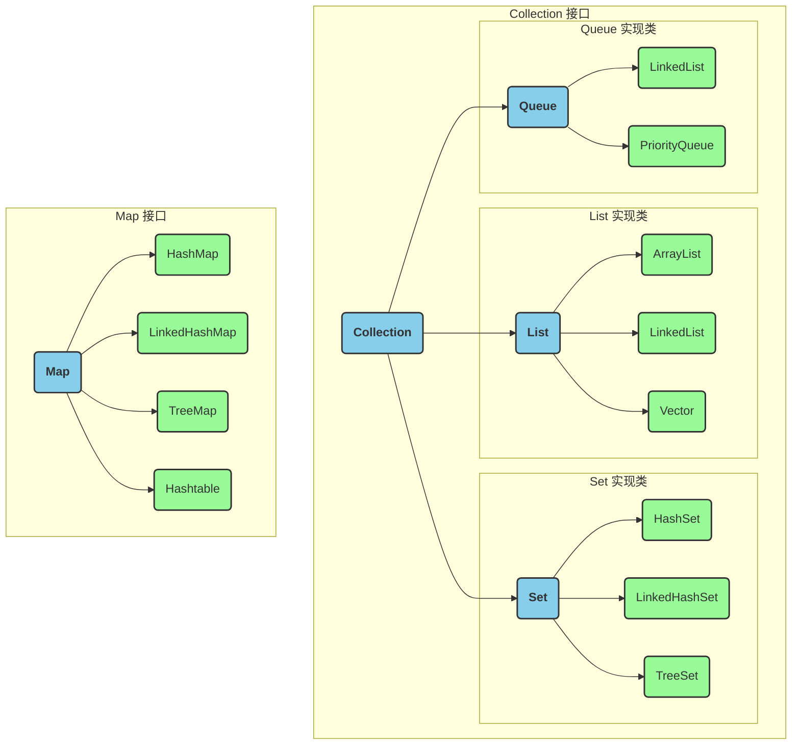

# 集合概述

## 常用的集合分类以及他们的区别?

- List(维护顺序): 存储的元素是有序的,可重复的.
- Set(独一无二): 存储的元素不可重复
- Queue(排队功能叫号机): 按特定的排队规则来确定先后顺序,存储的元素是有序的,可重复的
- Map(key-value): 使用键值对存储,key不可重复,Value可重复.

## 你最常用的集合实现类有哪些?

- ArrayList: 动态数组,实现了List接口,支持动态增长
- LinkedList: 双向链表,实现了List接口,支持快速的插入和删除操作
- HashMap: 基于哈希表的Map实现,存储键值对,通过键快速查找值
- HashSet: 基于HashMap实现的Set集合,用于存储唯一元素
- TreeMap: 基于红黑树实现的有序Map集合,可以按照键的顺序进行排序
- LinkedHashMap: 基于哈希表和双向链表实现的Map集合,保持插入顺序或访问顺序
- PriorityQueue: 优先队列,可以按照比较器或元素的自然顺序进行排序

## 哪些集合类是线程安全的?

Vector,HashTable,Stack都是线程安全的,HashMap是线程非安全,但是在JDK1.5之后随着Concurrent并发包出现,它有了对应自己的线程安全类ConcurrentHashMap.

## 什么是fail-fast,什么是fail-safe

它们都是多线程并发操作集合时的一种失败处理机制.

- fail-fast表示快速失败,集合遍历中,如果发现容器中的数据被修改了,会立即抛出ConcurrentModificationException异常,从而导致遍历失败
- fail-safe 表示失败安全,出现集合元素的修改,不会抛出ConcurrentModificationException异常.

## fast-fail快速失败机制底层怎么实现的呢?

迭代器遍历时直接访问集合中的内容,遍历过程中使用一个modCount变量.

集合在遍历期间如果内容发生变化,就会改变modCount变量的值.

迭代器使用hasNext()/next()遍历下一个元素之前,都会检测modCount变量是否为exceptedModCount的值,如果是则返回遍历;
否则就抛出异常,终止遍历.

## Collection 和collections有什么区别?

- Collection 是一个集合接口,提供对集合对象进行基本操作的通用接口方法,比如List,Set等都是它的子类.
- Collections 是一个包装类,包含很多静态方法,不能被实例化,像是一个工具类,比如提供排序方法.sort().

## List,Set,Map之间的区别是什么?

核心区别概览

| 特性       | List (列表)               | Set (集合)                           | Map (映射)                          |
|------------|---------------------------|--------------------------------------|-------------------------------------|
| 继承的接口 | Collection                | Collection                           | (不继承Collection)                  |
| 存储内容   | 单个元素 (Element)        | 单个元素 (Element)                   | 键值对 (Key-Value)                  |
| 元素顺序   | 有序 (按插入顺序)         | 通常无序¹                            | 通常无序¹ (按Key的顺序)             |
| 元素唯一性 | 允许重复                  | 不允许重复                           | Key不允许重复, Value可重复        |
| 访问方式   | 通过索引 get(index)       | 通过迭代器或for-each                 | 通过键 get(key)                     |
| 核心作用   | 存放一组有序、可重复的数据 | 存放一组无重复的数据，主要用于去重和成员检查 | 存放具有唯一标识（Key）的数据       |
| 常用实现类 | ArrayList, LinkedList     | HashSet, TreeSet, LinkedHashSet      | HashMap, TreeMap, LinkedHashMap     |

## 集合遍历的方法有哪些

- 普通for循环
- 增强for循环
- Iterator迭代器
- ListIterator列表迭代器
- Java8引入的forEach方法
- Stream API
