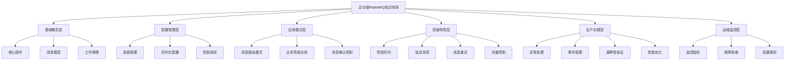
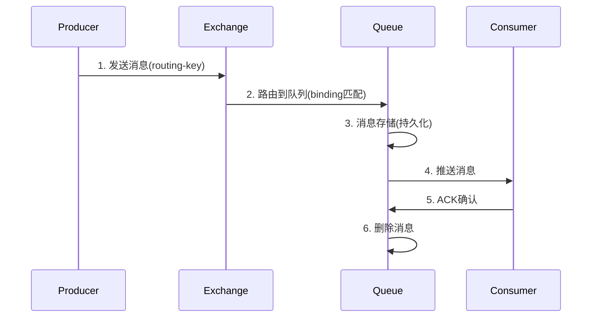

# 🏢 企业级RabbitMQ知识体系

> 基于你的Demo项目，构建企业单机项目中灵活运用RabbitMQ的完整知识图谱

## 📊 知识体系总览



## 🎯 你的现状分析

### ✅ 已掌握的内容（基于你的Demo）
- **基础消息收发**：Direct Exchange + 简单队列
- **对象序列化**：JSON消息转换器
- **SpringBoot集成**：基本配置和注解使用
- **REST API测试**：完整的测试接口
- **死信队列**：基础的死信处理配置

### ❌ 需要补强的关键领域
- **消息路由策略**：Topic、Fanout模式的深度应用
- **企业级异常处理**：重试、熔断、降级机制
- **性能优化**：连接池、批处理、内存管理
- **业务场景实践**：订单、支付、库存等实际场景
- **生产级配置**：集群、安全、监控

---

## 📚 分层知识体系详解

### 🏗️ Layer 1: 基础概念层

#### 1.1 核心组件深度理解
```yaml
核心组件关系:
  Producer(生产者):
    职责: 创建和发送消息
    关键点: 连接复用、批量发送、确认机制
    
  Exchange(交换机):
    类型: [Direct, Topic, Fanout, Headers]
    路由算法: 根据routing-key和binding规则分发
    
  Queue(队列):
    特性: FIFO、持久化、TTL、死信
    参数: x-message-ttl, x-max-length, x-dead-letter-*
    
  Consumer(消费者):
    模式: Push(推送) vs Pull(拉取)
    确认: 自动确认 vs 手动确认
```

#### 1.2 消息生命周期


### ⚙️ Layer 2: 配置管理层

#### 2.1 连接管理最佳实践
```java
// 企业级连接配置
@Configuration
public class EnterpriseRabbitConfig {
    
    @Bean
    public CachingConnectionFactory connectionFactory() {
        CachingConnectionFactory factory = new CachingConnectionFactory();
        
        // 连接池配置
        factory.setChannelCacheSize(100);          // 通道缓存大小
        factory.setConnectionCacheSize(10);        // 连接缓存大小
        factory.setChannelCheckoutTimeout(5000);   // 通道获取超时
        
        // 心跳和超时
        factory.setRequestedHeartBeat(30);         // 心跳间隔30秒
        factory.setConnectionTimeout(30000);       // 连接超时30秒
        
        // 发布确认
        factory.setPublisherConfirmType(
            CachingConnectionFactory.ConfirmType.CORRELATED);
        factory.setPublisherReturns(true);
        
        return factory;
    }
}
```

#### 2.2 性能调优配置
```yaml
# application.yml - 生产环境配置
spring:
  rabbitmq:
    # 基础连接配置
    host: ${RABBITMQ_HOST:localhost}
    port: ${RABBITMQ_PORT:5672}
    username: ${RABBITMQ_USERNAME:admin}
    password: ${RABBITMQ_PASSWORD:admin123}
    virtual-host: ${RABBITMQ_VHOST:/}
    
    # 连接池配置
    cache:
      connection:
        mode: channel
        size: 10
      channel:
        size: 100
        checkout-timeout: 5000
    
    # 监听器配置
    listener:
      simple:
        concurrency: 5              # 最小消费者数量
        max-concurrency: 20         # 最大消费者数量
        prefetch: 10                # 预取消息数量
        retry:
          enabled: true
          initial-interval: 1000    # 重试间隔
          max-attempts: 3           # 最大重试次数
          multiplier: 2.0           # 重试间隔倍数
          max-interval: 10000       # 最大重试间隔
        
    # 模板配置
    template:
      retry:
        enabled: true
        initial-interval: 1000
        max-attempts: 3
        multiplier: 2.0
      exchange: default.exchange    # 默认交换机
      routing-key: default.routing  # 默认路由键
      mandatory: true               # 强制路由
```

### 🔄 Layer 3: 应用模式层

#### 3.1 完整的路由模式应用

##### Direct Exchange（精确匹配）
```java
// 适用场景：系统日志分级、订单状态更新
@Component
public class LogRoutingExample {
    
    // 错误日志队列
    @RabbitListener(bindings = @QueueBinding(
        value = @Queue("log.error.queue"),
        exchange = @Exchange("log.exchange"),
        key = "log.error"
    ))
    public void handleErrorLog(String message) {
        // 处理错误日志，可能需要告警
        alertService.sendAlert("ERROR: " + message);
    }
    
    // 信息日志队列  
    @RabbitListener(bindings = @QueueBinding(
        value = @Queue("log.info.queue"),
        exchange = @Exchange("log.exchange"),
        key = "log.info"
    ))
    public void handleInfoLog(String message) {
        // 处理一般信息日志
        logService.writeLog(message);
    }
}
```

##### Topic Exchange（通配符匹配）
```java
// 适用场景：地域化消息、多维度数据统计
@Component
public class RegionalOrderExample {
    
    // 处理北京地区所有订单: order.beijing.*
    @RabbitListener(bindings = @QueueBinding(
        value = @Queue("order.beijing.queue"),
        exchange = @Exchange(value = "order.topic.exchange", type = "topic"),
        key = "order.beijing.*"
    ))
    public void handleBeijingOrders(OrderMessage order) {
        // 北京地区特殊处理逻辑
        beijingOrderService.process(order);
    }
    
    // 处理所有地区的VIP订单: order.*.vip
    @RabbitListener(bindings = @QueueBinding(
        value = @Queue("order.vip.queue"),
        exchange = @Exchange(value = "order.topic.exchange", type = "topic"),
        key = "order.*.vip"
    ))
    public void handleVipOrders(OrderMessage order) {
        // VIP订单特殊服务
        vipOrderService.processWithPriority(order);
    }
}
```

##### Fanout Exchange（广播模式）
```java
// 适用场景：缓存刷新、系统通知、实时统计
@Component
public class CacheInvalidationExample {
    
    // 用户缓存服务
    @RabbitListener(bindings = @QueueBinding(
        value = @Queue("cache.user.queue"),
        exchange = @Exchange(value = "cache.fanout.exchange", type = "fanout")
    ))
    public void invalidateUserCache(UserUpdateMessage message) {
        userCacheService.evict(message.getUserId());
    }
    
    // 商品缓存服务
    @RabbitListener(bindings = @QueueBinding(
        value = @Queue("cache.product.queue"),
        exchange = @Exchange(value = "cache.fanout.exchange", type = "fanout")
    ))
    public void invalidateProductCache(UserUpdateMessage message) {
        productCacheService.evictByUserId(message.getUserId());
    }
}
```

#### 3.2 企业级业务场景实现

##### 电商订单处理链路
```java
@Component
public class EcommerceOrderProcessor {
    
    // 1. 订单创建后的处理链
    @RabbitListener(queues = "order.created.queue")
    public void handleOrderCreated(OrderCreatedEvent event) {
        try {
            // 库存检查
            inventoryService.reserve(event.getOrderId(), event.getItems());
            
            // 发送到支付队列
            rabbitTemplate.convertAndSend("payment.exchange", 
                "payment.process", event.getOrderId());
            
            // 发送到物流队列
            rabbitTemplate.convertAndSend("logistics.exchange", 
                "logistics.prepare", event.getOrderId());
                
        } catch (InsufficientStockException e) {
            // 库存不足，发送到失败处理队列
            rabbitTemplate.convertAndSend("order.failed.exchange", 
                "order.stock.failed", event);
        }
    }
    
    // 2. 支付成功处理
    @RabbitListener(queues = "payment.success.queue")
    public void handlePaymentSuccess(PaymentSuccessEvent event) {
        // 确认库存扣减
        inventoryService.confirm(event.getOrderId());
        
        // 生成发货单
        shippingService.createShippingOrder(event.getOrderId());
        
        // 发送通知
        notificationService.sendOrderConfirmation(event.getOrderId());
    }
    
    // 3. 支付失败处理
    @RabbitListener(queues = "payment.failed.queue")
    public void handlePaymentFailed(PaymentFailedEvent event) {
        // 释放库存
        inventoryService.release(event.getOrderId());
        
        // 订单状态更新
        orderService.markAsFailed(event.getOrderId());
    }
}
```

### 🚀 Layer 4: 高级特性层

#### 4.1 企业级死信队列设计
```java
@Configuration
public class DeadLetterQueueConfig {
    
    // 业务队列配置
    @Bean
    public Queue businessQueue() {
        return QueueBuilder.durable("business.queue")
            .withArgument("x-dead-letter-exchange", "dlx.exchange")
            .withArgument("x-dead-letter-routing-key", "business.dlq")
            .withArgument("x-message-ttl", 300000)  // 5分钟TTL
            .withArgument("x-max-retries", 3)       // 最大重试次数
            .build();
    }
    
    // 死信队列
    @Bean
    public Queue deadLetterQueue() {
        return QueueBuilder.durable("business.dlq")
            .withArgument("x-message-ttl", 86400000)  // 24小时保留
            .build();
    }
    
    // 死信处理
    @RabbitListener(queues = "business.dlq")
    public void handleDeadLetter(Message message, @Header Map<String, Object> headers) {
        String reason = (String) headers.get("x-first-death-reason");
        Integer retryCount = (Integer) headers.get("x-death-count");
        
        // 记录死信原因
        deadLetterService.logDeadLetter(message, reason, retryCount);
        
        // 人工介入处理
        if (retryCount > 5) {
            alertService.notifyAdmin("Critical dead letter: " + message);
        }
    }
}
```

#### 4.2 延迟消息实现
```java
@Component
public class DelayedMessageService {
    
    // 基于TTL + 死信的延迟消息
    public void sendDelayedMessage(Object message, int delaySeconds) {
        rabbitTemplate.convertAndSend("delayed.exchange", "delayed.routing", 
            message, msg -> {
                msg.getMessageProperties().setExpiration(String.valueOf(delaySeconds * 1000));
                return msg;
            });
    }
    
    // 延迟队列（无消费者，消息过期后进入死信队列）
    @Bean
    public Queue delayedQueue() {
        return QueueBuilder.durable("delayed.queue")
            .withArgument("x-dead-letter-exchange", "business.exchange")
            .withArgument("x-dead-letter-routing-key", "business.delayed")
            .build();
    }
    
    // 实际处理延迟消息
    @RabbitListener(queues = "business.delayed.queue")
    public void handleDelayedMessage(Object message) {
        // 处理延迟到达的消息
        delayedTaskService.execute(message);
    }
}
```

#### 4.3 消息重试机制
```java
@Component
public class MessageRetryHandler {
    
    @RabbitListener(queues = "retry.queue")
    public void handleWithRetry(String message, 
                               @Header(name = "x-retry-count", defaultValue = "0") Integer retryCount) {
        try {
            // 业务处理逻辑
            businessService.process(message);
            
        } catch (Exception e) {
            if (retryCount < 3) {
                // 重试
                rabbitTemplate.convertAndSend("retry.exchange", "retry.key", message, msg -> {
                    msg.getMessageProperties().getHeaders().put("x-retry-count", retryCount + 1);
                    // 指数退避
                    long delay = (long) Math.pow(2, retryCount) * 1000;
                    msg.getMessageProperties().setExpiration(String.valueOf(delay));
                    return msg;
                });
            } else {
                // 超过重试次数，发送到死信队列
                rabbitTemplate.convertAndSend("dlx.exchange", "business.failed", 
                    new FailedMessage(message, e.getMessage(), retryCount));
            }
        }
    }
}
```

### 🏭 Layer 5: 生产实践层

#### 5.1 事务消息保证
```java
@Service
@Transactional
public class TransactionalMessageService {
    
    // 本地事务 + 消息事务
    public void processOrderWithMessage(Order order) {
        try {
            // 1. 数据库操作
            orderRepository.save(order);
            
            // 2. 发送消息（事务性）
            rabbitTemplate.execute(channel -> {
                channel.txSelect();  // 开启事务
                try {
                    rabbitTemplate.convertAndSend("order.exchange", 
                        "order.created", order);
                    channel.txCommit();  // 提交事务
                } catch (Exception e) {
                    channel.txRollback();  // 回滚事务
                    throw e;
                }
                return null;
            });
            
        } catch (Exception e) {
            // 数据库回滚会自动触发
            TransactionAspectSupport.currentTransactionStatus().setRollbackOnly();
            throw e;
        }
    }
}
```

#### 5.2 幂等性保证
```java
@Component
public class IdempotentMessageConsumer {
    
    @Autowired
    private RedisTemplate<String, String> redisTemplate;
    
    @RabbitListener(queues = "payment.queue")
    public void handlePayment(PaymentMessage payment, 
                             @Header("messageId") String messageId) {
        
        String lockKey = "payment:lock:" + messageId;
        String processedKey = "payment:processed:" + messageId;
        
        // 检查是否已处理
        if (redisTemplate.hasKey(processedKey)) {
            log.info("Payment message already processed: {}", messageId);
            return;
        }
        
        // 分布式锁防止重复处理
        Boolean locked = redisTemplate.opsForValue()
            .setIfAbsent(lockKey, "1", Duration.ofMinutes(5));
        
        if (!locked) {
            log.warn("Payment message processing locked: {}", messageId);
            return;
        }
        
        try {
            // 业务处理
            paymentService.processPayment(payment);
            
            // 标记已处理
            redisTemplate.opsForValue()
                .set(processedKey, "1", Duration.ofHours(24));
                
        } finally {
            // 释放锁
            redisTemplate.delete(lockKey);
        }
    }
}
```

### 📊 Layer 6: 运维监控层

#### 6.1 健康检查和监控
```java
@Component
public class RabbitMQHealthIndicator implements HealthIndicator {
    
    @Autowired
    private RabbitTemplate rabbitTemplate;
    
    @Override
    public Health health() {
        try {
            // 检查连接状态
            rabbitTemplate.execute(channel -> {
                return channel.isOpen();
            });
            
            // 检查队列状态
            Properties queueProperties = rabbitTemplate.execute(channel -> {
                return channel.queueDeclarePassive("critical.queue");
            });
            
            return Health.up()
                .withDetail("connection", "active")
                .withDetail("queues", "accessible")
                .build();
                
        } catch (Exception e) {
            return Health.down()
                .withDetail("error", e.getMessage())
                .build();
        }
    }
}
```

#### 6.2 性能监控
```java
@Component
public class RabbitMQMetrics {
    
    @EventListener
    public void handleRabbitEvent(AbstractApplicationEvent event) {
        if (event instanceof ListenerContainerConsumerTerminatedEvent) {
            // 消费者异常终止
            meterRegistry.counter("rabbitmq.consumer.terminated").increment();
        }
    }
    
    @Scheduled(fixedRate = 30000)
    public void collectMetrics() {
        // 队列长度监控
        rabbitAdmin.getQueueProperties("business.queue")
            .ifPresent(props -> {
                Integer messageCount = (Integer) props.get("QUEUE_MESSAGE_COUNT");
                meterRegistry.gauge("rabbitmq.queue.size", messageCount);
            });
    }
}
```

---

## 🎯 针对你的Demo的改进建议

### 当前Demo分析
你的Demo已经具备了：
- ✅ 基础的Direct Exchange配置
- ✅ JSON序列化支持
- ✅ 简单的死信队列
- ✅ REST API测试接口

### 建议添加的企业级功能

1. **消息路由模式扩展**
   - Topic Exchange实际应用场景
   - Fanout Exchange缓存刷新示例
   - 动态路由配置

2. **异常处理增强**
   - 指数退避重试机制
   - 熔断器集成
   - 监控告警

3. **性能优化示例**
   - 批量消息处理
   - 连接池调优
   - 内存管理

4. **实际业务场景**
   - 订单处理流程
   - 用户注册流程
   - 数据同步场景

## 📈 学习路径建议

### 第一阶段：巩固基础（1-2周）
1. 深入理解你现有Demo中的每个配置
2. 手动测试各种异常情况
3. 添加日志和监控

### 第二阶段：扩展功能（2-3周）
1. 实现Topic和Fanout模式
2. 添加重试和死信处理
3. 集成实际业务场景

### 第三阶段：生产优化（2-3周）
1. 性能调优和压力测试
2. 监控和告警系统
3. 文档和最佳实践总结

这个知识体系基于企业实际需求设计，遵循从基础到高级、从理论到实践的学习路径。你可以基于现有Demo逐步扩展，每个阶段都有明确的目标和可验证的成果。