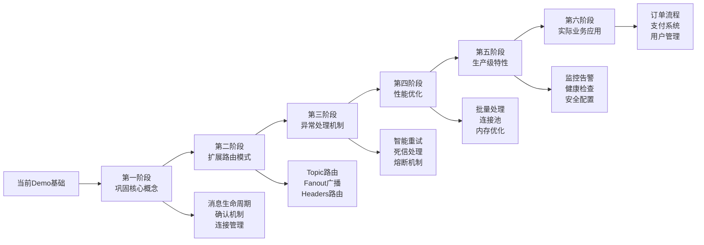
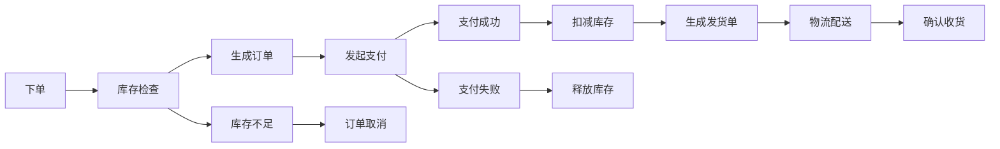

# 🎯 企业级RabbitMQ学习路径指南

> 从你现有的Demo出发，系统掌握企业项目中RabbitMQ的灵活运用

## 📚 学习路径总览



---

## 🎯 第一阶段：巩固核心概念（第1-2周）

### 📖 理论深化

#### 1.1 深入理解你现有的配置
```java
// 分析你的RabbitConfig.java中的每一个配置项
@Bean
public Queue helloQueue() {
    return QueueBuilder
        .durable(helloQueueName)                                    // ❓ 为什么需要持久化？
        .withArgument("x-dead-letter-exchange", deadLetterExchangeName)  // ❓ 死信机制的触发条件？
        .withArgument("x-dead-letter-routing-key", deadLetterRoutingKey) // ❓ 路由键的作用？
        .withArgument("x-message-ttl", 600000)                      // ❓ TTL与业务的关系？
        .build();
}
```

**深化学习任务：**
1. 手动创建消息，观察TTL过期后的行为
2. 模拟消费者异常，观察死信队列的消息流转
3. 测试不同ACK模式的区别（自动vs手动）

#### 1.2 消息确认机制实践
```java
// 在你的MessageConsumer中添加手动确认
@Component
public class ManualAckConsumer {
    
    @RabbitListener(queues = "hello.queue", ackMode = "MANUAL")
    public void handleMessageWithManualAck(String message, Channel channel, 
                                          @Header(AmqpHeaders.DELIVERY_TAG) long tag) {
        try {
            // 模拟业务处理
            if (message.contains("error")) {
                throw new RuntimeException("Business error");
            }
            
            // 业务成功，手动确认
            channel.basicAck(tag, false);
            log.info("消息处理成功并确认: {}", message);
            
        } catch (Exception e) {
            try {
                // 业务失败，拒绝消息并重新入队
                channel.basicNack(tag, false, true);
                log.error("消息处理失败，重新入队: {}", message);
            } catch (IOException ex) {
                log.error("确认消息时发生异常", ex);
            }
        }
    }
}
```

**实践任务：**
1. 发送包含"error"的消息，观察重试行为
2. 故意让消费者处理超时，观察unack消息
3. 比较手动确认与自动确认的性能差异

### 🛠️ 实践项目

#### 项目1：消息确认机制深度测试
```bash
# 在你的MessageController中添加新的测试接口
@PostMapping("/test-ack-modes")
public ResponseEntity<String> testAckModes(@RequestParam String mode) {
    switch(mode) {
        case "auto":
            // 发送到自动确认队列
            break;
        case "manual":
            // 发送到手动确认队列
            break;
        case "error":
            // 发送错误消息测试重试
            break;
    }
}
```

---

## 🔄 第二阶段：扩展路由模式（第3-4周）

### 📖 理论学习

#### 2.1 Topic Exchange 实际应用场景
```java
// 电商系统的订单状态更新路由
public class OrderStatusRouting {
    /*
    路由键设计：
    - order.{region}.{status}
    - order.beijing.created    (北京地区新订单)
    - order.shanghai.paid      (上海地区已支付)
    - order.*.cancelled        (所有地区取消订单)
    - order.beijing.*          (北京地区所有状态)
    */
}
```

#### 2.2 Fanout Exchange 系统事件广播
```java
// 用户信息更新的系统广播
public class UserUpdateBroadcast {
    /*
    应用场景：
    - 用户修改个人信息后
    - 缓存服务需要清理用户缓存
    - 推荐服务需要更新用户画像
    - 积分服务需要重新计算等级
    */
}
```

### 🛠️ 实践项目

#### 项目2：构建电商订单路由系统
```java
// 第1步：在你的项目中添加OrderRoutingConfig
@Configuration
public class OrderRoutingConfig {
    
    @Bean
    public TopicExchange orderTopicExchange() {
        return ExchangeBuilder.topicExchange("order.topic.exchange")
            .durable(true).build();
    }
    
    // 北京地区订单处理队列
    @Bean
    public Queue beijingOrderQueue() {
        return QueueBuilder.durable("order.beijing.queue").build();
    }
    
    // VIP订单处理队列
    @Bean  
    public Queue vipOrderQueue() {
        return QueueBuilder.durable("order.vip.queue").build();
    }
    
    // 财务统计队列
    @Bean
    public Queue financeQueue() {
        return QueueBuilder.durable("finance.all.queue").build();
    }
    
    // 路由绑定
    @Bean
    public Binding beijingOrderBinding() {
        return BindingBuilder.bind(beijingOrderQueue())
            .to(orderTopicExchange())
            .with("order.beijing.*");
    }
    
    @Bean
    public Binding vipOrderBinding() {
        return BindingBuilder.bind(vipOrderQueue())
            .to(orderTopicExchange())
            .with("order.*.vip");
    }
    
    @Bean
    public Binding financeBinding() {
        return BindingBuilder.bind(financeQueue())
            .to(orderTopicExchange())
            .with("order.#");  // 接收所有订单消息
    }
}
```

**学习目标：**
1. 理解Topic路由的通配符规则
2. 设计合理的路由键命名规范
3. 处理路由键冲突和重复消费

#### 项目3：用户事件广播系统
```java
// 第2步：添加用户事件广播
@Configuration  
public class UserEventBroadcastConfig {
    
    @Bean
    public FanoutExchange userEventExchange() {
        return ExchangeBuilder.fanoutExchange("user.event.fanout")
            .durable(true).build();
    }
    
    // 各个服务的处理队列
    @Bean public Queue cacheUpdateQueue() { 
        return QueueBuilder.durable("cache.user.update").build(); 
    }
    
    @Bean public Queue recommendationUpdateQueue() { 
        return QueueBuilder.durable("recommendation.user.update").build(); 
    }
    
    @Bean public Queue pointsUpdateQueue() { 
        return QueueBuilder.durable("points.user.update").build(); 
    }
}
```

**学习目标：**
1. 理解Fanout的广播特性
2. 设计服务解耦的事件驱动架构
3. 处理广播消息的幂等性问题

---

## ⚡ 第三阶段：异常处理机制（第5-6周）

### 📖 理论深化

#### 3.1 异常分类与处理策略
```yaml
异常类型分类:
  临时性异常:
    - 网络超时
    - 服务暂时不可用
    - 资源临时锁定
    策略: 指数退避重试
    
  业务异常:
    - 数据格式错误
    - 业务规则校验失败
    - 重复操作
    策略: 记录日志，人工处理
    
  系统异常:
    - 内存溢出
    - 磁盘空间不足
    - 数据库连接池耗尽
    策略: 熔断，告警，降级
```

### 🛠️ 实践项目

#### 项目4：智能重试机制
```java
// 第3步：在你的项目中实现智能重试
@Component
public class IntelligentRetryService {
    
    // 重试配置
    private static final int MAX_RETRY_COUNT = 5;
    private static final long[] RETRY_DELAYS = {1000, 2000, 4000, 8000, 16000}; // 指数退避
    
    @RabbitListener(queues = "business.order.queue")
    public void processOrder(OrderMessage order, 
                           @Header(value = "x-retry-count", defaultValue = "0") Integer retryCount,
                           @Header("messageId") String messageId) {
        try {
            // 模拟不同类型的异常
            if (order.getAmount().compareTo(BigDecimal.ZERO) < 0) {
                throw new BusinessException("订单金额不能为负数");
            }
            
            if (order.getProductId() == null) {
                throw new TemporaryException("产品服务暂时不可用");
            }
            
            // 正常业务处理
            orderService.processOrder(order);
            
        } catch (BusinessException e) {
            // 业务异常不重试，直接进入人工处理
            sendToManualProcessing(order, e.getMessage());
            
        } catch (TemporaryException e) {
            // 临时异常，智能重试
            if (retryCount < MAX_RETRY_COUNT) {
                scheduleRetry(order, messageId, retryCount + 1);
            } else {
                sendToDeadLetter(order, "超过最大重试次数");
            }
        }
    }
    
    private void scheduleRetry(OrderMessage order, String messageId, int retryCount) {
        long delay = RETRY_DELAYS[retryCount - 1];
        
        // 发送到延迟重试队列
        rabbitTemplate.convertAndSend("retry.delay.exchange", 
            "retry.delay.key", order, message -> {
                message.getMessageProperties().setExpiration(String.valueOf(delay));
                message.getMessageProperties().getHeaders().put("x-retry-count", retryCount);
                message.getMessageProperties().getHeaders().put("messageId", messageId);
                return message;
        });
        
        log.info("订单 {} 第 {} 次重试，延迟 {} ms", order.getOrderId(), retryCount, delay);
    }
}
```

#### 项目5：熔断器集成
```java
// 第4步：集成Resilience4j熔断器
@Component
public class CircuitBreakerOrderProcessor {
    
    @CircuitBreaker(name = "payment-service", fallbackMethod = "fallbackPayment")
    @TimeLimiter(name = "payment-service")
    @Retry(name = "payment-service")
    @RabbitListener(queues = "payment.process.queue")
    public CompletableFuture<String> processPayment(PaymentMessage payment) {
        return CompletableFuture.supplyAsync(() -> {
            // 调用外部支付服务
            return paymentService.processPayment(payment);
        });
    }
    
    // 熔断降级方法
    public CompletableFuture<String> fallbackPayment(PaymentMessage payment, Exception ex) {
        log.warn("支付服务熔断，订单 {} 进入降级处理", payment.getOrderId());
        
        // 降级策略：发送到延迟队列，稍后重试
        rabbitTemplate.convertAndSend("payment.fallback.exchange", 
            "payment.fallback.key", payment, message -> {
                message.getMessageProperties().setExpiration("300000"); // 5分钟后重试
                return message;
        });
        
        return CompletableFuture.completedFuture("fallback");
    }
}
```

**学习目标：**
1. 掌握不同异常的处理策略
2. 实现智能重试和熔断机制
3. 设计降级和恢复策略

---

## 🚀 第四阶段：性能优化（第7-8周）

### 📖 理论学习

#### 4.1 性能优化关键指标
```yaml
关键性能指标:
  吞吐量(Throughput):
    目标: >1000 msg/s
    优化: 批量处理、并发消费
    
  延迟(Latency):
    目标: <100ms P99
    优化: 连接池、预取优化
    
  可用性(Availability):
    目标: >99.9%
    优化: 重试机制、熔断器
    
  资源利用率:
    内存: <80%
    CPU: <70%
    连接数: <100
```

### 🛠️ 实践项目

#### 项目6：批量消息处理优化
```java
// 第5步：实现批量消息处理
@Component
public class BatchOrderProcessor {
    
    private final BlockingQueue<OrderMessage> orderBuffer = new LinkedBlockingQueue<>(1000);
    private final ScheduledExecutorService scheduler = Executors.newSingleThreadScheduledExecutor();
    
    @PostConstruct
    public void initBatchProcessor() {
        // 每5秒或达到100条消息时批量处理
        scheduler.scheduleAtFixedRate(this::processBatch, 5, 5, TimeUnit.SECONDS);
    }
    
    @RabbitListener(queues = "order.single.queue", concurrency = "5-10")
    public void collectOrder(OrderMessage order) {
        if (!orderBuffer.offer(order)) {
            log.warn("订单缓冲区已满，直接处理: {}", order.getOrderId());
            orderService.processSingle(order);
        }
        
        // 缓冲区满时立即触发批量处理
        if (orderBuffer.size() >= 100) {
            processBatch();
        }
    }
    
    private void processBatch() {
        List<OrderMessage> batch = new ArrayList<>();
        orderBuffer.drainTo(batch, 100);
        
        if (!batch.isEmpty()) {
            try {
                orderService.processBatch(batch);
                log.info("批量处理订单完成，数量: {}", batch.size());
            } catch (Exception e) {
                log.error("批量处理失败，回退到单条处理", e);
                batch.forEach(order -> orderService.processSingle(order));
            }
        }
    }
}
```

#### 项目7：连接池和并发优化
```java
// 第6步：优化连接池配置
@Configuration
public class HighPerformanceRabbitConfig {
    
    @Bean
    @Primary
    public CachingConnectionFactory highPerformanceConnectionFactory() {
        CachingConnectionFactory factory = new CachingConnectionFactory("localhost");
        
        // 连接池优化
        factory.setChannelCacheSize(200);           // 增加通道缓存
        factory.setConnectionCacheSize(20);         // 增加连接缓存
        factory.setChannelCheckoutTimeout(2000);    // 减少获取超时
        
        // 性能优化
        factory.setRequestedHeartBeat(60);          // 适当增加心跳间隔
        factory.setConnectionTimeout(10000);        // 减少连接超时
        
        // 确认机制优化
        factory.setPublisherConfirmType(CachingConnectionFactory.ConfirmType.SIMPLE);
        
        return factory;
    }
    
    @Bean
    public SimpleRabbitListenerContainerFactory highPerformanceListenerFactory(
            ConnectionFactory connectionFactory) {
        SimpleRabbitListenerContainerFactory factory = new SimpleRabbitListenerContainerFactory();
        factory.setConnectionFactory(connectionFactory);
        
        // 并发优化
        factory.setConcurrentConsumers(10);         // 增加最小消费者
        factory.setMaxConcurrentConsumers(50);      // 增加最大消费者
        factory.setPrefetchCount(20);               // 增加预取数量
        
        // 性能优化
        factory.setReceiveTimeout(1000L);           // 减少接收超时
        factory.setDefaultRequeueRejected(false);   // 失败消息不重新入队
        factory.setMissingQueuesFatal(false);       // 队列缺失不致命
        
        return factory;
    }
}
```

**学习目标：**
1. 理解批量处理的性能收益
2. 掌握连接池和并发配置
3. 学会性能测试和调优

---

## 🏭 第五阶段：生产级特性（第9-10周）

### 📖 理论学习

#### 5.1 生产环境关键特性
```yaml
监控告警:
  - 队列长度监控
  - 消息处理耗时
  - 错误率统计
  - 连接数监控
  
安全配置:
  - SSL/TLS加密
  - 用户权限管理
  - 网络访问控制
  - 敏感信息加密
  
高可用:
  - 多节点部署
  - 自动故障转移
  - 数据备份恢复
  - 灾难恢复计划
```

### 🛠️ 实践项目

#### 项目8：完整监控系统
```java
// 第7步：实现全面监控
@Component
public class ProductionRabbitMonitoring {
    
    private final MeterRegistry meterRegistry;
    private final AlertService alertService;
    
    // 队列长度监控
    @Scheduled(fixedRate = 30000)
    public void monitorQueueSizes() {
        Map<String, Integer> queueSizes = rabbitAdmin.getQueueProperties();
        
        queueSizes.forEach((queueName, size) -> {
            meterRegistry.gauge("rabbitmq.queue.size", 
                Tags.of("queue", queueName), size);
            
            // 告警阈值检查
            if (size > getAlertThreshold(queueName)) {
                alertService.sendAlert(String.format(
                    "队列 %s 消息堆积，当前数量: %d", queueName, size));
            }
        });
    }
    
    // 消息处理性能监控
    @EventListener
    public void handleMessageProcessed(MessageProcessedEvent event) {
        meterRegistry.timer("rabbitmq.message.processing.time",
            Tags.of("queue", event.getQueueName(),
                   "status", event.getStatus()))
            .record(event.getProcessingTime(), TimeUnit.MILLISECONDS);
    }
    
    // 错误率监控
    @EventListener
    public void handleMessageFailed(MessageFailedEvent event) {
        meterRegistry.counter("rabbitmq.message.failed",
            Tags.of("queue", event.getQueueName(),
                   "error", event.getErrorType()))
            .increment();
    }
}
```

#### 项目9：健康检查和故障恢复
```java
// 第8步：实现健康检查
@Component
public class ProductionHealthCheck implements HealthIndicator {
    
    @Override
    public Health health() {
        Map<String, Object> details = new HashMap<>();
        Health.Builder builder = Health.up();
        
        try {
            // 检查连接状态
            checkConnectionHealth(details, builder);
            
            // 检查关键队列状态
            checkCriticalQueues(details, builder);
            
            // 检查消费者状态
            checkConsumerHealth(details, builder);
            
            // 检查性能指标
            checkPerformanceMetrics(details, builder);
            
        } catch (Exception e) {
            builder.down().withDetail("error", e.getMessage());
        }
        
        return builder.withDetails(details).build();
    }
    
    private void checkPerformanceMetrics(Map<String, Object> details, Health.Builder builder) {
        // 检查平均处理时间
        Double avgProcessingTime = meterRegistry.timer("rabbitmq.message.processing.time")
            .mean(TimeUnit.MILLISECONDS);
            
        details.put("avgProcessingTime", avgProcessingTime);
        
        if (avgProcessingTime > 1000) { // 超过1秒告警
            builder.down().withDetail("performance", "处理时间过长: " + avgProcessingTime + "ms");
        }
    }
}
```

**学习目标：**
1. 构建完整的监控告警体系
2. 实现生产级健康检查
3. 掌握故障诊断和恢复技能

---

## 🏢 第六阶段：实际业务应用（第11-12周）

### 📖 业务场景分析

#### 6.1 电商系统订单流程


### 🛠️ 综合项目

#### 项目10：完整电商订单处理系统
```java
// 第9步：实现完整的业务流程
@Component
public class ECommerceOrderOrchestrator {
    
    // 1. 订单创建事件处理
    @RabbitListener(queues = "order.created.queue")
    public void handleOrderCreated(OrderCreatedEvent event) {
        log.info("处理订单创建事件: {}", event.getOrderId());
        
        try {
            // 调用库存服务检查
            InventoryCheckResult result = inventoryService.checkAndReserve(
                event.getOrderId(), event.getItems());
            
            if (result.isSuccess()) {
                // 库存充足，发送到支付队列
                PaymentRequest paymentRequest = PaymentRequest.builder()
                    .orderId(event.getOrderId())
                    .amount(event.getTotalAmount())
                    .userId(event.getUserId())
                    .build();
                    
                rabbitTemplate.convertAndSend("payment.exchange", 
                    "payment.process", paymentRequest);
                    
                log.info("订单 {} 已发送到支付处理", event.getOrderId());
            } else {
                // 库存不足，发送订单取消事件
                OrderCancelledEvent cancelEvent = OrderCancelledEvent.builder()
                    .orderId(event.getOrderId())
                    .reason("库存不足")
                    .build();
                    
                rabbitTemplate.convertAndSend("order.cancelled.exchange",
                    "order.cancelled", cancelEvent);
            }
            
        } catch (Exception e) {
            log.error("处理订单创建事件失败: {}", event.getOrderId(), e);
            // 发送到重试队列
            retryService.scheduleRetry(event, "order.created.retry");
        }
    }
    
    // 2. 支付成功事件处理
    @RabbitListener(queues = "payment.success.queue")
    public void handlePaymentSuccess(PaymentSuccessEvent event) {
        log.info("处理支付成功事件: {}", event.getOrderId());
        
        try {
            // 确认库存扣减
            inventoryService.confirmReservation(event.getOrderId());
            
            // 更新订单状态
            orderService.updateStatus(event.getOrderId(), OrderStatus.PAID);
            
            // 发送到履约队列
            FulfillmentRequest fulfillmentRequest = FulfillmentRequest.builder()
                .orderId(event.getOrderId())
                .shippingAddress(event.getShippingAddress())
                .build();
                
            rabbitTemplate.convertAndSend("fulfillment.exchange",
                "fulfillment.process", fulfillmentRequest);
                
            // 发送用户通知
            NotificationMessage notification = NotificationMessage.builder()
                .userId(event.getUserId())
                .type(NotificationType.ORDER_PAID)
                .content("您的订单 " + event.getOrderId() + " 支付成功")
                .build();
                
            rabbitTemplate.convertAndSend("notification.fanout",
                "", notification);
                
        } catch (Exception e) {
            log.error("处理支付成功事件失败: {}", event.getOrderId(), e);
            // 这里需要特别小心，可能需要人工介入
            alertService.sendCriticalAlert("支付后处理失败", event.getOrderId());
        }
    }
    
    // 3. 支付失败事件处理
    @RabbitListener(queues = "payment.failed.queue")
    public void handlePaymentFailed(PaymentFailedEvent event) {
        log.info("处理支付失败事件: {}", event.getOrderId());
        
        try {
            // 释放库存
            inventoryService.releaseReservation(event.getOrderId());
            
            // 更新订单状态
            orderService.updateStatus(event.getOrderId(), OrderStatus.PAYMENT_FAILED);
            
            // 发送用户通知
            NotificationMessage notification = NotificationMessage.builder()
                .userId(event.getUserId())
                .type(NotificationType.PAYMENT_FAILED)
                .content("订单 " + event.getOrderId() + " 支付失败，请重新支付")
                .build();
                
            rabbitTemplate.convertAndSend("notification.fanout",
                "", notification);
                
        } catch (Exception e) {
            log.error("处理支付失败事件失败: {}", event.getOrderId(), e);
        }
    }
}
```

**学习目标：**
1. 理解复杂业务流程的消息设计
2. 掌握事件驱动架构的实现
3. 处理分布式事务和一致性问题

---

## 📊 学习成果验收

### 阶段性检验项目

#### 检验项目1：压力测试（第8周末）
```bash
# 使用JMeter或自写脚本进行压力测试
# 目标：1000 msg/s，P99延迟 < 100ms
# 测试场景：
# 1. 单一队列高并发
# 2. 多队列并发处理
# 3. 异常场景下的恢复能力
```

#### 检验项目2：故障模拟（第10周末）
```bash
# 故障注入测试
# 1. 网络分区
# 2. 消费者crash
# 3. RabbitMQ服务重启
# 4. 数据库连接超时
```

#### 检验项目3：生产部署（第12周末）
```bash
# 生产环境部署checklist
# 1. 监控告警配置完整
# 2. 安全配置到位
# 3. 备份恢复方案
# 4. 运维文档完整
```

### 最终目标

完成12周学习后，你将具备：

- ✅ **深度理解**：RabbitMQ的核心原理和最佳实践
- ✅ **实战能力**：独立设计和实现企业级消息系统
- ✅ **问题解决**：快速诊断和解决生产环境问题
- ✅ **架构设计**：基于消息的微服务架构设计能力
- ✅ **性能优化**：系统性能调优和容量规划能力

### 进阶方向

学习完成后，可以进一步探索：

1. **消息队列选型**：Kafka、Pulsar、NATS对比
2. **分布式系统**：Saga模式、事件溯源
3. **云原生**：Kubernetes部署、Serverless消息处理
4. **流处理**：实时数据流处理和分析

这个学习路径将帮助你从现有的基础Demo出发，系统性地掌握企业级RabbitMQ应用，成为消息队列领域的专家！