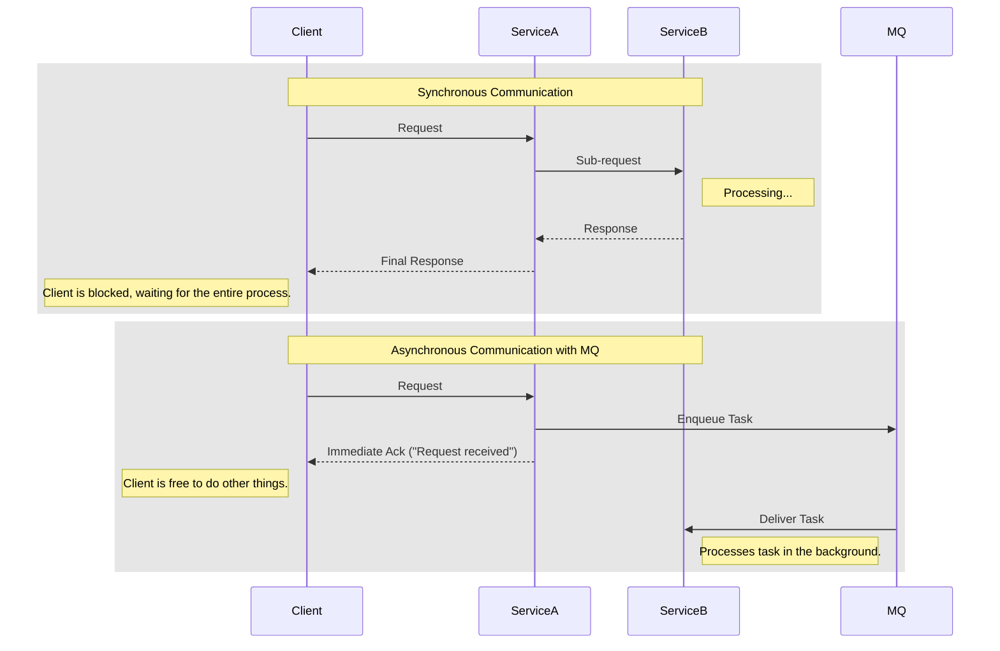
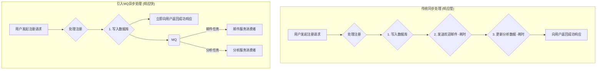
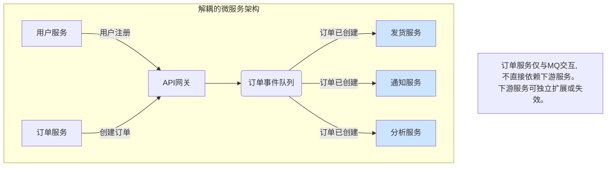
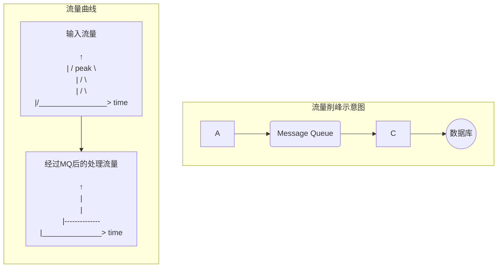
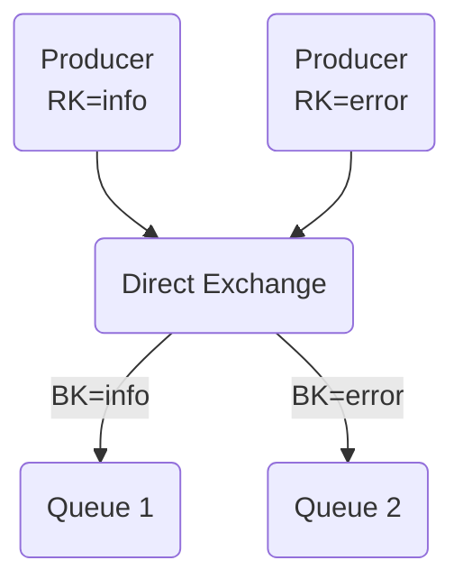
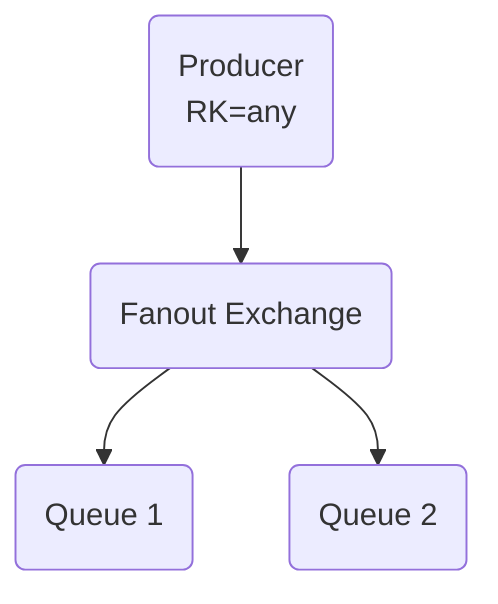
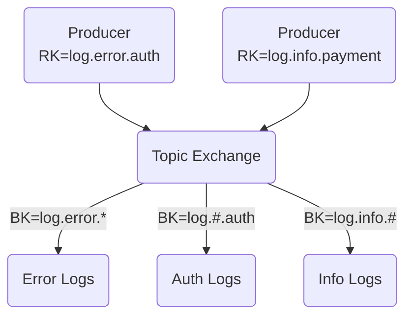
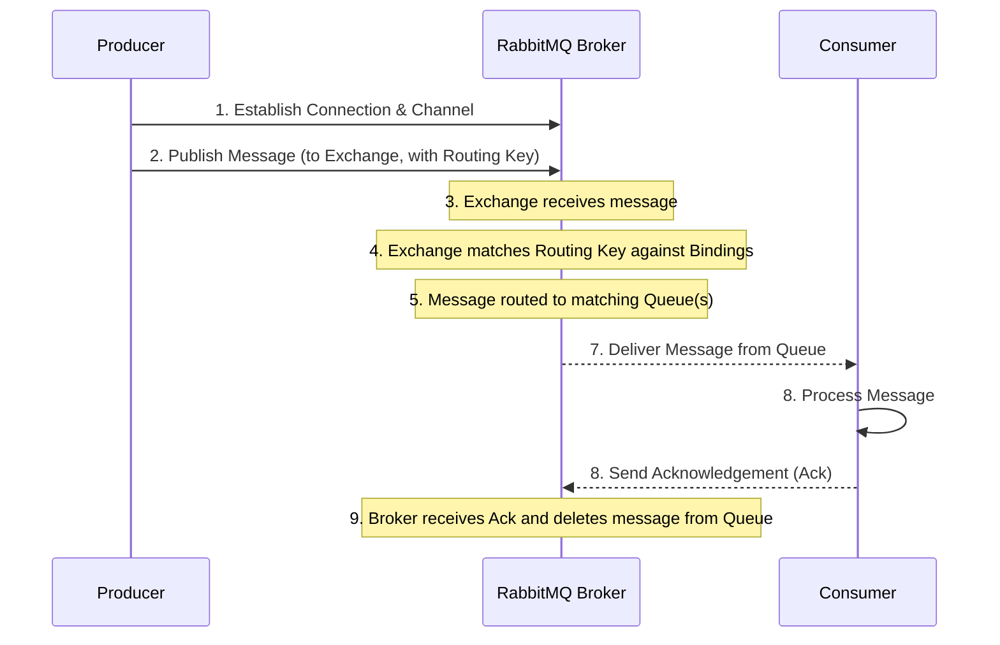

# 深入浅出消息队列：从核心概念到 RabbitMQ 实战

## I. 现代架构的驱动力：为什么我们需要消息队列

做分布式系统，首先要想清楚服务之间怎么"说话"。选错了沟通方式，扩展性、稳定性、响应速度都会受影响。同步调用简单直观，但一旦系统复杂起来，它的短板就会被不断放大。

### 1.1. 简介：超越同步通信的瓶颈

所谓同步（阻塞）通信，就是A调用B后要原地等B回话，线程就卡在那里。小场景还行，但在微服务里，一个请求常常要串很多服务，只要某个环节慢了或挂了，整条链路都被拖住，用户等待变长，甚至引发连锁故障。

异步通信走的是另一条路：A把事交出去就继续干活，不等结果（非阻塞）。消息队列（MQ）就是为这种模式准备的"中间层/缓冲区"，把服务之间的直接强耦合变成经由队列的松耦合，交互方式因此被改造。



消息队列不仅仅是一种技术工具，它更是一种架构思想的体现。现代分布式系统，尤其是微服务架构，其核心目标之一就是实现服务的独立开发、部署和扩展 。然而，如果服务之间通过紧密的同步调用网络连接，一个服务的故障很容易引发连锁反应，形成所谓的“分布式单体”。消息队列通过提供一个可靠的异步通信层，将服务间的强依赖关系转变为弱依赖关系，是实现真正松耦合、高韧性微服务架构的基石 。

从更深层次看，消息队列的所有核心优势都源于一个共同的原理：它在系统交互中引入了一个时间维度上的缓冲。同步通信强制所有参与方在同一时间片内协同工作，而消息队列打破了这种时间上的刚性约束。它允许生产者在某个时间点提交任务，而消费者可以在未来的任何时间点进行处理。这种“时间解耦”是异步处理、系统解耦和削峰填谷等所有实际效益的根本来源。

### 1.2. 核心优势一：异步处理，提升系统响应速度

在许多业务场景中，一个用户请求会触发多个后续操作，但并非所有操作都需要立即完成并返回给用户。以用户注册为例，核心业务是创建用户账户并将其存入数据库，这个过程必须同步完成。但接下来的操作，如发送欢迎邮件、更新搜索引擎索引、为用户生成分析报告等，都是耗时较长且对用户来说非即时的 。

在没有消息队列的架构中，系统必须等待所有这些操作全部完成后，才能向用户返回“注册成功”的提示，这可能需要数秒钟，严重影响用户体验。

通过引入消息队列，流程得以优化。系统在完成核心的数据库写入操作后，立即向用户返回成功响应。同时，将发送邮件、更新索引等耗时任务作为消息发送到队列中 。这些消息随后由专门的后台工作进程（消费者）从队列中取出并异步执行。如此一来，用户的感知响应时间从数秒缩短到毫秒级别，系统的吞吐量也得到了显著提升。

下图展示了这一优化过程：




### 1.3. 核心优势二：应用解耦，构建高韧性与可扩展架构

“解耦”是消息队列为系统架构带来的最重要价值之一。在紧耦合系统中，服务之间直接调用。如果订单服务需要调用库存服务和通知服务，它就必须知道这两个服务的网络地址和接口细节。一旦库存服务宕机，订单服务的相关功能就会失败。

消息队列作为中间人，打破了这种直接依赖 。生产者（如订单服务）只需将消息发送到队列，而无需关心谁是消费者，也无需关心消费者当前是否在线。同样，消费者也只需从队列中获取消息，不关心消息的来源。

这种模式带来了两大好处：

1. **提升系统韧性（Fault Tolerance）**：以上述电商场景为例，当客户下单后，订单服务会发布一条"订单已创建"的消息 。即使此时通知服务因故障下线，订单服务也完全不受影响，可以继续处理新的订单。消息会安全地存储在队列中，待通知服务恢复正常后，它会继续从队列中拉取积压的消息进行处理，确保最终业务的一致性 。

2. **增强系统可扩展性（Scalability）**：解耦使得系统各组件可以独立扩展。如果发现邮件发送速度成为瓶颈，我们只需增加处理邮件任务的消费者数量，而无需对订单服务或系统的其他部分做任何改动。反之，如果订单量激增，也可以独立扩展订单服务实例。这种按需扩展的能力是构建大型分布式系统的关键 。

下图描绘了一个使用消息队列解耦的电商微服务架构：




### 1.4. 核心优势三：削峰填谷，保障系统稳定性

互联网应用的流量往往具有突发性。例如，在电商平台的“秒杀”活动中，流量可能在瞬间飙升至平时的数十倍甚至上百倍。后端系统（尤其是数据库）的处理能力通常是有限的。假设一个MySQL数据库每秒最多能处理2000次写入请求（QPS），而秒杀活动带来了5000 QPS的洪峰流量，这将直接压垮数据库，导致系统崩溃，大量用户请求失败 。

消息队列在此场景下扮演了“蓄水池”的角色，实现了所谓的“削峰填谷”（Peak Shaving 或 Load Leveling）。它能够瞬时接收所有涌入的请求，将其作为消息暂存在队列中，然后允许后端消费者服务以自己能承受的平稳速率（如2000 QPS）从队列中拉取并处理这些请求。

尽管对于部分用户来说，请求的处理会有一定的延迟（因为请求在队列中排队），但这保证了系统不会崩溃，所有用户的请求最终都会被处理，避免了数据丢失和服务不可用。消息队列将瞬时的流量洪峰平滑地分摊到更长的时间段内进行处理，极大地增强了系统的稳定性和可靠性 。

下图直观地展示了削峰填谷的效果：




## II. 消息中间件生态系统：RabbitMQ 的定位

知道为什么要用消息队列之后，下一步就是选型。常见的有 RabbitMQ、Apache Kafka、Redis Streams。它们不是彼此的简单替代，而是在设计理念、能力边界、适用场景上各有侧重。

### 2.1. 主流选择概览：RabbitMQ, Kafka, 和 Redis Streams

RabbitMQ: 成熟、功能完备的消息代理（AMQP），以灵活路由、精细投递控制、可靠性见长，是传统消息队列的“标准答案”。

Apache Kafka: 面向高吞吐、可持久化、可重放的数据流平台，本质是分布式、分区、可复制的提交日志（Commit Log）。

Redis Streams: Redis 5.0 的流数据结构，以内存为主、只追加；延迟极低，适合轻量实时场景。

### 2.2. 深度对比分析

要看清三者定位，先分清"智能代理 vs 哑代理"：系统里的"智能"（路由、分发策略等）放在代理还是放在客户端。

**RabbitMQ 是"智能代理"（Smart Broker）**：生产者把消息发到交换机（Exchange），代理按绑定（Binding）规则路由到队列；代理负责推送（Push）、确认、重试等，生产者侧很轻。

**Kafka 是"哑代理 + 智能消费者"**：Broker 更像持久化日志，不做复杂路由，也不记录谁读了什么。消费者维护偏移量（Offset），从主题（Topic）按需拉取（Pull），可各自节奏消费并随时回放。

基于这一核心差异，我们可以从多个维度进行详细比较：

#### 消息消费模型
RabbitMQ 以推送（Push）为主，代理主动把消息发给消费者，使用简单但要注意背压；Kafka 以拉取（Pull）为主，消费者按自身能力取消息，流量控制和批处理更灵活。

#### 性能（吞吐量与延迟）

**吞吐量**：Kafka、Redis Streams 通常更高。Kafka 依靠分区（Partition）+ 批处理可达百万级/秒；Redis Streams 基于内存，同样很高。RabbitMQ 一般在数万到十万级/秒。

**延迟**：Redis Streams 最低（亚毫秒）；RabbitMQ 也很低；Kafka 因磁盘与批处理设计延迟更高，但对大数据流场景可接受。

#### 持久化与数据保留

**Kafka**：默认磁盘持久化，可按策略长期保留（天、月、甚至永久），可作为事实来源（Source of Truth）。

**RabbitMQ**：支持持久化，但定位是"中转站"，确认后通常删除，不适合长期存储。

**Redis Streams**：以内存为主，可用 RDB/AOF 持久化；可靠性与运维复杂度不同于专为持久化设计的 Kafka。

#### 路由能力
RabbitMQ 最强（Direct / Fanout / Topic / Headers），能做复杂路由；Kafka 相对简单，更依赖主题与分区；Redis Streams 路由能力最轻。

### 2.3. 如何选择：适用场景与总结

基于以上分析，可以这样选：

#### 选择 RabbitMQ 的场景

- **复杂路由**：按内容/属性/规则分发到不同消费者。
- **传统任务队列**：邮件、报表、图像处理等后台任务，借助确认、重试更稳。
- **精细控制**：需要单条消息的可靠投递、顺序（受限条件）、事务性支持。

#### 选择 Kafka 的场景

- **大规模数据管道/流处理**：日志、行为、IoT 等海量实时数据。
- **事件溯源（Event Sourcing）**：用不可变事件日志重放构建状态。
- **实时分析/监控**：与 Spark/Flink 等配合的多下游消费。

#### 选择 Redis Streams 的场景

- **超低延迟实时应用**：排行榜、通知、指令分发等。
- **已有 Redis 技术栈**：减少新组件引入，运维更简单。
- **轻量流处理**：数据量不大、持久化要求适中。

#### 对比总结表

| 特性 | RabbitMQ | Apache Kafka | Redis Streams |
| --- | --- | --- | --- |
| 核心模型 | 智能代理 (AMQP) | 分布式日志 / 发布订阅 | 内存数据结构 |
| 消息流 | 生产者 -> 交换机 -> 队列 -> 消费者 | 生产者 -> 主题(分区) -> 消费者 | 生产者 -> 流 -> 消费者组 |
| 消费模式 | 推送 (Push-based) | 拉取 (Pull-based) | 推送/拉取混合 |
| 吞吐量 | 高 (数万条/秒) | 非常高 (百万条/秒) | 非常高 (百万条/秒) |
| 延迟 | 低 | 低至中 | 非常低 (亚毫秒) |
| 持久化 | 强 (可配置, 磁盘) | 非常强 (默认, 磁盘) | 中等 (可选, RDB/AOF) |
| 路由能力 | 非常灵活 (Direct, Fanout, Topic, Headers) | 基于主题 (分区) | 简单 (基于流) |
| 理想场景 | 任务队列, 复杂微服务通信 | 事件溯源, 数据管道, 实时分析 | 实时应用, 缓存, 消息通知 |


## III. RabbitMQ 的解剖学：深入理解核心架构

要高效地使用 RabbitMQ，必须理解其内部的组件和消息流转机制。RabbitMQ 的强大功能源于其对 AMQP 0-9-1 协议的精巧实现，该协议定义了一套由生产者、消费者和代理（Broker）以及一系列逻辑组件构成的消息处理模型。

### 3.1. 核心角色：生产者、消费者与代理

在一个典型的消息系统中，存在三个基本角色：

- **生产者 (Producer)**：消息的创建者和发送方。一个应用程序，它将业务数据封装成消息，并将其发布到 RabbitMQ 代理 。   

- **消费者 (Consumer)**：消息的接收者和处理方。一个应用程序，它连接到 RabbitMQ 代理，订阅队列，并接收消息进行处理 。   

- **代理 (Broker)**：RabbitMQ 服务器本身。它是一个中间件，负责接收来自生产者的消息，并根据路由规则将其可靠地投递给消费者 。   

### 3.2. AMQP 模型：交换机、队列、绑定与路由键

生产者和消费者之间并非直接通信，而是通过 AMQP 模型中的一系列核心组件进行交互。这些组件共同构成了 RabbitMQ 灵活而强大的路由系统 。   

- **队列 (Queue)**：消息的最终存储地，可以看作是一个先进先出（FIFO）的缓冲区。消息在被消费者处理之前，会一直存放在队列中。队列具有一些重要属性，如持久化（Durable）（代理重启后队列依然存在）和排他性（Exclusive）（仅供一个连接使用，连接关闭后自动删除）。   

- **交换机 (Exchange)**：消息的路由中心。生产者实际上是将消息发布到交换机，而不是直接发送到队列。交换机接收到消息后，负责根据其类型和绑定规则将消息路由到一个或多个队列，甚至其他交换机 。交换机的存在是 RabbitMQ 路由灵活性的关键，它实现了生产者与队列拓扑的解耦。   

交换机的强大之处在于其提供的“间接性”。生产者只需关心它要发送的是哪一类消息（例如，一个“日志”消息），并将它发送到一个名为 logs_topic 的交换机。它完全不需要知道，也不必关心这条消息最终可能被路由到三个不同的队列：一个用于持久化存储到文件，一个用于实时显示在监控仪表盘，另一个用于触发紧急警报。系统的路由逻辑可以通过增删绑定来动态调整，而生产者代码无需任何修改。这种设计原则极大地提升了系统的灵活性和可维护性 。   

RabbitMQ 提供了四种核心的交换机类型：

#### Direct Exchange (直连交换机)

- **工作方式**：将消息路由到绑定键（Binding Key）与消息的路由键（Routing Key）完全匹配的队列。
- **应用场景**：点对点通信或需要将消息精确地发送到特定队列的场景。




#### Fanout Exchange (扇形交换机)

- **工作方式**：忽略路由键，将接收到的所有消息广播到所有与之绑定的队列。
- **应用场景**：广播，如系统配置更新、体育比赛比分实时推送等。




#### Topic Exchange (主题交换机)

- **工作方式**：基于模式匹配来路由消息。绑定键和路由键都是由点（.）分隔的字符串。绑定键中可以使用两个通配符：*（星号）匹配一个单词，#（井号）匹配零个或多个单词。
- **应用场景**：实现灵活的发布/订阅模式，如根据日志级别和来源（log.error.auth）进行多维度订阅。




#### Headers Exchange (头交换机)

- **工作方式**：不依赖路由键，而是根据消息头（Headers）中的键值对进行匹配。绑定时可以指定匹配所有头（x-match=all）还是任一头（x-match=any）。
- **应用场景**：当路由规则比简单的字符串匹配更复杂时，例如需要根据非字符串类型的值进行路由。

- **绑定 (Binding)**：连接交换机和队列的规则。一个绑定就是告诉交换机，符合某些条件的消息应该被路由到指定的队列。一个交换机可以与多个队列绑定，一个队列也可以与多个交换机绑定

- **路由键 (Routing Key)**：生产者在发送消息时附加的一个字符串标签。交换机使用这个路由键，结合绑定键，来决定消息的去向 。

### 3.3. 一条消息的旅程：完整流程解析

现在，我们将所有组件串联起来，追踪一条消息从诞生到被消费的完整生命周期：

1. **建立连接**：生产者首先与 RabbitMQ 代理建立一个 TCP 连接，并在此连接上创建一个信道（Channel）。信道是进行消息收发的逻辑通道。

2. **发布消息**：生产者构建一条消息（包含消息体和属性），并指定一个交换机名称和一个路由键，然后通过信道将消息发布出去。

3. **交换机路由**：交换机接收到消息后，会查看消息的路由键和自身的类型。

4. **匹配绑定**：交换机根据其绑定列表，查找与消息路由键匹配的绑定规则。

5. **投递到队列**：对于每个匹配的绑定，交换机将消息的一个副本投递到该绑定所连接的队列中。如果没有任何队列匹配，消息可能会被丢弃或根据配置返回给生产者。

6. **消息存储**：消息到达队列后，被存储起来，等待消费者处理。

7. **消费者接收**：消费者通过其信道订阅了某个队列。当队列中有消息时，代理会将消息推送给消费者。

8. **处理与确认**：消费者接收到消息后，执行其业务逻辑。处理完成后，消费者会向代理发送一个确认回执（Acknowledgement, Ack）。

9. **消息删除**：代理收到 Ack 后，才会将该消息从队列中彻底删除。如果在收到 Ack 之前消费者断开连接，代理会认为消息未被成功处理，并将其重新投递给其他消费者，以保证消息不丢失 。

下图详细描绘了这一完整流程：




## IV. 从理论到实践：构建你的第一个 RabbitMQ 应用

理论知识是基础，但亲手编写代码才能真正掌握一门技术。本节将指导你使用 Java 和官方的 RabbitMQ Java Client 库，一步步构建一个简单的"Hello, World!"消息收发应用。

### 4.1. 准备工作：环境搭建

为了简化安装过程，我们强烈建议使用 Docker 来运行 RabbitMQ。

#### 安装并运行 RabbitMQ

打开终端，执行以下命令来启动一个 RabbitMQ 容器。这个命令会同时启动 RabbitMQ 服务和其管理界面。

```bash
docker run -d --hostname my-rabbit --name some-rabbit -p 5672:5672 -p 15672:15672 rabbitmq:3-management
```

- `-p 5672:5672`：映射 AMQP 协议的默认端口。
- `-p 15672:15672`：映射管理界面的端口。

启动后，你可以通过浏览器访问 [http://localhost:15672](http://localhost:15672)，使用默认用户名 guest 和密码 guest 登录管理后台 。   

#### 添加 Maven 依赖

在 Java 项目中，我们使用 RabbitMQ 官方提供的 Java Client。在你的 `pom.xml` 文件中添加以下依赖：

```xml
<dependency>
    <groupId>com.rabbitmq</groupId>
    <artifactId>amqp-client</artifactId>
    <version>5.20.0</version>
</dependency>
```

如果使用 Gradle，在 `build.gradle` 文件中添加：

```gradle
implementation 'com.rabbitmq:amqp-client:5.20.0'
```
   

### 4.2. 生产者 (Send.java): 发送 "Hello, World!"

生产者负责创建并发送消息。创建一个名为 `Send.java` 的文件，并输入以下代码：

```java
import com.rabbitmq.client.Channel;
import com.rabbitmq.client.Connection;
import com.rabbitmq.client.ConnectionFactory;

public class Send {
    private final static String QUEUE_NAME = "hello";

    public static void main(String[] argv) throws Exception {
        // 1. 创建连接工厂并配置连接参数
        ConnectionFactory factory = new ConnectionFactory();
        factory.setHost("localhost");
        
        // 2. 建立到 RabbitMQ 服务器的连接和信道
        try (Connection connection = factory.newConnection();
             Channel channel = connection.createChannel()) {
            
            // 3. 声明一个名为 'hello' 的队列
            //    这个操作是幂等的，如果队列已存在，则不会有任何影响。
            //    声明队列是为了确保消息有处可去。
            channel.queueDeclare(QUEUE_NAME, false, false, false, null);
            
            // 4. 发布消息
            //    exchange="" 表示使用默认交换机。
            //    routingKey="hello" 指定消息要被发送到名为 'hello' 的队列。
            String message = "Hello World!";
            channel.basicPublish("", QUEUE_NAME, null, message.getBytes("UTF-8"));
            
            System.out.println(" [x] Sent '" + message + "'");
        }
        // 5. try-with-resources 会自动关闭连接和信道
    }
}
```


#### 代码解析与核心概念

**默认交换机（Default Exchange）**：这段代码中的 `exchange=""` 是一个关键的简化。它使用的是 RabbitMQ 预先声明的一个特殊的默认交换机。这是一个匿名的直连交换机，它的一个特殊行为是：当你声明一个队列时，RabbitMQ 会自动用队列的名称作为绑定键，将该队列绑定到默认交换机上。因此，当我们向默认交换机发布一条路由键为 'hello' 的消息时，它会被精确地路由到名为 'hello' 的队列中。理解这一点至关重要，因为它解释了为什么在没有显式声明交换机和绑定的情况下，消息依然能够正确投递。在更复杂的场景中，你必须使用具名的交换机（如 Fanout 或 Topic）来实现高级路由。   

### 4.3. 消费者 (Receive.java): 接收 "Hello, World!"

消费者负责连接队列，接收并处理消息。创建 `Receive.java` 文件：

```java
import com.rabbitmq.client.*;

public class Receive {
    private final static String QUEUE_NAME = "hello";

    public static void main(String[] argv) throws Exception {
        // 1. 创建连接工厂并配置连接参数
        ConnectionFactory factory = new ConnectionFactory();
        factory.setHost("localhost");
        
        // 2. 建立到 RabbitMQ 服务器的连接和信道
        Connection connection = factory.newConnection();
        Channel channel = connection.createChannel();

        // 3. 再次声明队列
        //    这是一个好习惯，可以保证即使消费者先于生产者启动，队列也一定存在。
        channel.queueDeclare(QUEUE_NAME, false, false, false, null);
        
        System.out.println(" [*] Waiting for messages. To exit press CTRL+C");

        // 4. 定义一个回调函数来处理接收到的消息
        DeliverCallback deliverCallback = (consumerTag, delivery) -> {
            String message = new String(delivery.getBody(), "UTF-8");
            System.out.println(" [x] Received '" + message + "'");
            
            // 可以在这里添加消息处理逻辑
            try {
                Thread.sleep(1000); // 模拟处理耗时
            } catch (InterruptedException e) {
                Thread.currentThread().interrupt();
            }
            System.out.println(" [x] Done");
        };
        
        // 5. 开始消费消息
        //    autoAck=true 表示消息一旦被消费者接收，就自动确认，然后从队列中删除。
        //    在生产环境中，通常设为 false，在消息处理成功后再手动确认。
        channel.basicConsume(QUEUE_NAME, true, deliverCallback, consumerTag -> { });
        
        // 注意：这里不关闭连接，让消费者持续运行
    }
}
```
   

#### 代码解析与核心概念

**幂等性与资源声明**：注意生产者和消费者都执行了 `channel.queueDeclare(QUEUE_NAME, false, false, false, null)`。这是一个非常重要的设计模式，体现了分布式系统中的"假设无状态，按需声明"原则。`queueDeclare` 是一个幂等操作，重复执行不会产生副作用。每个服务在启动时都声明自己所依赖的资源（队列、交换机等），这使得系统组件的启动顺序无关紧要，极大地简化了部署和运维，增强了系统的鲁棒性。   

### 4.4. 运行示例

现在，激动人心的时刻到了。你需要先编译代码，然后打开两个终端窗口。

#### 首先编译 Java 代码

```bash
# 编译生产者
javac -cp ".:path/to/rabbitmq-client.jar" Send.java

# 编译消费者  
javac -cp ".:path/to/rabbitmq-client.jar" Receive.java
```

如果使用 Maven 项目，可以直接使用：

```bash
mvn compile exec:java -Dexec.mainClass="Send"
mvn compile exec:java -Dexec.mainClass="Receive"
```

#### 在第一个终端中，启动消费者

```bash
java -cp ".:path/to/rabbitmq-client.jar" Receive
# 或使用 Maven
mvn exec:java -Dexec.mainClass="Receive"
```

你会看到输出 `[*] Waiting for messages. To exit press CTRL+C`，表示消费者已准备就绪，正在等待消息。

#### 在第二个终端中，启动生产者

```bash
java -cp ".:path/to/rabbitmq-client.jar" Send
# 或使用 Maven
mvn exec:java -Dexec.mainClass="Send"
```

生产者会发送一条消息然后退出，并打印 `[x] Sent 'Hello World!'`。

#### 观察消费者终端

几乎在生产者运行的同时，消费者的终端会打印出接收到的消息：

```text
[*] Waiting for messages. To exit press CTRL+C
 [x] Received 'Hello World!'
 [x] Done
```

恭喜！你已经成功地通过 RabbitMQ 发送并接收了你的第一条消息。你可以多次运行 `Send` 类，会看到消费者持续不断地接收和处理新消息。

## V. 总结：回答核心问题 "为什么用 MQ，为什么用 RabbitMQ？"

经过前面的深入探讨，我们现在可以清晰、自信地回答最初的问题。

### 为什么使用消息队列（MQ）？

在构建现代分布式应用时，使用消息队列并非一个可选项，而是一个战略性的架构决策。其核心价值在于解决了同步通信模式下的三大根本性难题：

1. **为了响应速度，我们使用 MQ 实现异步处理**：将耗时但非核心的操作（如发送邮件、数据分析）从主请求流程中剥离，放入队列后台处理，从而极大地缩短了用户感知的响应时间，提升了系统吞吐量。

2. **为了系统韧性与可扩展性，我们使用 MQ 实现应用解耦**：MQ 作为服务间的缓冲和中介，使得服务可以独立演进、部署和伸缩。一个服务的暂时性故障不会引发整个系统的级联崩溃，增强了系统的健壮性。

3. **为了系统稳定性，我们使用 MQ 实现削峰填谷**：面对突发流量洪峰，MQ 充当"蓄水池"，平滑处理压力，保护后端脆弱的服务（如数据库）不被冲垮，确保了业务的连续性和数据的完整性。

### 为什么选择 RabbitMQ？

在众多消息中间件中，RabbitMQ 凭借其成熟度、稳定性和强大的功能，占据了不可或缺的地位。选择 RabbitMQ 的理由在于其独特的设计哲学和核心优势：

- **它是一个"智能代理"，擅长处理复杂的路由逻辑**：RabbitMQ 的核心是实现了 AMQP 协议的强大代理，内置了灵活的交换机（Direct, Fanout, Topic, Headers）和绑定机制。这使得开发者可以将复杂的业务路由规则交给 RabbitMQ 来管理，而生产者和消费者则可以保持简单。这与 Kafka 的"哑代理"模型形成鲜明对比，后者要求消费者自行处理更多的逻辑。

- **它是构建复杂微服务通信和后台任务系统的理想选择**：当你需要精细地控制消息的流向、确保每条任务被可靠地传递给特定的工作单元、并利用成熟的消息确认和重试机制时，RabbitMQ 是业界公认的最佳实践。

总而言之，当你的需求是构建一个可靠、灵活的消息传递系统，用于驱动复杂的业务流程和后台任务时，RabbitMQ 是你的首选。而当你的目标是构建一个高吞吐量的数据流平台，用于日志聚合、实时分析或事件溯源时，Kafka 可能是更合适的工具。Redis Streams 则在对延迟要求极致且场景相对轻量的领域中闪耀。理解这些根本性的差异，将使你能够在正确的时间为正确的任务选择正确的工具。

