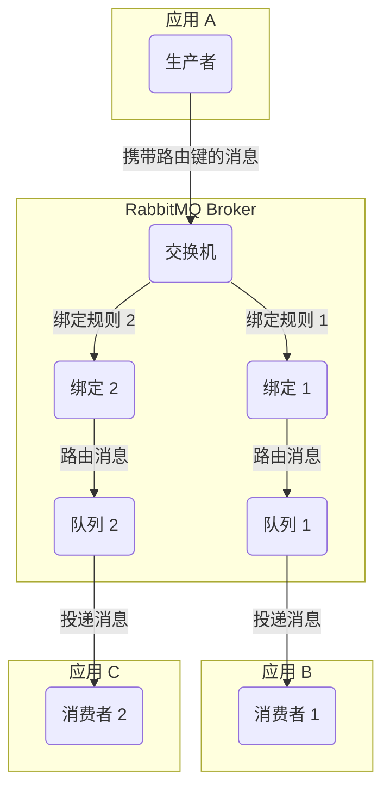
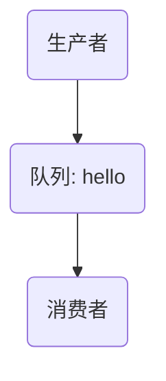
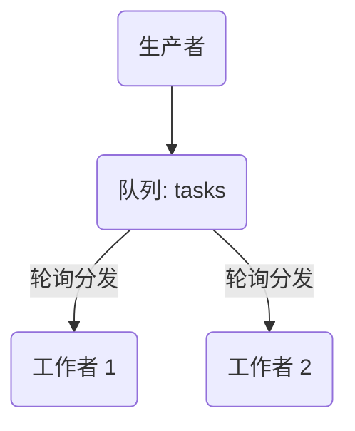
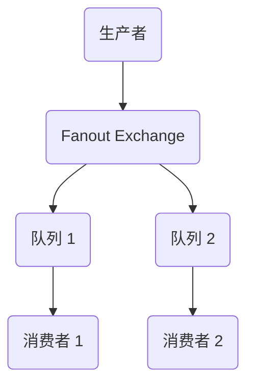
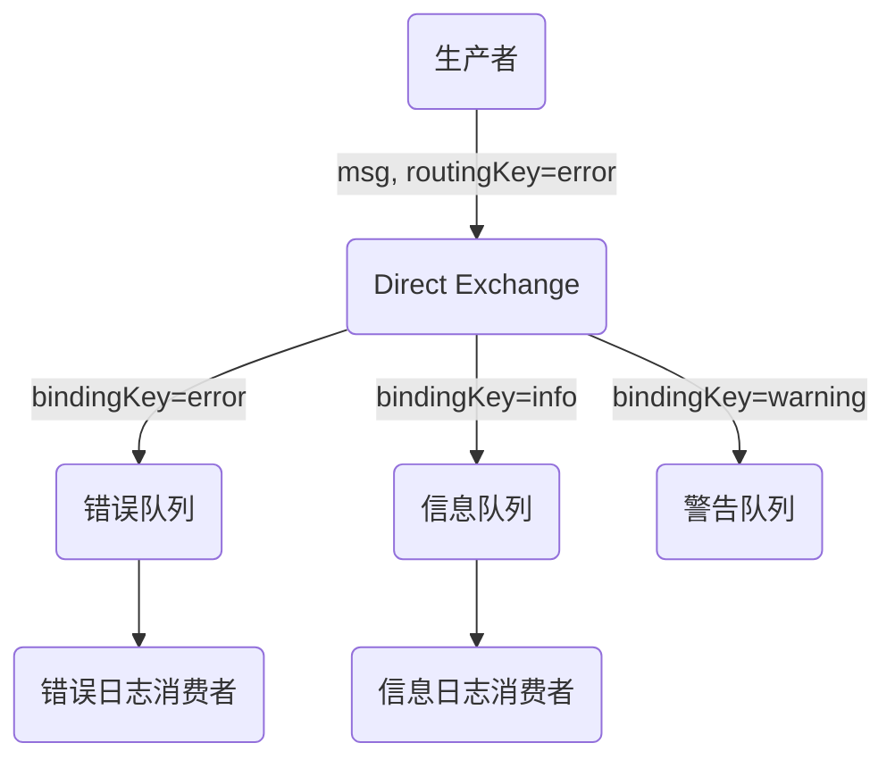
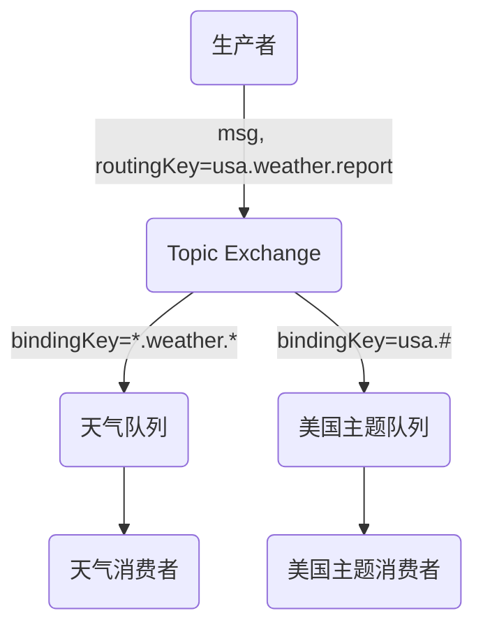
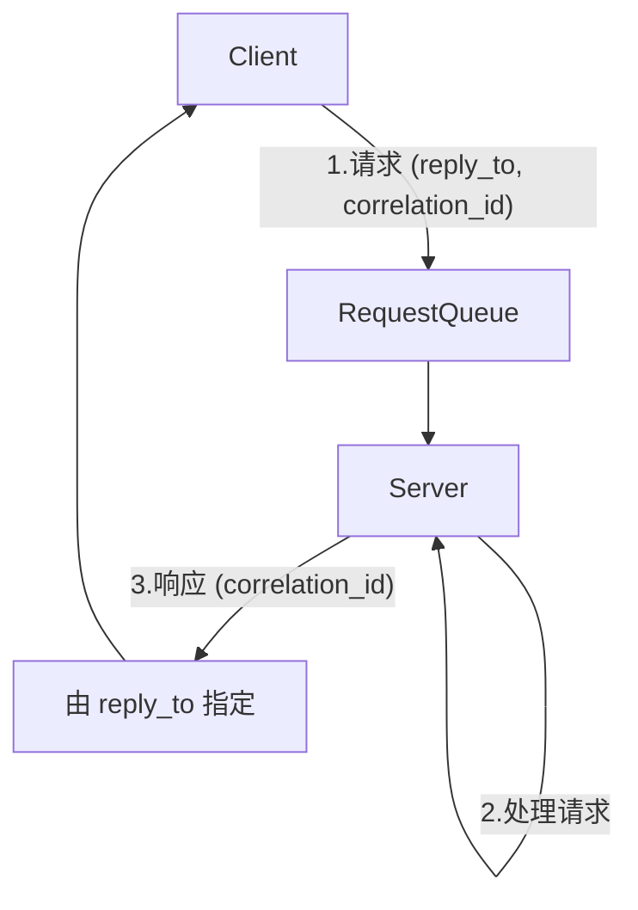

# 使用 Spring Boot 掌握 RabbitMQ：从基础到可靠消息传递的开发者指南

## 引言：现代软件中 RabbitMQ 的"为何"与"为何物"

### 耦合系统的困境

在现代软件架构，特别是微服务架构中，服务间的通信方式是设计的核心。传统的紧密耦合、同步通信模式，虽然实现直观，但随着系统复杂度的增加，其弊端日益凸显。当一个服务同步调用另一个服务时，它必须等待响应，这会阻塞当前进程。如果被调用方响应缓慢或发生故障，调用方也会被拖累，甚至引发"雪崩效应"，导致整个系统的连锁故障。这种架构缺乏弹性，难以独立扩展，并且服务间的强依赖关系使得维护和迭代变得异常困难 1。

### 消息中间件的引入

为了解决这些问题，消息中间件（Message Broker）应运而生。它扮演着一个"中间人"或"邮局"的角色，解除了服务间的直接依赖关系。生产者（发送方）将消息发送给中间件后，即可继续执行其他任务，无需等待消费者（接收方）的处理结果。消费者则在自己方便的时候从中间件获取并处理消息。这种异步通信模式极大地提升了系统的弹性、可伸缩性和整体吞吐量 1。服务之间不再需要知道彼此的网络位置，只需与消息中间件通信，从而实现了真正的解耦。

### RabbitMQ 是什么？

RabbitMQ 是一款成熟、开源且被广泛采用的消息中间件。它完整地实现了高级消息队列协议（Advanced Message Queuing Protocol, AMQP），这是一个为面向消息的中间件设计的开放标准协议，确保了不同系统和应用间的互操作性 2。RabbitMQ 使用 Erlang 语言开发，这门为构建大规模、高并发、高可用性系统而设计的语言，赋予了 RabbitMQ 处理海量并发连接和保证消息可靠传递的卓越能力 1。

### 本指南路线图

本指南旨在为熟悉 Java 和 Spring Boot 但对消息队列领域尚感陌生的开发者，提供一份详尽的、从入门到精通的学习资料。我们将从 RabbitMQ 的核心概念和基本工作流开始，逐步深入探讨其六种核心消息模式，并为每种模式提供原生 Java 客户端和 Spring Boot 两种实现方式。随后，我们将重点剖析保证消息可靠性的两大基石——消息确认机制与持久化。最终，所有理论知识将汇集于一个完整的、生产级的 Spring Boot + RabbitMQ 演示项目，助您构建可靠、高效的消息驱动应用。

## 第一节：RabbitMQ 的解剖学：核心概念与消息流

在深入研究各种高级模式之前，必须先掌握 RabbitMQ 的基本构成要素和它们之间的协作方式。理解这些核心概念是构建任何消息系统的基础。

### 消息传递的基石

- **生产者 (Producer)**：消息的创建者和发送方。它是一个应用程序，负责将消息发布到 RabbitMQ 的交换机 1。
- **消费者 (Consumer)**：消息的接收者和处理方。它是一个应用程序，订阅队列并处理其中的消息 1。
- **连接 (Connection) 与 通道 (Channel)**：这是客户端与 RabbitMQ 服务器交互的两个重要层次。
  - **连接**：是应用程序与 RabbitMQ 服务器之间的一个 TCP 物理连接。建立和销毁 TCP 连接的开销较大 4。
  - **通道**：是在一个 TCP 连接内部建立的虚拟、轻量级连接。几乎所有的 AMQP 操作，如声明队列、发送消息、消费消息等，都是通过通道完成的。多个通道可以复用同一个 TCP 连接，这种多路复用机制极大地减少了系统开销，是 RabbitMQ 的一项关键性能特性 4。
- **队列 (Queue)**：消息的存储缓冲区，位于 RabbitMQ 内部。它遵循先进先出（FIFO）的原则，消息由生产者发送后，暂存在队列中，直到被消费者取出处理 1。
- **交换机 (Exchange)**：消息路由的核心，可以比作"邮局"或"路由器"。生产者从不直接将消息发送到队列，而是始终将消息发布到交换机。交换机接收到消息后，根据其类型和绑定规则，决定将消息路由到一个或多个队列，或者直接丢弃 2。这是初学者最容易误解的关键概念之一。
- **绑定 (Binding)**：连接交换机和队列的规则。一个绑定关系明确地告诉交换机，符合特定条件的消息应该被路由到哪个队列 1。
- **路由键 (Routing Key)**：生产者在发送消息时附加的一个"地址"或"标签"。交换机利用这个路由键，并结合绑定规则（Binding Key），来决定消息的具体去向 4。

### 可视化消息流

为了更直观地理解这些组件如何协同工作，下面的图示描绘了一个完整的、通用的消息生命周期。



### 消息流详解

根据上图，一个典型的消息传递过程如下 2：

1. **发布消息**：生产者创建一个消息，并为其指定一个路由键。然后，它通过一个通道将该消息发布到一个特定的交换机。值得注意的是，生产者完全与消费者解耦，它只需要知道交换机的存在。
2. **交换机路由**：交换机接收到消息后，会检查消息的路由键以及自身的类型。它会查找所有与自己绑定的队列，并根据绑定时设定的规则（Binding Key）与消息的路由键进行匹配。
3. **消息入队**：如果匹配成功，交换机会将消息的一份副本放入对应的队列中。根据交换机类型和绑定规则，一个消息可能被路由到一个、多个或零个队列。
4. **消费者接收**：消费者通过一个通道订阅了某个队列。当队列中有消息时，RabbitMQ 会将消息推送给订阅的消费者。
5. **处理与确认**：消费者接收到消息后，执行其业务逻辑。处理完成后，它会向 RabbitMQ 发送一个确认（Acknowledgement），告知消息已被成功处理。RabbitMQ 收到确认后，才会将该消息从队列中永久删除。

### 揭秘"隐形"的默认交换机

在学习 RabbitMQ 的官方教程时，一个常见的困惑点出现在最初的"Hello World"和"Work Queue"模式中。在这两种模式下，代码似乎直接将消息发布到了一个队列，这与"生产者只向交换机发布消息"的核心原则相悖 6。

这种看似矛盾的现象，其背后是 RabbitMQ 的一个精巧设计——默认交换机（Default Exchange）。

- RabbitMQ 的核心架构规定，消息必须发布到交换机，而非队列 9。
- 在最简单的示例代码中，我们看到类似 `channel.basicPublish("", QUEUE_NAME,...)` 的调用，其中第一个参数（交换机名称）是一个空字符串 6。
- 这个空字符串实际上代表的就是默认交换机。它是一个由 RabbitMQ 预先声明好的、没有名字的直连交换机（Direct Exchange） 3。
- 默认交换机有一个特殊的属性：每个被创建的队列都会自动地与它绑定，并且绑定的路由键（Binding Key）与队列的名称完全相同 3。
- 因此，当一个生产者向默认交换机（即名称为空字符串的交换机）发布一条消息，并指定路由键为 `my-queue` 时，默认交换机会根据其自动创建的绑定规则，准确地将这条消息路由到名为 `my-queue` 的队列中。

所以，前两种模式并非架构规则的例外，而是该规则的一种特殊应用。它们隐式地利用了默认交换机，简化了入门示例的复杂度。在本指南中明确揭示这一点至关重要，因为它能帮助初学者建立一个正确且一致的 RabbitMQ 架构心智模型，避免在后续学习中因显式引入交换机而感到困惑。

## 第二节：实现六大核心消息模式

掌握了基础概念后，现在是时候通过实践来深入理解 RabbitMQ 的强大功能了。本节将作为一个动手训练营，逐一介绍并实现 RabbitMQ 官方教程中的六种核心消息模式。为了便于比较和快速查阅，我们首先提供一个概览表。

### 核心 RabbitMQ 消息模式概览

| 模式名称 | 交换机类型 | 路由逻辑 | 常见用例 |
|---------|-----------|---------|----------|
| 简单队列 (Simple Queue) | 默认 (Direct) | 路由键必须与队列名称完全匹配。 | 点对点通信，简单的后台任务。 |
| 工作队列 (Work Queues) | 默认 (Direct) | 与简单队列相同，但一个队列有多个消费者。 | 在多个工作者之间分发耗时任务。 |
| 发布/订阅 (Publish/Subscribe) | 扇出 (Fanout) | 忽略路由键；将消息广播到所有绑定的队列。 | 系统通知、实时体育比分、全系统告警。 |
| 路由 (Routing) | 直连 (Direct) | 将消息路由到绑定键（Binding Key）与消息路由键（Routing Key）完全匹配的队列。 | 按日志级别（如 error, info）选择性接收日志。 |
| 主题 (Topics) | 主题 (Topic) | 基于路由键和绑定模式之间的通配符匹配（*, #）进行路由。 | 具有细粒度主题订阅的多播消息传递。 |
| 远程过程调用 (RPC) | 直连 (Direct) | 使用一个请求队列、一个临时的回复队列，以及 correlationId 和 replyTo 属性。 | 需要获得响应的请求/回复式交互。 |

### 2.1 简单队列 (Hello World)

**概念**：这是最基础的一对一消息传递模式。一个生产者向一个特定的队列发送消息，一个消费者从该队列接收并处理消息。如前所述，此模式隐式地使用了默认交换机 12。

**图示**：



#### 原生 Java 实现

以下代码来自 RabbitMQ 官方教程，展示了如何使用原生 Java 客户端实现简单队列 6。

**Send.java (生产者)**

```java
import com.rabbitmq.client.ConnectionFactory;
import com.rabbitmq.client.Connection;
import com.rabbitmq.client.Channel;

public class Send {
    private final static String QUEUE_NAME = "hello";

    public static void main(String argv) throws Exception {
        ConnectionFactory factory = new ConnectionFactory();
        factory.setHost("localhost");
        // 使用 try-with-resources 语句确保连接和通道被自动关闭
        try (Connection connection = factory.newConnection();
             Channel channel = connection.createChannel()) {
            // 声明一个队列。如果队列不存在，则会被创建。
            // 这是一个幂等操作。
            channel.queueDeclare(QUEUE_NAME, false, false, false, null);
            String message = "Hello World!";
            // 发布消息到默认交换机，路由键为队列名
            channel.basicPublish("", QUEUE_NAME, null, message.getBytes("UTF-8"));
            System.out.println(" [x] Sent '" + message + "'");
        }
    }
}
```

**Recv.java (消费者)**

```java
import com.rabbitmq.client.ConnectionFactory;
import com.rabbitmq.client.Connection;
import com.rabbitmq.client.Channel;
import com.rabbitmq.client.DeliverCallback;

public class Recv {
    private final static String QUEUE_NAME = "hello";

    public static void main(String argv) throws Exception {
        ConnectionFactory factory = new ConnectionFactory();
        factory.setHost("localhost");
        Connection connection = factory.newConnection();
        Channel channel = connection.createChannel();

        channel.queueDeclare(QUEUE_NAME, false, false, false, null);
        System.out.println(" [*] Waiting for messages. To exit press CTRL+C");

        // 定义消息投递的回调函数
        DeliverCallback deliverCallback = (consumerTag, delivery) -> {
            String message = new String(delivery.getBody(), "UTF-8");
            System.out.println(" [x] Received '" + message + "'");
        };
        // 开始消费消息，autoAck 设置为 true 表示自动确认
        channel.basicConsume(QUEUE_NAME, true, deliverCallback, consumerTag -> { });
    }
}
```

#### Spring Boot 实现

**依赖与配置**：

在 pom.xml 中添加 spring-boot-starter-amqp 依赖。

```xml
<dependency>
    <groupId>org.springframework.boot</groupId>
    <artifactId>spring-boot-starter-amqp</artifactId>
</dependency>
```

在 application.properties 中配置 RabbitMQ 连接信息 13。

```properties
spring.rabbitmq.host=localhost
spring.rabbitmq.port=5672
spring.rabbitmq.username=guest
spring.rabbitmq.password=guest
```


**配置类 (RabbitMQConfig.java)**：

使用 @Configuration 注解定义一个配置类，并声明一个 Queue 类型的 Bean 13。

```java
import org.springframework.amqp.core.Queue;
import org.springframework.context.annotation.Bean;
import org.springframework.context.annotation.Configuration;

@Configuration
public class RabbitMQConfig {
    @Bean
    public Queue helloQueue() {
        return new Queue("hello");
    }
}
```

**生产者 (Producer.java)**：

创建一个服务，注入 RabbitTemplate 来发送消息。注意，第一个参数（交换机名称）为空字符串，表示使用默认交换机 13。

```java
import org.springframework.amqp.rabbit.core.RabbitTemplate;
import org.springframework.beans.factory.annotation.Autowired;
import org.springframework.stereotype.Component;

@Component
public class Producer {
    @Autowired
    private RabbitTemplate rabbitTemplate;

    public void send() {
        String message = "Hello from Spring Boot!";
        // 发送到默认交换机，路由键为 "hello"
        this.rabbitTemplate.convertAndSend("", "hello", message);
        System.out.println(" [x] Sent '" + message + "'");
    }
}
```

**消费者 (Consumer.java)**：

创建一个组件，使用 @RabbitListener 注解来监听指定的队列 13。

```java
import org.springframework.amqp.rabbit.annotation.RabbitListener;
import org.springframework.stereotype.Component;

@Component
public class Consumer {
    @RabbitListener(queues = "hello")
    public void receive(String message) {
        System.out.println(" [x] Received '" + message + "'");
    }
}
```

### 2.2 工作队列 (Work Queues)

**概念**：也称为任务队列（Task Queues），这是一种用于在多个"工作者"（消费者）之间分发耗时任务的模式。一个生产者将任务（消息）发送到一个队列，多个消费者共同监听这个队列，每个任务只会被其中一个消费者处理。这是一种实现任务并行处理和系统水平扩展的有效方式 12。

**图示**：



#### 原生 Java 实现

工作队列的实现基于简单队列，但引入了两个关键概念：消息持久化和公平分发 6。

**轮询分发 (Round-Robin) vs. 公平分发 (Fair Dispatch)**：

- 默认情况下，RabbitMQ 使用轮询方式将消息依次分发给每个消费者。如果所有任务的处理时间都差不多，这种方式很有效。但如果某些任务耗时远超其他任务，轮询会导致某些消费者一直繁忙，而另一些则处于空闲状态，造成资源浪费。
- 公平分发通过设置 prefetch count 为 1 (`channel.basicQos(1)`) 来解决这个问题。它告诉 RabbitMQ，在消费者确认（ACK）上一条消息之前，不要向其发送新的消息。这样，只有处理完当前任务的空闲消费者才能接收新任务，实现了"能者多劳" 16。

**NewTask.java (生产者)**
```java
//... imports...
import com.rabbitmq.client.MessageProperties;

public class NewTask {
    private static final String TASK_QUEUE_NAME = "task_queue";

    public static void main(String argv) throws Exception {
        //... 连接和通道设置...
        try (Connection connection = factory.newConnection();
             Channel channel = connection.createChannel()) {
            // 声明一个持久化的队列 (durable = true)
            boolean durable = true;
            channel.queueDeclare(TASK_QUEUE_NAME, durable, false, false, null);

            String message = String.join(" ", argv);

            // 发布持久化的消息
            channel.basicPublish("", TASK_QUEUE_NAME,
                    MessageProperties.PERSISTENT_TEXT_PLAIN,
                    message.getBytes("UTF-8"));
            System.out.println(" [x] Sent '" + message + "'");
        }
    }
}
```


**Worker.java (消费者)**
```java
//... imports...
public class Worker {
    private static final String TASK_QUEUE_NAME = "task_queue";

    public static void main(String argv) throws Exception {
        //... 连接和通道设置...
        Channel channel = connection.createChannel();
        boolean durable = true;
        channel.queueDeclare(TASK_QUEUE_NAME, durable, false, false, null);
        System.out.println(" [*] Waiting for messages. To exit press CTRL+C");

        // 设置 prefetch count 为 1，实现公平分发
        channel.basicQos(1);

        DeliverCallback deliverCallback = (consumerTag, delivery) -> {
            String message = new String(delivery.getBody(), "UTF-8");
            System.out.println(" [x] Received '" + message + "'");
            try {
                doWork(message);
            } finally {
                System.out.println(" [x] Done");
                // 手动发送确认
                channel.basicAck(delivery.getEnvelope().getDeliveryTag(), false);
            }
        };
        // 关闭自动确认 (autoAck = false)
        boolean autoAck = false;
        channel.basicConsume(TASK_QUEUE_NAME, autoAck, deliverCallback, consumerTag -> { });
    }
    // 模拟耗时任务
    private static void doWork(String task) { /*... */ }
}
```


#### Spring Boot 实现

**配置**：与简单队列的配置基本相同。要实现公平分发，需在 application.properties 中设置 prefetch 值 17。
```properties
# 设置每个消费者一次最多能预取 1 条未确认的消息
spring.rabbitmq.listener.simple.prefetch=1
```


**生产者**：与简单队列的生产者完全相同。

**消费者**：与简单队列的消费者代码也完全相同。神奇之处在于，当您启动多个该 Spring Boot 应用的实例时，Spring AMQP 会自动将它们注册为同一个队列上的竞争消费者。由于配置了 prefetch=1，RabbitMQ 会在这些实例之间公平地分发任务。

### 2.3 发布/订阅 (Publish/Subscribe)

**概念**：这是一种一对多的广播模式。生产者将消息发送到一个扇出交换机（Fanout Exchange）。该交换机接收到消息后，会忽略路由键，直接将消息的副本发送给所有与之绑定的队列。每个消费者监听自己的队列，从而都能收到同样的消息 2。

**图示**：



#### 原生 Java 实现

此模式的关键在于消费者创建的是临时的、由服务器命名的队列。这样可以确保每个消费者实例都有自己独立的队列来接收广播消息 18。

**EmitLog.java (生产者)**
```java
public class EmitLog {
    private static final String EXCHANGE_NAME = "logs";

    public static void main(String argv) throws Exception {
        //... 连接和通道设置...
        try (Connection connection = factory.newConnection();
             Channel channel = connection.createChannel()) {
            // 声明一个 fanout 类型的交换机
            channel.exchangeDeclare(EXCHANGE_NAME, "fanout");

            String message = "Log message...";
            // 发布消息到交换机，路由键为空字符串 (会被忽略)
            channel.basicPublish(EXCHANGE_NAME, "", null, message.getBytes("UTF-8"));
            System.out.println(" [x] Sent '" + message + "'");
        }
    }
}
```


**ReceiveLogs.java (消费者)**
```java
public class ReceiveLogs {
    private static final String EXCHANGE_NAME = "logs";

    public static void main(String argv) throws Exception {
        //... 连接和通道设置...
        channel.exchangeDeclare(EXCHANGE_NAME, "fanout");
        // 声明一个临时的、非持久的、独占的、自动删除的队列
        String queueName = channel.queueDeclare().getQueue();
        // 将该临时队列绑定到交换机
        channel.queueBind(queueName, EXCHANGE_NAME, "");

        System.out.println(" [*] Waiting for messages.");

        DeliverCallback deliverCallback = (consumerTag, delivery) -> {
            String message = new String(delivery.getBody(), "UTF-8");
            System.out.println(" [x] Received '" + message + "'");
        };
        channel.basicConsume(queueName, true, deliverCallback, consumerTag -> { });
    }
}
```


#### Spring Boot 实现

**配置类 (FanoutConfig.java)**：

需要声明一个 FanoutExchange，以及多个队列（通常使用 AnonymousQueue 来创建临时队列），并通过 Binding 将它们连接起来 13。
```java
import org.springframework.amqp.core.*;
import org.springframework.context.annotation.Bean;
import org.springframework.context.annotation.Configuration;

@Configuration
public class FanoutConfig {
    @Bean
    public FanoutExchange fanout() {
        return new FanoutExchange("logs.fanout");
    }

    @Bean
    public Queue autoDeleteQueue1() {
        // AnonymousQueue 是一个非持久、独占、自动删除的队列
        return new AnonymousQueue();
    }

    @Bean

    public Queue autoDeleteQueue2() {
        return new AnonymousQueue();
    }

    // 将队列1绑定到 fanout 交换机
    @Bean
    public Binding binding1(FanoutExchange fanout, Queue autoDeleteQueue1) {
        return BindingBuilder.bind(autoDeleteQueue1).to(fanout);
    }

    // 将队列2绑定到 fanout 交换机
    @Bean
    public Binding binding2(FanoutExchange fanout, Queue autoDeleteQueue2) {
        return BindingBuilder.bind(autoDeleteQueue2).to(fanout);
    }
}
```


**生产者**：

向指定的 FanoutExchange 发送消息，路由键可以为空。
```java
rabbitTemplate.convertAndSend("logs.fanout", "", "This is a broadcast message.");
```


**消费者**：

创建多个监听器，分别监听由 Spring Boot 自动命名的匿名队列。
```java
@Component
public class FanoutConsumer {
    @RabbitListener(queues = "#{autoDeleteQueue1.name}")
    public void receive1(String message) {
        System.out.println("Consumer 1 Received: " + message);
    }

    @RabbitListener(queues = "#{autoDeleteQueue2.name}")
    public void receive2(String message) {
        System.out.println("Consumer 2 Received: " + message);
    }
}
```


### 2.4 路由 (Routing)

**概念**：这是一种选择性的一对多模式。生产者将消息发送到一个直连交换机（Direct Exchange），并附带一个路由键。交换机会将消息精确地转发给那些绑定键（Binding Key）与消息路由键完全匹配的队列 2。

**图示**：



#### 原生 Java 实现

生产者发送带有特定路由键（如 "error", "info"）的消息，消费者则可以根据需要绑定一个或多个路由键到自己的队列 21。

**EmitLogDirect.java (生产者)**
```java
public class EmitLogDirect {
    private static final String EXCHANGE_NAME = "direct_logs";

    public static void main(String argv) throws Exception {
        //... 连接和通道设置...
        try (Connection connection = factory.newConnection();
             Channel channel = connection.createChannel()) {
            channel.exchangeDeclare(EXCHANGE_NAME, "direct");

            String severity = "error"; // e.g., "info", "warning", "error"
            String message = "This is an error message.";

            // 发布消息，指定路由键
            channel.basicPublish(EXCHANGE_NAME, severity, null, message.getBytes("UTF-8"));
            System.out.println(" [x] Sent '" + severity + "':'" + message + "'");
        }
    }
}
```


**ReceiveLogsDirect.java (消费者)**
```java
public class ReceiveLogsDirect {
    private static final String EXCHANGE_NAME = "direct_logs";

    public static void main(String argv) throws Exception {
        //... 连接和通道设置...
        channel.exchangeDeclare(EXCHANGE_NAME, "direct");
        String queueName = channel.queueDeclare().getQueue();

        // 消费者可以绑定多个感兴趣的路由键
        String severities = {"error", "warning"};
        for (String severity : severities) {
            channel.queueBind(queueName, EXCHANGE_NAME, severity);
        }
        //... 消费消息的逻辑...
    }
}
```


#### Spring Boot 实现

**配置类 (DirectConfig.java)**：

声明一个 DirectExchange，以及多个队列和绑定关系 13。
```java
@Configuration
public class DirectConfig {
    @Bean
    public DirectExchange direct() {
        return new DirectExchange("logs.direct");
    }

    @Bean
    public Queue errorQueue() {
        return new Queue("queue.error");
    }

    @Bean
    public Queue infoQueue() {
        return new Queue("queue.info");
    }

    @Bean
    public Binding bindingError(DirectExchange direct, Queue errorQueue) {
        return BindingBuilder.bind(errorQueue).to(direct).with("error");
    }

    @Bean
    public Binding bindingInfo(DirectExchange direct, Queue infoQueue) {
        return BindingBuilder.bind(infoQueue).to(direct).with("info");
    }
}
```


**生产者**：

发送消息时，指定交换机名称和路由键。
```java
rabbitTemplate.convertAndSend("logs.direct", "error", "A critical error occurred.");
rabbitTemplate.convertAndSend("logs.direct", "info", "System is running normally.");
```


**消费者**：

为每个队列创建一个监听器。
```java
@Component
public class DirectConsumer {
    @RabbitListener(queues = "queue.error")
    public void receiveError(String message) {
        System.out.println("Error consumer received: " + message);
    }

    @RabbitListener(queues = "queue.info")
    public void receiveInfo(String message) {
        System.out.println("Info consumer received: " + message);
    }
}
```


### 2.5 主题 (Topics)

**概念**：这是最灵活的路由模式。它与直连交换机类似，但绑定时允许使用通配符，从而实现更复杂的路由逻辑。路由键是由点（.）分隔的单词列表 11。

- `*` (星号) 可以匹配一个单词。
- `#` (井号) 可以匹配零个或多个单词。

例如，一个绑定键为 `kern.*` 的队列可以接收到路由键为 `kern.critical` 的消息，但不能接收到 `kern.critical.sub` 的消息。而绑定键为 `kern.#` 的队列则可以接收以上两者。

**图示**：



#### 原生 Java 实现

实现方式与路由模式非常相似，只是交换机类型改为 topic，并且绑定键可以使用通配符 23。

**EmitLogTopic.java (生产者)**
```java
//...
channel.exchangeDeclare(EXCHANGE_NAME, "topic");
String routingKey = "kern.critical";
String message = "A critical kernel error";
channel.basicPublish(EXCHANGE_NAME, routingKey, null, message.getBytes("UTF-8"));
//...
```


**ReceiveLogsTopic.java (消费者)**
```java
//...
channel.exchangeDeclare(EXCHANGE_NAME, "topic");
String queueName = channel.queueDeclare().getQueue();
// 绑定 "kern.*" 和 "*.critical"
String bindingKeys = {"kern.*", "*.critical"};
for (String bindingKey : bindingKeys) {
    channel.queueBind(queueName, EXCHANGE_NAME, bindingKey);
}
//...
```


#### Spring Boot 实现

**配置类 (TopicConfig.java)**：

声明一个 TopicExchange，并使用通配符创建绑定 24。
```java
@Configuration
public class TopicConfig {
    @Bean
    public TopicExchange topic() {
        return new TopicExchange("logs.topic");
    }

    @Bean
    public Queue allLogsQueue() {
        return new Queue("queue.all_logs");
    }

    @Bean
    public Queue kernelLogsQueue() {
        return new Queue("queue.kernel_logs");
    }

    @Bean
    public Binding bindingAll(TopicExchange topic, Queue allLogsQueue) {
        // 绑定键 "#" 匹配所有路由键
        return BindingBuilder.bind(allLogsQueue).to(topic).with("#");
    }

    @Bean
    public Binding bindingKernel(TopicExchange topic, Queue kernelLogsQueue) {
        // 绑定键 "kern.*" 匹配所有以 "kern." 开头的路由键
        return BindingBuilder.bind(kernelLogsQueue).to(topic).with("kern.*");
    }
}
```


**生产者**：

发送消息时，使用点分隔的路由键。
```java
rabbitTemplate.convertAndSend("logs.topic", "kern.info", "Kernel information log.");
rabbitTemplate.convertAndSend("logs.topic", "auth.error", "Authentication failed.");
```


**消费者**：

根据不同的队列进行监听。
```java
@Component
public class TopicConsumer {
    @RabbitListener(queues = "queue.all_logs")
    public void receiveAll(String message) { /*... */ }

    @RabbitListener(queues = "queue.kernel_logs")
    public void receiveKernel(String message) { /*... */ }
}
```


### 2.6 远程过程调用 (RPC)

**概念**：这是一种在 AMQP 之上构建的请求/回复模式，并非一种新的交换机类型。它模拟了客户端-服务器的同步调用。其工作流程如下 12：

1. **客户端**：创建一个临时的、独占的回调队列。然后发送一个请求消息到服务器的请求队列。该消息包含两个重要的属性：
   - `reply_to`：设置为回调队列的名称。
   - `correlation_id`：一个唯一的标识符，用于将响应与请求匹配起来。

2. **服务器**：从请求队列中接收消息，执行任务，然后将结果作为一个新消息发送到 `reply_to` 属性指定的队列中，并附上原始的 `correlation_id`。

3. **客户端**：在回调队列上等待响应。当收到消息时，检查 `correlation_id` 是否匹配，如果匹配，则处理响应。

**图示**：



#### 原生 Java 实现

原生实现相对复杂，需要手动管理回调队列、关联 ID 和客户端的阻塞等待 29。

#### Spring Boot 实现

Spring AMQP 极大地简化了 RPC 模式的实现，将复杂的底层逻辑完全封装。

**服务器 (消费者)**：

一个用 @RabbitListener 注解的方法可以直接返回一个值。Spring AMQP 会自动捕获这个返回值，将其打包成一个消息，并发送到原始请求消息中 reply_to 指定的队列 27。
```java
import org.springframework.amqp.rabbit.annotation.RabbitListener;
import org.springframework.stereotype.Component;

@Component
public class RpcServer {
    @RabbitListener(queues = "rpc.requests")
    // 这个方法的返回值会自动作为 RPC 响应发送回去
    public int fibonacci(int n) {
        System.out.println(" [x] Received request for fib(" + n + ")");
        int result = fib(n);
        System.out.println(" [.] Returned " + result);
        return result;
    }

    private int fib(int n) {
        return n == 0? 0 : n == 1? 1 : (fib(n - 1) + fib(n - 2));
    }
}
```


**客户端 (生产者)**：

使用 RabbitTemplate 的 convertSendAndReceive 方法。这个方法是同步的，它会发送请求并阻塞，直到收到匹配的响应或超时 27。
```java
import org.springframework.amqp.rabbit.core.RabbitTemplate;
import org.springframework.beans.factory.annotation.Autowired;
import org.springframework.stereotype.Component;

@Component
public class RpcClient {
    @Autowired
    private RabbitTemplate rabbitTemplate;

    public void sendRequest() {
        System.out.println(" [x] Requesting fib(10)");
        // 该方法会发送请求并阻塞等待响应
        Integer response = (Integer) rabbitTemplate.convertSendAndReceive("rpc.requests", 10);
        System.out.println(" [.] Got '" + response + "'");
    }
}
```

Spring Boot 的实现优雅地隐藏了所有关于回调队列和关联 ID 的复杂性，让开发者可以像调用本地方法一样使用 RPC。

## 第三节：为可靠性而构建：确认与持久化

在分布式系统中，网络中断、服务崩溃等故障是常态而非例外。仅仅发送消息是不够的，我们必须确保消息能够被可靠地传递和处理。RabbitMQ 提供了两大核心机制来保证这一点：消息确认协议和持久化。

### A 部分：确认协议 (ACK) - 保证消息处理

**概念**：确认（Acknowledgement）是消费者向 RabbitMQ 发送的一个信号，用以表明某条消息已经被成功接收、处理，并且可以从队列中安全地删除了。这个机制是防止因消费者故障导致消息丢失的关键 9。

#### 自动确认 vs. 手动确认

- **自动确认 (Automatic ACK)**：在这种模式下，RabbitMQ 在将消息发送给消费者的那一刻，就立即将其从队列中标记为删除。这也被称为"发后即忘"（fire-and-forget）。这种模式的优点是吞吐量高，但安全性极低。如果消费者在收到消息后、处理完成前崩溃，那么这条消息将永久丢失 31。

- **手动确认 (Manual ACK)**：在这种模式下，消费者必须在完成业务逻辑处理后，显式地向 RabbitMQ 发送一个 ack 信号。如果消费者在发送 ack 之前崩溃（或其连接断开），RabbitMQ 会认为该消息未被成功处理，并将其重新入队，以便投递给另一个健康的消费者（或在当前消费者恢复后再次投递给它）。这种模式确保了消息的"至少一次"投递，是构建可靠系统的基石 31。

#### 在 Spring Boot 中实现手动确认

**配置**：在 application.properties 中，将监听器的确认模式设置为 manual 35。
```properties
spring.rabbitmq.listener.simple.acknowledge-mode=manual
```


**修改监听器方法签名**：为了能够手动操作，监听器方法需要能够访问底层的 Channel 和消息的 deliveryTag（一个在通道内唯一标识消息的数字）。这可以通过添加额外的参数实现 35。
```java
import com.rabbitmq.client.Channel;
import org.springframework.amqp.support.AmqpHeaders;
import org.springframework.messaging.handler.annotation.Header;
import java.io.IOException;

@RabbitListener(queues = "my-queue")
public void receive(String payload, Channel channel, @Header(AmqpHeaders.DELIVERY_TAG) long tag) throws IOException {
    //...
}
```


**编写确认逻辑**：在方法体内，使用 try-catch 块来包裹业务逻辑。

- **成功处理**：在 try 块的末尾，调用 `channel.basicAck(tag, false)` 来发送肯定确认。第二个参数 multiple 设置为 false 表示只确认当前这一条消息。
- **处理失败**：在 catch 块中，调用 `channel.basicNack(tag, false, true)` 或 `channel.basicReject(tag, true)` 来发送否定确认。basicNack 是 RabbitMQ 对 AMQP 的一个扩展，比 basicReject 更灵活，可以批量拒绝。最后一个参数 requeue 设置为 true 表示让 RabbitMQ 将该消息重新放回队列头部，以便后续重试。如果设置为 false，消息将被丢弃或（如果配置了）发送到死信交换机 31。

**代码示例**：
```java
@RabbitListener(queues = "order.processing")
public void processOrder(String orderJson, Channel channel, @Header(AmqpHeaders.DELIVERY_TAG) long tag) {
    try {
        System.out.println("Processing order: " + orderJson);
        // 模拟业务处理
        if (orderJson.contains("fail")) {
            throw new IllegalArgumentException("Invalid order data");
        }
        // 业务处理成功，发送 ACK
        channel.basicAck(tag, false);
        System.out.println("Order processed successfully.");
    } catch (Exception e) {
        System.err.println("Failed to process order. Rejecting message.");
        try {
            // 业务处理失败，发送 NACK，并要求重新入队
            channel.basicNack(tag, false, true);
        } catch (IOException ioException) {
            System.err.println("Failed to NACK message.");
        }
    }
}
```


#### Spring ACK 模式的抽象与潜在误区

对于同时了解原生 RabbitMQ 和 Spring AMQP 的开发者来说，Spring 的确认模式命名常常会引起混淆。

- **原生 RabbitMQ** 只有两种模式：auto（不安全）和 manual（安全）31。
- **Spring AMQP** 定义了一个 AcknowledgeMode 枚举，包含三个主要选项：NONE, AUTO, MANUAL 33。
  - `AcknowledgeMode.NONE` 对应原生 RabbitMQ 的不安全的 auto 模式。
  - `AcknowledgeMode.AUTO` (这是 Spring 的默认设置) 并非原生 auto 模式。它是一个更高层次的抽象。在这种模式下，Spring 的监听器容器在底层实际使用的是原生手动模式。如果监听器方法正常执行完毕，容器会自动替你发送 basicAck。如果方法抛出异常，容器则会自动发送 basicNack（默认行为是重新入队）。
  - `AcknowledgeMode.MANUAL` 则要求开发者完全接管确认逻辑，即注入 Channel 和 deliveryTag，并自行调用 ack 或 nack。

这个设计的初衷是"默认安全"，但 AUTO 这个命名对于熟悉原生 RabbitMQ 的人来说极具误导性。它是一个可能导致错误假设的"抽象泄漏"。因此，必须明确：**Spring Boot 的默认确认行为是安全的、基于异常的自动确认机制，它在底层使用了 RabbitMQ 的手动确认模式**。只有当你需要更精细的控制（例如，在不抛出异常的情况下拒绝消息）时，才需要切换到 AcknowledgeMode.MANUAL。

### B 部分：通过持久化确保耐久性 - 在重启中幸存

消息确认机制保证了消息在处理过程中的可靠性，但如果 RabbitMQ 服务器本身发生崩溃或重启，会发生什么？默认情况下，队列、交换机和消息都只存在于内存中，重启后会全部丢失。为了防止这种情况，我们需要启用持久化。

实现真正的消息持久化，并非一个单一的设置，而是需要同时满足三个条件，可以称之为"持久化三支柱"。系统的持久性取决于这三个环节中最薄弱的一环。

1. **交换机必须是持久化的。**
2. **队列必须是持久化的。**
3. **消息本身必须被标记为持久化的。**

如果一个持久化的消息被路由到一个非持久化的队列，当 Broker 重启时，队列会消失，消息自然也随之丢失。反之，如果一个非持久化的消息被存入一个持久化的队列，当 Broker 重启时，队列虽然会恢复，但其中的非持久化消息将会被丢弃 8。

#### 在 Spring Boot 中实现持久化三支柱

**支柱 1：持久化的交换机**

在声明交换机 Bean 时，确保其 durable 属性为 true。Spring AMQP 提供的多数交换机构造函数默认就是持久化的，但显式声明是好习惯 38。
```java
@Bean
public TopicExchange ordersExchange() {
    // new TopicExchange(name, durable, autoDelete)
    return new TopicExchange("orders.exchange", true, false);
}
```


**支柱 2：持久化的队列**

在声明队列 Bean 时，将构造函数的 durable 参数设置为 true 22。
```java
@Bean
public Queue ordersQueue() {
    // new Queue(name, durable)
    return new Queue("orders.queue", true);
}
```


**支柱 3：持久化的消息**

使用 RabbitTemplate 发送消息时，默认的消息投递模式就是持久化的（MessageDeliveryMode.PERSISTENT）。如果需要显式设置或覆盖，可以使用 MessagePostProcessor 39。
```java
import org.springframework.amqp.core.MessageDeliveryMode;
import org.springframework.amqp.rabbit.core.RabbitTemplate;

//...

public void sendPersistentOrder(Order order) {
    rabbitTemplate.convertAndSend("orders.exchange", "order.new", order, message -> {
        // 显式设置消息的投递模式为持久化
        message.getMessageProperties().setDeliveryMode(MessageDeliveryMode.PERSISTENT);
        return message;
    });
}
```


通过同时配置这三个要素，可以确保即使在 RabbitMQ 服务器意外重启的情况下，关键业务消息也不会丢失，从而构建一个真正可靠的消息系统。

## 第四节：项目综合：一个可靠的 Spring Boot + RabbitMQ 演示

理论知识最终要服务于实践。本节将把前面讨论的所有核心概念——特定的消息模式、手动确认和持久化——整合到一个完整的、可运行的 Spring Boot 应用中。这个项目将直接满足用户提出的"能写一个基础 Spring Boot + RabbitMQ Demo，可靠收发消息"的目标。

**场景**：一个简化的"订单处理"服务。一个 REST API 端点接收外部系统的订单请求，将其作为消息发布出去。一个后台工作者服务消费该消息，模拟处理订单，并确保整个过程的可靠性。

### 架构与组件

**pom.xml**：

项目需要 Web 和 AMQP 的 starter 依赖 13。
```xml
<dependencies>
    <dependency>
        <groupId>org.springframework.boot</groupId>
        <artifactId>spring-boot-starter-amqp</artifactId>
    </dependency>
    <dependency>
        <groupId>org.springframework.boot</groupId>
        <artifactId>spring-boot-starter-web</artifactId>
    </dependency>
    <dependency>
        <groupId>com.fasterxml.jackson.core</groupId>
        <artifactId>jackson-databind</artifactId>
    </dependency>
</dependencies>
```


**application.properties**：

配置 RabbitMQ 连接信息，并启用手动确认模式 13。
```properties
spring.rabbitmq.host=localhost
spring.rabbitmq.port=5672
spring.rabbitmq.username=guest
spring.rabbitmq.password=guest

# 启用手动确认模式
spring.rabbitmq.listener.simple.acknowledge-mode=manual
```


**RabbitMQConfig.java**：

集中配置所有 RabbitMQ 的基础设施 Bean，确保交换机和队列都是持久化的。
```java
import org.springframework.amqp.core.*;
import org.springframework.amqp.support.converter.Jackson2JsonMessageConverter;
import org.springframework.amqp.support.converter.MessageConverter;
import org.springframework.context.annotation.Bean;
import org.springframework.context.annotation.Configuration;

@Configuration
public class RabbitMQConfig {

    public static final String EXCHANGE_NAME = "orders.exchange";
    public static final String QUEUE_NAME = "orders.queue";
    public static final String ROUTING_KEY = "order.#";

    @Bean
    public TopicExchange ordersExchange() {
        // 声明一个持久化的 Topic Exchange
        return new TopicExchange(EXCHANGE_NAME, true, false);
    }

    @Bean
    public Queue ordersQueue() {
        // 声明一个持久化的 Queue
        return new Queue(QUEUE_NAME, true);
    }

    @Bean
    public Binding ordersBinding(TopicExchange ordersExchange, Queue ordersQueue) {
        // 将队列绑定到交换机，使用通配符路由键
        return BindingBuilder.bind(ordersQueue).to(ordersExchange).with(ROUTING_KEY);
    }

    @Bean
    public MessageConverter jsonMessageConverter() {
        // 使用 Jackson 进行 JSON 序列化和反序列化
        return new Jackson2JsonMessageConverter();
    }
}
```


**Order.java**：

定义消息载体的 POJO。为了能被 Jackson 序列化，需要提供一个无参构造函数。
```java
import java.io.Serializable;

public class Order implements Serializable {
    private String orderId;
    private double amount;
    // Getters, Setters, Constructor, toString...
}
```


**OrderController.java**：

提供一个 REST 端点，用于接收订单并触发消息发送。
```java
import org.springframework.beans.factory.annotation.Autowired;
import org.springframework.web.bind.annotation.*;

@RestController
@RequestMapping("/orders")
public class OrderController {

    @Autowired
    private OrderProducer orderProducer;

    @PostMapping
    public String createOrder(@RequestBody Order order) {
        orderProducer.sendOrder(order);
        return "Order received and sent to processing queue.";
    }
}
```


**OrderProducer.java**：

负责将订单消息发送到 RabbitMQ。它使用 RabbitTemplate，并确保消息是持久化的。
```java
import org.springframework.amqp.rabbit.core.RabbitTemplate;
import org.springframework.beans.factory.annotation.Autowired;
import org.springframework.stereotype.Service;

@Service
public class OrderProducer {

    @Autowired
    private RabbitTemplate rabbitTemplate;

    public void sendOrder(Order order) {
        System.out.println("Sending order: " + order);
        // 发送到持久化的交换机，路由键符合绑定规则
        // Spring Boot 默认发送持久化消息
        rabbitTemplate.convertAndSend(RabbitMQConfig.EXCHANGE_NAME, "order.new", order);
    }
}
```


**OrderConsumer.java**：

应用的后台工作者，负责监听订单队列，并进行可靠的消息处理。
```java
import com.rabbitmq.client.Channel;
import org.springframework.amqp.rabbit.annotation.RabbitListener;
import org.springframework.amqp.support.AmqpHeaders;
import org.springframework.messaging.handler.annotation.Header;
import org.springframework.stereotype.Component;
import java.io.IOException;

@Component
public class OrderConsumer {

    @RabbitListener(queues = RabbitMQConfig.QUEUE_NAME)
    public void receiveOrder(Order order, Channel channel, @Header(AmqpHeaders.DELIVERY_TAG) long tag) {
        System.out.println("Received order for processing: " + order);

        try {
            // 模拟订单处理逻辑
            Thread.sleep(2000); // 模拟耗时操作

            if (order.getAmount() < 0) {
                throw new IllegalArgumentException("Order amount cannot be negative.");
            }

            System.out.println("Order " + order.getOrderId() + " processed successfully.");
            // 成功处理，发送 ACK
            channel.basicAck(tag, false);

        } catch (Exception e) {
            System.err.println("Error processing order " + order.getOrderId() + ": " + e.getMessage());
            try {
                // 处理失败，发送 NACK，并要求重新入队以进行重试
                // 在生产环境中，应考虑使用死信队列来处理反复失败的消息
                channel.basicNack(tag, false, true);
            } catch (IOException ioException) {
                System.err.println("Failed to send NACK for order " + order.getOrderId());
            }
        }
    }
}
```


这个综合项目演示了一个端到端的可靠消息处理流程，涵盖了持久化配置和手动确认机制，为构建生产级的消息驱动应用打下了坚实的基础。

## 结论：关键要点与后续步骤

### 核心原则回顾

本指南系统性地探索了 RabbitMQ 的核心功能，从基本概念到高级可靠性机制。关键的知识点可以总结为：

- **解耦是核心**：交换机的存在是 RabbitMQ 架构的精髓，它将生产者与消费者彻底解耦，带来了极大的灵活性和弹性。
- **模式服务于场景**：从简单队列到主题模式，RabbitMQ 提供了丰富的路由策略以适应不同的业务场景。选择正确的模式是高效使用 RabbitMQ 的第一步。
- **可靠性是基石**：在真实的分布式环境中，手动消息确认（Manual ACK） 和 持久化三支柱（Durable Exchange, Durable Queue, Persistent Message） 并非可选项，而是构建健壮、不丢失数据的系统的必要条件。

### 超越基础

掌握了本指南的内容后，您已经具备了使用 RabbitMQ 构建可靠应用的能力。然而，RabbitMQ 的世界远不止于此。以下是一些建议的进阶学习方向，它们将帮助您应对更复杂的生产环境挑战：

- **死信交换机 (Dead Letter Exchange, DLX)**：当一条消息被消费者拒绝（NACK）且不重新入队，或者过期时，它可以被自动转发到一个预先配置的"死信交换机"。这是处理处理失败消息、实现延迟队列等高级模式的强大工具 10。

- **发布者确认 (Publisher Confirms)**：这是消息可靠性链条的另一端。它允许生产者确认消息是否已成功到达 RabbitMQ Broker。结合消费者确认，可以实现端到端的可靠性保证 2。

- **集群与高可用性**：在生产环境中，单个 RabbitMQ 节点是单点故障。学习如何部署 RabbitMQ 集群，利用镜像队列或 Quorum 队列来实现数据冗余和故障转移，是保证服务高可用的关键 41。

- **RabbitMQ 管理插件 (Management UI)**：RabbitMQ 提供了一个强大的 Web 管理界面。熟练使用它可以实时监控队列状态、连接、通道、消息速率，以及手动发送消息和管理配置，是日常运维和调试的必备技能 4。

通过不断实践和探索这些高级主题，您将能更深入地驾驭 RabbitMQ，并将其强大的能力充分应用到您的软件架构中。

