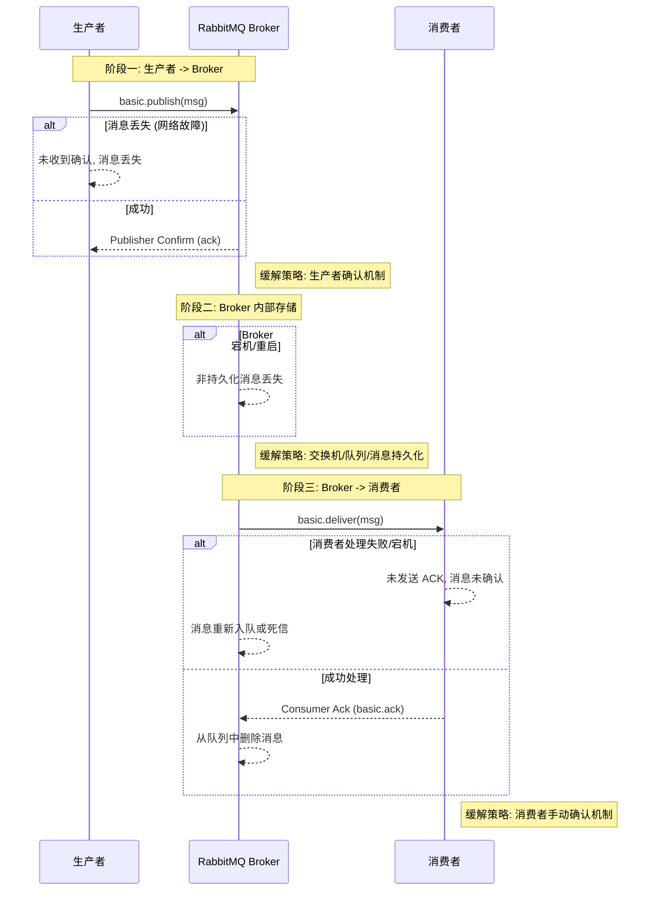
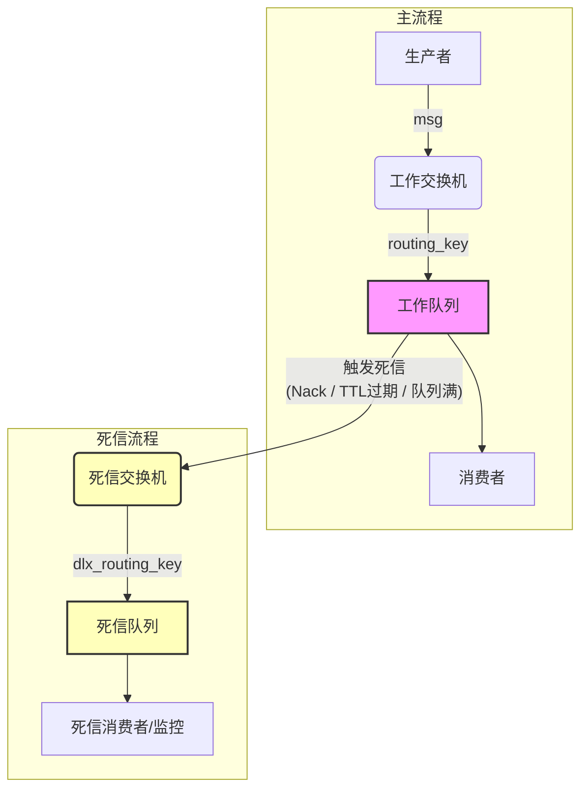
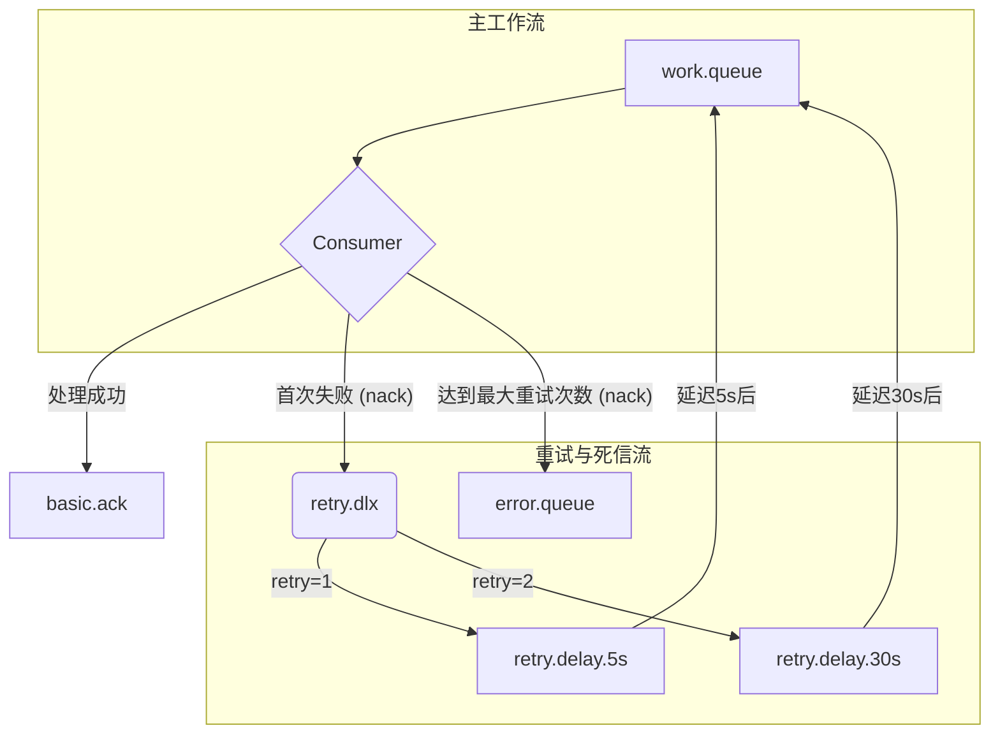

可靠性架构：面向技术面试的 RabbitMQ 高级模式深度解析


引言


目的

本报告旨在为准备技术面试的开发者提供一份关于 RabbitMQ 高级概念的全面、专家级的学习资料。报告将深入剖析分布式消息系统中常见的可靠性、幂等性与顺序性挑战，并针对性地讲解 RabbitMQ 提供的解决方案。其核心目标是让读者能够自信、准确地回答关于消息系统设计的高阶面试问题。

受众

本报告面向具有一定技术背景，特别是 Java 开发经验的“务实型开发者”。这些开发者追求对技术“是什么”、“为什么”以及最重要的“如何做”有深入且可操作的理解。报告中的理论阐述、架构图示和可运行的 Java 代码示例，都将围绕着在面试中证明专业能力这一最终目标展开。

结构概览

报告的结构遵循一个逻辑递进的路径。首先，我们将从构建可靠消息系统的基石——保证消息至少一次送达（At-Least-Once Delivery）——开始。在此基础上，我们将探讨更高级的流程控制机制，如死信队列和延迟消息。最后，我们将深入到消费者端的正确性保障，涵盖重试、幂等性（有效一次处理，Effectively-Once Processing）和消息顺序性。报告的结尾部分将所有知识点进行提炼，为核心面试问题提供直接、精炼的回答范本。

第一部分：可靠性基石 —— 保证消息传递 (“如何保证消息不丢失？”)

本节将完整剖析一条消息从生产者发出，到被消费者成功处理的整个生命周期中的可靠性保障。这是构建任何可靠消息传递系统的基础。

1.1 至少一次送达的三方责任模型

概念：在分布式系统中，消息丢失可能发生在三个关键阶段：从生产者到代理（Broker），在代理内部存储时，以及从代理到消费者。要实现真正的可靠性，必须对这三个阶段都进行保障 1。这构成了一个生产者、代理和消费者之间的三方责任模型。
图示：以下是一个高级时序图，展示了三个潜在的故障阶段及其对应的缓解策略（生产者确认、持久化、消费者确认）。

Code snippet



1.2 阶段一：从生产者到代理的保证

问题：网络是不可靠的。一个标准的 basicPublish 调用是“发后即忘”的，它不会返回任何关于代理是否成功接收到消息的信息。如果消息在传输过程中丢失，生产者将毫不知情 1。
解决方案 A：生产者确认 (Publisher Confirms)：这是 RabbitMQ 对 AMQP 协议的一个扩展，为发布的消息提供了类似 TCP 的确认机制 3。
开启确认模式：通过调用 channel.confirmSelect() 方法，可以将信道（Channel）设置为确认模式 4。
策略 1：同步单条确认
说明：发布一条消息后，立即调用 channel.waitForConfirmsOrDie()。此方法会阻塞，直到收到服务器的确认。如果收到 nack 或者超时，它会抛出异常。这种方式实现简单，但严重影响性能，只适用于吞吐量要求极低但至关重要的任务 4。
Java 代码示例：
Java
// 开启确认模式
channel.confirmSelect();
String message = "Hello, single confirm!";
try {
    channel.basicPublish("", QUEUE_NAME, null, message.getBytes());
    // 等待确认，超时时间为5秒
    channel.waitForConfirmsOrDie(5_000);
    System.out.println(" [x] Sent '" + message + "' and confirmed.");
} catch (IOException | InterruptedException | TimeoutException e) {
    System.err.println("Message was not confirmed in time.");
    // 在此处理重发逻辑
}


策略 2：同步批量确认
说明：发布一批消息后，再调用一次 waitForConfirmsOrDie()。这种方式提升了吞吐量，但缺点是如果出现 nack，难以确定是批次中的哪一条消息失败了 4。
Java 代码示例：
Java
channel.confirmSelect();
int batchSize = 100;
for (int i = 0; i < batchSize; i++) {
    String message = "Message " + i;
    channel.basicPublish("", QUEUE_NAME, null, message.getBytes());
}
try {
    channel.waitForConfirmsOrDie(5_000);
    System.out.println(" [x] Sent batch of " + batchSize + " messages and confirmed.");
} catch (IOException | InterruptedException | TimeoutException e) {
    System.err.println("Batch was not confirmed in time.");
    // 整个批次都需要重发或处理
}


策略 3：异步确认 (推荐)
说明：这是性能最高、功能最强的推荐方式。通过 channel.addConfirmListener() 注册一个回调监听器，该监听器包含处理 ack 和 nack 的方法。为了将异步返回的确认与已发送的消息关联起来，通常会使用一个 ConcurrentNavigableMap 来存储待确认的消息，键为消息的序列号（sequenceNumber），值为消息内容。收到 ack 后，从 Map 中移除消息；收到 nack 后，可以精确定位失败的消息并进行重试 4。
Java 代码示例：
Java
import com.rabbitmq.client.Channel;
import com.rabbitmq.client.ConfirmCallback;
import java.util.concurrent.ConcurrentNavigableMap;
import java.util.concurrent.ConcurrentSkipListMap;

//... 在生产者类中...
channel.confirmSelect();

// 使用 ConcurrentSkipListMap 存储待确认消息
ConcurrentNavigableMap<Long, String> outstandingConfirms = new ConcurrentSkipListMap<>();

// 确认回调
ConfirmCallback cleanOutstandingConfirms = (sequenceNumber, multiple) -> {
    if (multiple) {
        // 如果 multiple 为 true，表示所有小于等于 sequenceNumber 的消息都已确认
        ConcurrentNavigableMap<Long, String> confirmed = outstandingConfirms.headMap(sequenceNumber, true);
        confirmed.clear();
    } else {
        // 只确认当前 sequenceNumber 的消息
        outstandingConfirms.remove(sequenceNumber);
    }
    System.out.println("Message(s) with sequence number " + sequenceNumber + " confirmed.");
};

// Nack 回调
ConfirmCallback nackCallback = (sequenceNumber, multiple) -> {
    String body = outstandingConfirms.get(sequenceNumber);
    System.err.format(
        "Message with body %s has been nack-ed. Sequence number: %d, multiple: %b%n",
        body, sequenceNumber, multiple
    );
    // 在这里处理消息重发逻辑
    cleanOutstandingConfirms.handle(sequenceNumber, multiple);
};

channel.addConfirmListener(cleanOutstandingConfirms, nackCallback);

// 发布消息
String message = "Hello, async confirm!";
long nextSeqNo = channel.getNextPublishSeqNo();
outstandingConfirms.put(nextSeqNo, message);
channel.basicPublish("", QUEUE_NAME, null, message.getBytes());


解决方案 B：处理不可路由的消息 (Publisher Returns)：
问题：一条消息可能被代理成功接收（因此生产者会收到 ack 确认），但随后因为无法路由到任何队列而被丢弃（例如，错误的交换机名称、不匹配的路由键）。仅靠生产者确认机制无法捕获这种逻辑错误 2。
解决方案：在 basicPublish 时将 mandatory 标志位设为 true，并为信道添加一个 ReturnListener。如果一条 mandatory 消息无法被路由，代理会通过 basic.return 命令将其返回给生产者，并触发 ReturnListener 的回调。这个回调会在 ConfirmListener 的 ack 回调之前被调用 7。
Java 代码示例：
Java
import com.rabbitmq.client.AMQP;
import com.rabbitmq.client.ReturnListener;
import java.io.IOException;

//... 在生产者类中...
channel.addReturnListener((replyCode, replyText, exchange, routingKey, properties, body) -> {
    String message = new String(body);
    System.err.println("Message returned: " + message);
    System.err.println("Reply Code: " + replyCode);
    System.err.println("Reply Text: " + replyText);
    System.err.println("Exchange: " + exchange);
    System.err.println("Routing Key: " + routingKey);
    // 在这里处理不可路由的消息，例如记录日志或告警
});

// 发布一条不可路由的消息，注意 mandatory=true
String unroutableMessage = "This message will be returned.";
channel.basicPublish("non-existent-exchange", "any-key", true, null, unroutableMessage.getBytes());


生产者确认和返回机制是互补的。确认机制保证消息到达代理，而返回机制保证消息可被路由。一个完整的生产者实现必须同时处理这两种回调，才能区分“成功入队”和“已接收但不可路由”这两种情况。

1.3 阶段二：代理内部的保证 (持久化)

问题：如果 RabbitMQ 代理节点崩溃或重启，所有内存中的非持久化消息、队列和交换机都会丢失 9。
解决方案 (三位一体的配置)：
持久化的交换机 (Durable Exchange)：声明交换机时，将 durable 标志设为 true，确保其元数据在代理重启后能够恢复 2。
Java 代码: channel.exchangeDeclare("my-durable-exchange", "direct", true); 8
持久化的队列 (Durable Queue)：声明队列时，将 durable 标志设为 true，确保其元数据及其持有的持久化消息在代理重启后能够恢复 10。
Java 代码: channel.queueDeclare("my-durable-queue", true, false, false, null); 11
持久化的消息 (Persistent Message)：这是最关键的一环。消息本身必须被标记为持久化，通过设置 deliveryMode=2 (或在 Java 客户端中使用 MessageProperties.PERSISTENT_TEXT_PLAIN)。需要强调的是，这三者缺一不可：持久化消息存入非持久化队列，重启后消息会丢失；非持久化消息存入持久化队列，重启后消息同样会丢失 9。
Java 代码: channel.basicPublish("my-durable-exchange", "routing-key", MessageProperties.PERSISTENT_TEXT_PLAIN, message.getBytes()); 13
现代实践：Quorum 队列：对于需要高可用和数据安全的场景，现代 RabbitMQ 版本推荐使用 Quorum 队列。它基于 Raft 共识算法，设计上就是持久化和多副本复制的，是传统镜像队列的更优替代方案 14。
可靠性是一条链，而不是单一的设置。一个常见的误解是认为仅将消息标记为“持久化”就足够了。真正的可靠性要求在生产者、代理和消费者三个环节都采取措施。任何一个环节的疏忽（例如忘记使用生产者确认）都会破坏整个保证链。

1.4 阶段三：从代理到消费者的保证

问题：消费者可能收到了消息，但在完全处理完业务逻辑之前就崩溃了。如果代理认为消息已经成功投递，那么这条消息将永久丢失 3。
解决方案：手动确认 (Manual Acknowledgements)：
禁用自动确认：默认的 autoAck=true 模式是危险的“发后即忘”模式。在这种模式下，消息在通过 TCP 套接字发送给消费者的那一刻就被认为是已成功投递，如果消费者此时失败，消息就会丢失 3。因此，实现可靠消费的第一步总是在消费时设置
autoAck=false。
肯定确认 (basicAck)：消费者必须在成功完成其业务逻辑之后，显式调用 channel.basicAck(deliveryTag, false)。这会通知代理可以安全地从队列中删除该消息 3。
否定确认 (basicNack / basicReject)：当消费者处理消息失败时，可以通过这两个方法来通知代理。其中 requeue 标志位至关重要：
requeue=true：将消息重新放回队列。对于“毒丸消息”（永远无法成功处理的消息），这可能导致无限循环。
requeue=false：将消息从队列中丢弃。如果队列配置了死信交换机（Dead Letter Exchange），消息将被发送到那里，而不是被简单丢弃 18。
Java 代码示例：一个完整的消费者实现，展示了 autoAck=false、处理业务逻辑的 try/catch 块，以及在成功时调用 basicAck，失败时调用 basicNack。
Java
import com.rabbitmq.client.Channel;
import com.rabbitmq.client.DeliverCallback;
import java.io.IOException;

//... 在消费者类中...
boolean autoAck = false; // 关键：禁用自动确认
channel.basicConsume(QUEUE_NAME, autoAck, (consumerTag, delivery) -> {
    long deliveryTag = delivery.getEnvelope().getDeliveryTag();
    String message = new String(delivery.getBody(), "UTF-8");
    System.out.println(" [x] Received '" + message + "'");

    try {
        // 模拟业务处理
        processMessage(message);
        // 业务处理成功，发送肯定确认
        channel.basicAck(deliveryTag, false);
        System.out.println(" [x] Done processing and acked.");
    } catch (Exception e) {
        System.err.println("Failed to process message: " + message);
        // 业务处理失败，发送否定确认，不重新入队 (requeue=false)
        // 消息将被丢弃或进入死信队列
        channel.basicNack(deliveryTag, false, false);
        System.err.println(" [x] Nacked message.");
    }
}, consumerTag -> {});


第二部分：高级流程控制 —— 死信与延迟队列

本节将基于第一部分建立的可靠性基础，探讨如何处理无法立即处理或需要稍后处理的消息，引入更复杂的、更具弹性的消息处理模式。

2.1 死信交换机 (DLX)：失败消息的“收容所”

概念：死信交换机（Dead Letter Exchange, DLX）本身不是一种特殊类型的交换机，它就是一个普通的交换机（如 direct, fanout, topic），被用作“死信”消息的目标 19。当一条消息在队列中变成“死信”时，RabbitMQ 会自动地将它重新发布到配置的 DLX 上。
成为死信的三个条件：
消息被否定确认：消费者调用 basic.reject 或 basic.nack，并且 requeue 参数为 false 20。这是处理业务逻辑失败消息最常见的场景。
消息 TTL 过期：消息在队列中的存留时间超过了设置的 TTL (Time-To-Live)，并且此时还未被消费 21。这是实现延迟队列的一种方式。
队列达到最大长度：消息被发送到一个已满的队列（达到了 max-length 或 max-length-bytes 限制）23。
配置方式：
通过队列参数：在声明队列时，通过 x-arguments 指定 x-dead-letter-exchange 和可选的 x-dead-letter-routing-key 19。这种方式缺乏灵活性，因为修改配置需要重新声明队列，通常不推荐在生产环境中使用。
Java
Map<String, Object> args = new HashMap<>();
args.put("x-dead-letter-exchange", "my_dlx");
args.put("x-dead-letter-routing-key", "dead-letter-key");
channel.queueDeclare("work_queue", true, false, false, args);


通过策略 (Policy)：这是推荐的方式。通过 RabbitMQ 的管理界面或 rabbitmqctl 命令设置策略，可以动态地为一组符合特定模式（如 .*）的队列应用 DLX 配置，而无需修改应用代码或重启服务 19。
图示：一个清晰的架构图，展示了工作队列（Work Queue）如何通过 DLX 策略将死信消息路由到死信交换机（DLX），并最终进入死信队列（DLQ）。

Code snippet



2.2 实现延迟队列

应用场景：延迟消息在很多场景下都非常有用，例如：用户下单后半小时未支付则自动取消订单；实现失败任务的延迟重试；定时发送通知等 25。
方法一：TTL + DLX 模式
架构：该模式巧妙地利用了消息 TTL 过期会成为死信的特性。其架构如下：
创建一个“延迟队列”（例如 delay.queue.10s），不声明任何消费者。
为这个队列设置 x-message-ttl 属性，值为延迟时间（毫秒）。
为这个队列配置 x-dead-letter-exchange，指向一个工作交换机。
生产者将需要延迟的消息发送到这个“延迟队列”。消息将在队列中“停留”指定的 TTL 时间，过期后自动成为死信，被路由到工作交换机，并最终进入真正的工作队列被消费者处理 26。
Java 代码示例：
Java
// 生产者端
// 1. 声明工作交换机和工作队列
channel.exchangeDeclare("work_exchange", "direct");
channel.queueDeclare("work_queue", true, false, false, null);
channel.queueBind("work_queue", "work_exchange", "work_key");

// 2. 声明延迟队列，并配置 TTL 和 DLX
Map<String, Object> args = new HashMap<>();
args.put("x-message-ttl", 10000); // 延迟10秒
args.put("x-dead-letter-exchange", "work_exchange");
args.put("x-dead-letter-routing-key", "work_key");
channel.queueDeclare("delay_queue_10s", true, false, false, args);

// 3. 发送消息到延迟队列
String message = "This message is delayed for 10 seconds.";
channel.basicPublish("", "delay_queue_10s", null, message.getBytes());

// 消费者端只需监听 "work_queue" 即可


致命缺陷：队头阻塞 (Head-of-Line Blocking)：这是一个非常关键的知识点。RabbitMQ 的经典队列只会在消息到达队头时检查其是否过期 22。这意味着，如果一条 TTL 为 10 分钟的消息排在一条 TTL 为 10 秒的消息前面，那么后面这条 10 秒的消息必须等待 10 分钟后，前面的消息过期或被消费，它到达队头才会被检查并标记为过期。这使得消息的实际延迟时间变得不可控，因此该方案仅适用于延迟时间固定的场景。
队头阻塞图示：
Code snippet
```mermaid
graph TD
    subgraph "延迟队列 (delay_queue)"
        direction LR
        Msg1("消息1<br/>TTL: 10分钟") --> Msg2("消息2<br/>TTL: 10秒")
    end
    subgraph "工作队列 (work_queue)"
         direction LR
         Consumer[消费者]
    end

    Msg1 -- "10分钟后过期<br/>(到达队头)" --> DLX(DLX)
    DLX --> Consumer

    Note right of Msg2: 我必须等待消息1过期后<br/>才能到达队头并被检查TTL,<br/>实际延迟远超10秒!
```


方法二：使用 rabbitmq-delayed-message-exchange 插件 (推荐)
概念：这是一个官方插件，为 RabbitMQ 增加了一种新的交换机类型 x-delayed-message。这种交换机在内部处理延迟逻辑（通常使用一个基于时间的优先队列），完全避免了队头阻塞问题 25。
用法：
在 RabbitMQ 服务器上启用插件: rabbitmq-plugins enable rabbitmq_delayed_message_exchange。
声明交换机时，类型指定为 x-delayed-message，并通过 x-delayed-type 参数指定其底层的路由逻辑（如 direct）。
生产者发布消息时，在消息的 headers 中添加一个 x-delay 属性，值为延迟的毫秒数 29。
Java 代码示例：
Java
// 生产者端
// 1. 声明一个延迟交换机
Map<String, Object> args = new HashMap<>();
args.put("x-delayed-type", "direct"); // 底层路由逻辑为 direct
channel.exchangeDeclare("delayed_exchange", "x-delayed-message", true, false, args);

// 2. 声明并绑定工作队列
channel.queueDeclare("work_queue", true, false, false, null);
channel.queueBind("work_queue", "delayed_exchange", "work_key");

// 3. 发布带 x-delay头的消息
String message = "This message is delayed for 10 seconds accurately.";
Map<String, Object> headers = new HashMap<>();
headers.put("x-delay", 10000); // 延迟10秒
AMQP.BasicProperties props = new AMQP.BasicProperties.Builder().headers(headers).build();
channel.basicPublish("delayed_exchange", "work_key", props, message.getBytes());

// 消费者逻辑不变，仍然监听 "work_queue"


DLX 不仅仅是存放“死亡”消息的垃圾桶，它更是实现复杂、可控的重试机制的基石。通过将处理失败的消息 nack 到一个 DLX，再由该 DLX 路由到一个延迟队列，我们就可以在一段可控的退避（backoff）时间后，将消息重新送回原始的工作队列进行重试。这使得 DLX 从一个被动的“墓地”转变为弹性系统中的一个主动组件。

特性
TTL + DLX 方案
延迟交换机插件
实现机制
消息TTL过期 + 死信交换机
特殊的 x-delayed-message 交换机类型
消息顺序
不可靠；存在队头阻塞问题 22
可靠；消息按其延迟时间排序处理 29
延迟精度
低；实际延迟可能远大于设定值
高；延迟时间准确
设置复杂度
高；需要配置多个队列、交换机和绑定
低；只需一个特殊交换机
Broker 依赖
标准 RabbitMQ 功能
需要启用 rabbitmq_delayed_message_exchange 插件
最佳应用场景
延迟时间固定的简单场景（如所有重试间隔都是5分钟）
延迟时间可变或要求高精度的场景（推荐的通用方案）


第三部分：架构正确性 —— 幂等、重试与顺序

本节将聚焦于消费者端的逻辑，解决分布式系统中的现实挑战：如何处理失败、重复以及乱序的消息。

3.1 构建弹性消费者：实用的重试模式

概念：结合 DLX 和延迟队列，可以构建一个带指数退避（Exponential Backoff）的健壮重试机制。当消息处理失败时，不是立即重试，而是等待一个逐渐增长的时间间隔再试，避免因暂时性问题（如依赖服务不可用）而对系统造成冲击。
架构：
主流程：消费者从“工作队列”（work.queue）获取消息。
首次失败：处理失败后，消费者 nack 消息（requeue=false）。消息被发送到“重试DLX”（retry.dlx）。消费者在 nack 之前，会检查或添加一个重试次数的 header。
路由到延迟队列：retry.dlx 根据消息的重试次数（或一个特定的 routing key）将其路由到不同的“重试延迟队列”，例如 retry.delay.5s, retry.delay.30s, retry.delay.5m。
延迟等待：每个延迟队列都使用延迟交换机插件来实现精确的延迟。例如，retry.delay.5s 会将消息延迟 5 秒。
重新入队：延迟时间到后，消息从延迟队列被重新发布到原始的“工作队列”，等待下一次处理。
最终失败：当重试次数达到上限时，消费者不再将其路由到延迟队列，而是路由到一个最终的“错误队列”（error.queue 或 parking-lot.queue），等待人工介入或分析。
图示：

Code snippet



Java 消费者逻辑 (概念)：

Java


//... 在 handleDelivery 方法中...
try {
    processMessage(message);
    channel.basicAck(deliveryTag, false);
} catch (Exception e) {
    Map<String, Object> headers = properties.getHeaders();
    long retryCount = (headers == null ||!headers.containsKey("x-retry-count"))? 0L : (Long) headers.get("x-retry-count");

    if (retryCount < MAX_RETRIES) {
        // 增加重试次数
        Map<String, Object> newHeaders = new HashMap<>();
        if (headers!= null) {
            newHeaders.putAll(headers);
        }
        newHeaders.put("x-retry-count", retryCount + 1);
        AMQP.BasicProperties newProps = properties.builder().headers(newHeaders).build();
        
        // 发布到重试交换机，让其根据新的重试次数路由到对应的延迟队列
        // 这里假设延迟队列的绑定是基于消息属性的，或者直接发布到对应的延迟队列
        // 为了简化，这里直接 nack，并依赖 DLX 的 routing key
        channel.basicNack(deliveryTag, false, false); 
    } else {
        // 达到最大重试次数，发送到错误队列
        System.err.println("Max retries reached. Sending to error queue.");
        channel.basicPublish("error_exchange", "error_key", properties, body);
        channel.basicAck(deliveryTag, false); // 确认原消息，因为它已被手动处理
    }
}


3.2 保证消息不重复：幂等消费者 ("如何保证消息不重复？")

“为什么”会产生重复消息：首先必须明确，只要追求“至少一次送达”，就无法从根本上避免重复消息的产生 1。典型的重复场景包括：
生产者重发：生产者的 Publisher Confirm 的 ack 确认消息在网络中丢失，导致生产者超时重发已经成功到达代理的消息 1。
消费者重投：消费者成功处理了消息，但在发送 basicAck 之前崩溃或与代理断开连接。代理未收到确认，会认为消息未被处理，从而将其重新投递给其他（或同一个恢复后的）消费者 17。
“如何做”：幂等消费者模式
核心思想：幂等性（Idempotence）指一个操作执行一次和执行多次产生的效果是相同的。要实现消费者幂等，生产者必须为每条消息赋予一个全局唯一的 ID（例如 UUID 或由业务关键信息组成的唯一标识）。消费者则需要维护一个持久化的记录，追踪所有已成功处理的消息 ID。在处理新消息时，首先检查其 ID 是否已被处理过，如果是，则直接丢弃（但仍需发送 ack），不执行业务逻辑 31。
实现方案一：使用 Redis
机制：这是高吞吐量、低延迟场景的理想选择。利用 Redis 的 SETNX (SET if Not eXists) 命令的原子性。消费者在处理消息前，尝试将消息的唯一 ID 作为 key 存入 Redis。如果 SETNX 返回 1，表示 key 是新的，消费者继续执行业务逻辑；如果返回 0，表示 key 已存在，说明是重复消息，消费者应跳过业务逻辑，直接 ack 34。
Java 代码示例 (使用 Jedis)：
Java
import redis.clients.jedis.Jedis;

//... 在消费者类中，假设已注入 Jedis 实例...
private Jedis jedis;
private static final String PROCESSED_MESSAGES_KEY_PREFIX = "processed:msg:";
private static final int EXPIRATION_SECONDS = 24 * 60 * 60; // 24小时

//... 在 handleDelivery 方法中...
String messageId = properties.getMessageId(); // 假设生产者在 properties 中设置了 messageId

if (messageId == null |


| messageId.isEmpty()) {
// 无法进行幂等性检查，根据业务决定是处理还是拒绝
channel.basicNack(deliveryTag, false, false);
return;
}


    String redisKey = PROCESSED_MESSAGES_KEY_PREFIX + messageId;
    
    // SETNX 是原子操作
    long setResult = jedis.setnx(redisKey, "processed");

    if (setResult == 1) { // 成功设置，是新消息
        // 设置过期时间，防止 Redis 无限增长
        jedis.expire(redisKey, EXPIRATION_SECONDS);
        try {
            processBusinessLogic(message);
            channel.basicAck(deliveryTag, false);
        } catch (Exception e) {
            // 业务处理失败，需要删除 Redis key 以便重试
            jedis.del(redisKey);
            channel.basicNack(deliveryTag, false, true); // 重新入队以便重试
        }
    } else { // key 已存在，是重复消息
        System.out.println("Duplicate message detected: " + messageId);
        // 直接确认，丢弃消息
        channel.basicAck(deliveryTag, false);
    }
    ```


实现方案二：使用数据库
机制：当业务处理本身就需要与数据库交互时，可以将幂等性检查整合到同一个数据库事务中。创建一个 processed_messages 表，将消息 ID 设置为主键或唯一索引。在处理业务逻辑前，消费者尝试将当前消息的 ID INSERT 到该表中。如果插入成功，则执行业务逻辑；如果因主键冲突而插入失败，则说明是重复消息 33。
Java 代码示例 (使用 JDBC 概念)：
Java
//... 在 handleDelivery 方法中，假设有 Connection conn...
String messageId = properties.getMessageId();
conn.setAutoCommit(false); // 开启事务

try (PreparedStatement checkStmt = conn.prepareStatement("INSERT INTO processed_messages (message_id) VALUES (?)")) {
    checkStmt.setString(1, messageId);
    checkStmt.executeUpdate(); // 尝试插入ID

    // 如果上面没有抛出唯一约束异常，说明是新消息
    //... 在这里执行业务逻辑的数据库操作...

    conn.commit(); // 提交整个事务
    channel.basicAck(deliveryTag, false); // 事务成功后才确认消息

} catch (SQLException e) {
    // 检查是否是唯一约束冲突异常
    if (isUniqueConstraintViolation(e)) {
        System.out.println("Duplicate message detected: " + messageId);
        conn.rollback(); // 回滚事务
        channel.basicAck(deliveryTag, false); // 重复消息，直接确认
    } else {
        // 其他数据库错误，处理失败
        conn.rollback();
        channel.basicNack(deliveryTag, false, true); // 重新入队
    }
}


构建一个真正健壮的系统，不仅要考虑消息代理的可靠性，还必须管理其依赖项的可靠性。用于幂等性检查的 Redis 或数据库本身也可能成为单点故障。如果幂等性存储不可用，整个“有效一次”的保证就会失效。因此，一个完整的解决方案必须将业务逻辑、幂等性检查和消息确认纳入同一个事务边界或补偿逻辑中。

3.3 保证消息顺序性 ("如何保证消息有序？")

基线保证：RabbitMQ 在特定条件下可以保证消息的先进先出（FIFO）顺序：消息由单个生产者通过单个信道发布，经过一个交换机，路由到一个队列，并最终由单个消费者进行消费 12。
并行化带来的问题：为了提高处理能力，最常见的做法是为一个队列增加多个消费者。一旦这样做，全局的顺序性保证就会被打破。RabbitMQ 会以轮询（Round-Robin）的方式将消息分发给消费者。一个处理速度快的消费者可能先处理完消息 #3，而另一个速度慢的消费者此时可能还在处理消息 #2 39。
图示：多消费者破坏顺序性

Code snippet
```mermaid

graph TD
    subgraph "消息源"
        P[生产者] --> Q[队列: [Msg3, Msg2, Msg1]]
    end
    
    subgraph "并行消费"
        Q -- "分发" --> C1[消费者1 (慢)]
        Q -- "分发" --> C2[消费者2 (快)]
    end

    subgraph "处理结果 (乱序)"
        C1 -- "处理 Msg1" --> R1{结果1}
        C2 -- "处理 Msg2" --> R2{结果2}
        C2 -- "处理 Msg3" --> R3{结果3}
    end

    R3 -- "先完成" --> R2 -- "后完成" --> R1 -- "最后完成"
```


可扩展的解决方案：一致性哈希交换机 (Consistent Hash Exchange)
概念：这是一个插件提供的交换机类型。它不根据路由键的精确匹配或模式匹配来路由，而是根据路由键的哈希值来决定将消息发送到哪个队列。关键在于，相同的路由键总是会被哈希到相同的值，因此总会被路由到同一个队列 41。
架构：
创建多个队列，例如 order.queue.1, order.queue.2, order.queue.3。
为每个队列分配一个专门的消费者。
将这些队列绑定到一个类型为 x-consistent-hash 的交换机上。
生产者在发送与某个特定实体（如一个订单）相关的消息时，统一使用该实体的唯一标识（如 order_id_123）作为路由键。
交换机根据 order_id_123 的哈希值，始终将所有关于这个订单的消息路由到同一个队列（例如 order.queue.2）。
结果：order.queue.2 的消费者会按顺序处理所有关于 order_id_123 的消息。同时，其他订单（如 order_id_456）的消息可能被路由到 order.queue.1，由另一个消费者并行处理。这样就在保证了单个实体内部消息顺序的前提下，实现了不同实体间的并行处理。
Java 代码示例 (声明与发布)：
Java
// 声明一致性哈希交换机
// 需要先在服务器上启用 rabbitmq_consistent_hash_exchange 插件
channel.exchangeDeclare("orders-exchange", "x-consistent-hash", true);

// 声明并绑定多个队列
for (int i = 0; i < NUM_QUEUES; i++) {
    String queueName = "order-queue-" + i;
    channel.queueDeclare(queueName, true, false, false, null);
    // 绑定时，routingKey 代表权重，这里设为 "1" 表示权重均等
    channel.queueBind(queueName, "orders-exchange", "1");
}

// 生产者发布消息
String orderId = "order_123"; // 这是一个订单的所有相关消息
String message1 = "Order created";
String message2 = "Order paid";
String message3 = "Order shipped";

// 使用相同的 routing key (orderId) 来保证这些消息被路由到同一个队列
channel.basicPublish("orders-exchange", orderId, null, message1.getBytes());
channel.basicPublish("orders-exchange", orderId, null, message2.getBytes());
channel.basicPublish("orders-exchange", orderId, null, message3.getBytes());


顺序性与并行性是分布式系统中的一个经典权衡。绝对的全局顺序性意味着单点处理，这会成为性能瓶颈。一致性哈希交换机提供了一种优雅的折中方案：它将问题从“保证所有消息的全局顺序”转变为“保证相关消息的局部顺序”，这对于大多数业务场景来说，既满足了业务需求，又具备了水平扩展的能力。

第四部分：面试精华 —— 核心问题回答范本

本节将前述的深入分析提炼为直接、结构化的回答，旨在帮助您在面试中清晰、自信地展示您的专业知识。

4.1 回答“如何保证消息不丢失？”

可以从三个层面来回答，体现出对消息完整生命周期的系统性思考：
生产者端保证：“首先，为了确保消息从生产者可靠地发送到 RabbitMQ Broker，我会启用生产者确认机制（Publisher Confirms）。对于高性能场景，我会选择异步确认模式，通过回调和内部的待确认消息集合来精确跟踪每条消息的发送状态，并对发送失败（nack）的消息进行重试。同时，为了防止消息因路由错误而被 Broker 默默丢弃，我会在发布时设置 mandatory 标志位，并配合使用返回监听器（Publisher Returns）来捕获并处理那些不可路由的消息。”
Broker 端保证：“其次，为了确保消息在 Broker 端不会因服务器重启或崩溃而丢失，我会进行全面的持久化配置。这包括三个关键点：声明持久化的交换机（Durable Exchange）、声明持久化的队列（Durable Queue），以及在发布消息时将其投递模式（deliveryMode）设置为持久化。这三者缺一不可，共同保证了消息及其路由信息的磁盘存储。”
消费者端保证：“最后，为了确保消息在被消费者成功处理之前不会从队列中移除，我会禁用自动确认（autoAck=false），并实现手动确认机制。在我的消费者代码中，只有当业务逻辑完全成功执行后，才会调用 basicAck 来肯定确认消息。如果处理过程中发生异常，我会根据情况调用 basicNack，可以选择将消息重新入队重试，或者在配置了死信队列（DLX）的情况下，将其发送到死信队列进行后续分析或处理。”

4.2 回答“如何保证消息不重复？”

首先，要点明问题产生的根源，再给出解决方案和不同实现方式的权衡：
“‘至少一次送达’的可靠性保证机制，本身就意味着在网络分区或确认消息丢失等异常情况下，消息可能会被重复投递。为了解决这个问题，实现‘有效一次处理’（Effectively-Once Processing），我会在消费端实现幂等消费者（Idempotent Consumer）模式。”
“具体实现上，这要求生产者在发送每条消息时，都在其属性中附加一个全局唯一的业务ID（例如订单ID或UUID）。消费者侧则需要维护一个持久化的、已处理消息ID的记录。”
“根据应用场景和性能要求，我有两种主流的实现策略：”
高性能场景 (Redis)：“对于吞吐量要求高的系统，我会使用 Redis 的原子命令 SETNX。在处理每条消息前，我以消息的唯一ID为键，尝试在 Redis 中设置一个值。如果 SETNX 返回成功，说明这是条新消息，我便执行业务逻辑，并在处理成功后 ack 消息。如果返回失败，则表明该ID已存在，是重复消息，我将直接 ack 消息，跳过业务逻辑。”
事务一致性场景 (数据库)：“如果业务逻辑本身就需要与关系型数据库交互，我会将幂等性检查整合到同一个数据库事务中。我会设计一个‘已处理消息表’，并将消息ID设为主键。在开启事务后，首先尝试将消息ID插入此表，然后执行业务逻辑的数据库操作，最后提交事务。如果插入ID时因主键冲突而失败，说明是重复消息，我会回滚事务并直接 ack 消息。这样可以保证业务操作和幂等性记录的原子性。”

4.3 回答“如何保证消息有序？”

这个问题需要分场景讨论，展示出对不同业务需求和架构权衡的理解：
“RabbitMQ 对消息顺序性的保证取决于消费模式。我会根据业务对顺序性的具体要求和对系统吞吐量的需求，选择不同的方案：”
场景一：全局严格有序：“如果业务要求所有消息都必须维持严格的先进先出（FIFO）顺序，那么唯一的解决方案是使用一个队列，并且只配置一个单线程的消费者。这种架构可以保证消息被顺序地接收和处理，但它的缺点是牺牲了并行处理能力，消费者的处理速度会成为整个系统的瓶颈。”
场景二：局部有序与高吞吐量：“在大多数实际应用中，我们通常需要保证的是‘局部有序’，即与同一实体（例如同一个用户、同一笔订单）相关的消息需要按顺序处理，而不同实体间的消息则可以并行处理以提高系统吞-吐量。为了实现这种可扩展的有序消费，我会使用 RabbitMQ 的一致性哈希交换机插件（Consistent Hash Exchange）。”
“我的具体做法是：设置多个队列，每个队列都有一个独立的消费者。生产者在发送消息时，使用能够标识业务实体的字段（如 order_id）作为消息的 routing key。一致性哈希交换机会根据这个 routing key 的哈希值，确保所有与同一个订单相关的消息始终被路由到同一个队列中。这样，每个消费者负责一部分订单，并在其负责的范围内保证了消息的顺序性，而整个系统则可以通过增加队列和消费者的数量来水平扩展。”
