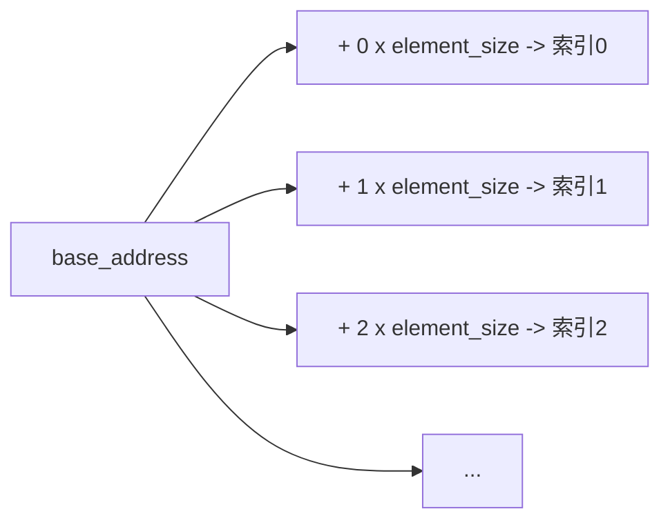
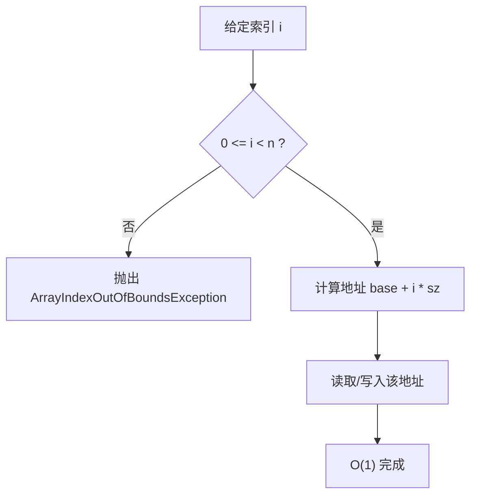

# 数组 (Array) 基础知识

## 1. 数组基础概念

### 1.1 数组定义

- **定义**：数组是存储同一类型数据元素的有序集合，元素在内存中连续存储
- **特点**：
  - 元素类型相同
  - 内存连续分配
  - 通过下标（索引）访问元素
  - 下标从0开始

### 1.2 数组的声明和初始化

#### Java中的数组声明

```java
// 方式1：声明后初始化
int[] arr1;
arr1 = new int[5];  // 创建长度为5的数组

// 方式2：声明时初始化
int[] arr2 = new int[5];

// 方式3：声明并赋值
int[] arr3 = {1, 2, 3, 4, 5};
int[] arr4 = new int[]{1, 2, 3, 4, 5};

// 方式4：动态初始化
int[] arr5 = new int[10];
```

#### 多维数组

```java
// 二维数组声明
int[][] matrix1 = new int[3][4];  // 3行4列
int[][] matrix2 = {{1,2,3}, {4,5,6}, {7,8,9}};

// 不规则二维数组（锯齿数组）
int[][] jaggedArray = new int[3][];
jaggedArray[0] = new int[2];
jaggedArray[1] = new int[3];
jaggedArray[2] = new int[1];

// 三维数组
int[][][] cube = new int[2][3][4];
```

## 2. 数组的内存布局

### 2.1 内存分配

```java
// 数组在内存中的存储示意
int[] arr = {10, 20, 30, 40, 50};
/*
内存地址：  1000  1004  1008  1012  1016
存储值：    10    20    30    40    50
索引：      0     1     2     3     4
*/
```

### 2.2 数组对象结构

- 数组长度（length）
- 数组元素的引用/值
- 对象头信息

## 3. 数组的基本操作

### 3.1 访问元素

```java
int[] arr = {1, 2, 3, 4, 5};
// 读取元素
int first = arr[0];    // 时间复杂度: O(1)
int last = arr[arr.length - 1];

// 修改元素
arr[2] = 100;          // 时间复杂度: O(1)
```

### 3.2 遍历数组

```java
int[] arr = {1, 2, 3, 4, 5};

// 方式1：传统for循环
for (int i = 0; i < arr.length; i++) {
    System.out.println(arr[i]);
}

// 方式2：增强for循环（for-each）
for (int element : arr) {
    System.out.println(element);
}

// 方式3：while循环
int i = 0;
while (i < arr.length) {
    System.out.println(arr[i]);
    i++;
}

// 方式4：使用Stream API (Java 8+)
Arrays.stream(arr).forEach(System.out::println);
```

### 3.3 数组长度和边界检查

```java
int[] arr = new int[5];
System.out.println(arr.length);  // 输出: 5

// 边界检查 - 避免ArrayIndexOutOfBoundsException
if (index >= 0 && index < arr.length) {
    return arr[index];
}
```

## 4. 数组的优缺点

### 4.1 优点

- **随机访问**：通过索引直接访问，时间复杂度O(1)
- **内存效率**：连续存储，缓存友好
- **简单易用**：语法简单，概念直观

### 4.2 缺点

- **固定大小**：一旦创建，大小不可改变
- **插入删除效率低**：需要移动元素，时间复杂度O(n)
- **内存浪费**：可能存在未使用的空间

## 5. 数组 vs 其他数据结构

| 操作 | 数组 | ArrayList | LinkedList |
|------|------|-----------|------------|
| 随机访问 | O(1) | O(1) | O(n) |
| 插入（末尾） | - | O(1) | O(1) |
| 插入（中间） | O(n) | O(n) | O(1) |
| 删除（末尾） | - | O(1) | O(1) |
| 删除（中间） | O(n) | O(n) | O(1) |
| 空间复杂度 | O(n) | O(n) | O(n) |

## 6. 实际应用场景

### 6.1 适合使用数组的场景

- 数据量固定且已知
- 需要频繁随机访问元素
- 对内存使用有严格要求
- 简单的数据存储和访问

### 6.2 不适合使用数组的场景

- 数据量动态变化
- 频繁插入和删除操作
- 不确定数据大小的情况

## 7. 注意事项

### 7.1 空指针异常

```java
int[] arr = null;
// arr.length;  // 会抛出NullPointerException
```

### 7.2 数组越界

```java
int[] arr = new int[5];
// arr[5] = 10;  // 会抛出ArrayIndexOutOfBoundsException
```

### 7.3 数组赋值的陷阱

```java
int[] arr1 = {1, 2, 3};
int[] arr2 = arr1;  // 浅拷贝，arr2指向arr1的内存地址
arr2[0] = 100;      // arr1[0] 也变成了 100

// 正确的数组拷贝
int[] arr3 = Arrays.copyOf(arr1, arr1.length);  // 深拷贝
int[] arr4 = arr1.clone();                      // 浅拷贝（一维数组相当于深拷贝）
```

---

## 8. 图解与示例

### 8.1 数组内存布局（连续地址）



要点：数组支持通过公式 address = base + index × element_size 常数时间定位，带来 O(1) 随机访问。

### 8.2 访问/修改的 O(1) 流程



### 8.3 插入删除的代价可视化（以删除为例）

索引与元素：
```
索引:   0  1  2  3  4
原始:   2  5  7  9  11
删除2:  2  5  9  11
移动:         ↑  ↑
```
删除中间元素需要整体搬移右侧元素，最坏 O(n)。插入中间同理。

### 8.4 示例：不规则二维数组（锯齿）常见坑

```java
int[][] jag = new int[3][];     // 仅分配了行引用
// jag[0][0] = 1; // NPE! 行未初始化
jag[0] = new int[2];            // 逐行分配
jag[1] = new int[3];
jag[2] = new int[1];
jag[0][0] = 1;                  // OK
```

### 8.5 示例：数组与 ArrayList 选择建议

- 已知固定规模、频繁随机访问：优先数组
- 规模可变、末尾增删、需要集合操作：优先 ArrayList（内部即动态数组）

