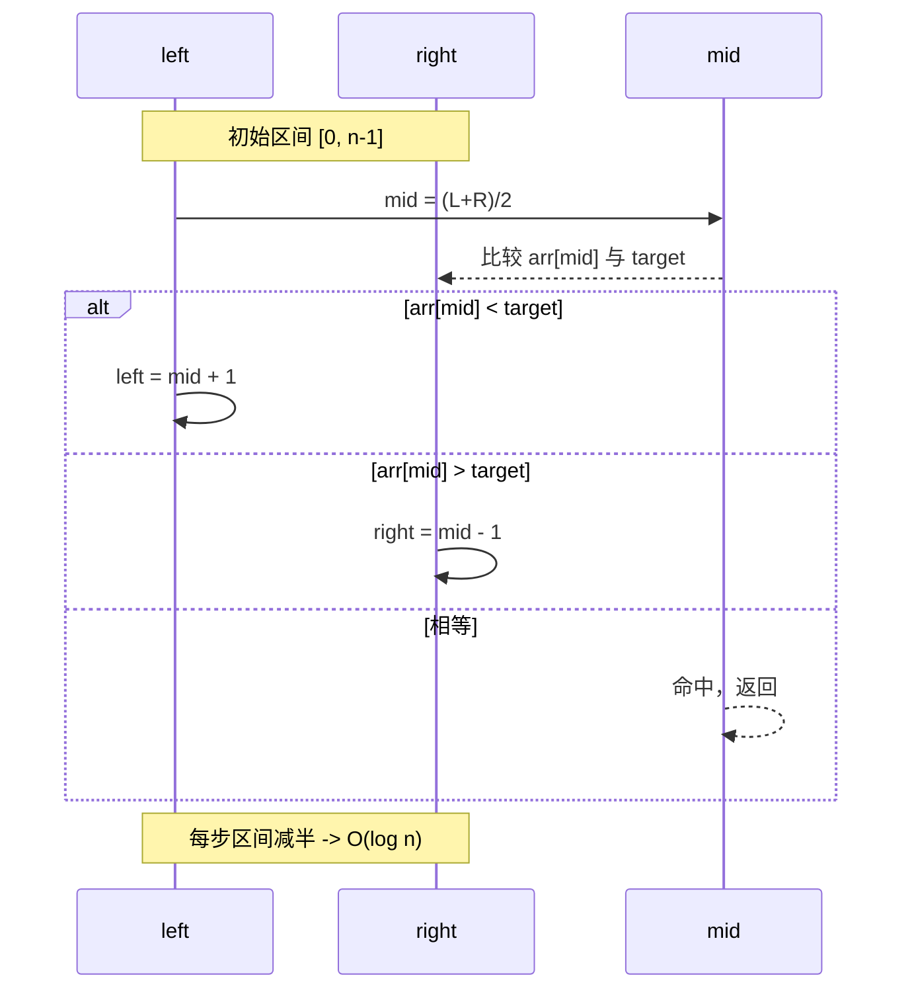
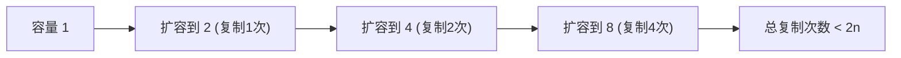
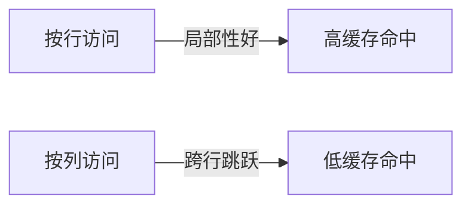

# 数组时间复杂度和空间复杂度分析

## 1. 时间复杂度分析

### 1.1 基本操作的时间复杂度

| 操作类型 | 时间复杂度 | 说明 |
|---------|-----------|------|
| **访问元素** | O(1) | 通过索引直接访问，常数时间 |
| **修改元素** | O(1) | 通过索引直接修改，常数时间 |
| **查找元素（线性）** | O(n) | 最坏情况需要遍历整个数组 |
| **查找元素（二分）** | O(log n) | 仅适用于有序数组 |
| **插入元素（末尾）** | O(1)* | 如果有空间，否则需要扩容 |
| **插入元素（指定位置）** | O(n) | 需要移动后续元素 |
| **删除元素（末尾）** | O(1) | 直接删除最后一个元素 |
| **删除元素（指定位置）** | O(n) | 需要移动后续元素 |
| **遍历数组** | O(n) | 需要访问所有元素 |

*注：静态数组末尾插入需要创建新数组，实际为O(n)

### 1.2 详细时间复杂度分析

#### 访问操作 - O(1)

```java
int[] arr = {10, 20, 30, 40, 50};

// 随机访问 - O(1)
int value = arr[2];  // 直接通过索引访问，时间复杂度为常数

// 内存地址计算公式：
// address = base_address + (index * element_size)
// 例如：address = 1000 + (2 * 4) = 1008
```

**为什么是O(1)？**

- 数组元素在内存中连续存储
- 通过数学公式直接计算目标地址
- 不需要遍历或搜索

#### 查找操作

```java
// 线性查找 - O(n)
public static int linearSearch(int[] arr, int target) {
    for (int i = 0; i < arr.length; i++) {  // 最多执行n次
        if (arr[i] == target) {
            return i;
        }
    }
    return -1;
}
// 最好情况：O(1) - 第一个元素就是目标
// 平均情况：O(n/2) = O(n)
// 最坏情况：O(n) - 目标在最后或不存在

// 二分查找 - O(log n)
public static int binarySearch(int[] arr, int target) {
    int left = 0, right = arr.length - 1;
    
    while (left <= right) {  // 最多执行log₂(n)次
        int mid = left + (right - left) / 2;
        if (arr[mid] == target) return mid;
        else if (arr[mid] < target) left = mid + 1;
        else right = mid - 1;
    }
    return -1;
}
// 每次迭代都将搜索范围减半
// n → n/2 → n/4 → ... → 1
// 迭代次数：log₂(n)
```

#### 二分查找可视化



#### 插入操作

```java
// 末尾插入（动态数组）- 摊还 O(1)
public void addLast(int value) {
    if (size >= capacity) {
        resize();  // O(n) - 但不频繁发生
    }
    arr[size++] = value;  // O(1)
}

// 指定位置插入 - O(n)
public static int[] insertAt(int[] arr, int index, int value) {
    int[] newArr = new int[arr.length + 1];
    
    // 复制前半部分 - O(index)
    for (int i = 0; i < index; i++) {
        newArr[i] = arr[i];
    }
    
    newArr[index] = value;  // O(1)
    
    // 复制后半部分 - O(n-index)
    for (int i = index; i < arr.length; i++) {
        newArr[i + 1] = arr[i];
    }
    
    return newArr;
}
// 总时间复杂度：O(index) + O(n-index) = O(n)
```

#### 删除操作

```java
// 删除指定位置元素 - O(n)
public static int[] deleteAt(int[] arr, int index) {
    int[] newArr = new int[arr.length - 1];
    
    // 复制前半部分 - O(index)
    System.arraycopy(arr, 0, newArr, 0, index);
    
    // 复制后半部分 - O(n-index-1)
    System.arraycopy(arr, index + 1, newArr, index, arr.length - index - 1);
    
    return newArr;
}
// 总时间复杂度：O(n)
```

### 1.3 排序算法时间复杂度

| 排序算法 | 最好情况 | 平均情况 | 最坏情况 | 稳定性 |
|---------|---------|---------|---------|--------|
| **冒泡排序** | O(n) | O(n²) | O(n²) | 稳定 |
| **选择排序** | O(n²) | O(n²) | O(n²) | 不稳定 |
| **插入排序** | O(n) | O(n²) | O(n²) | 稳定 |
| **快速排序** | O(n log n) | O(n log n) | O(n²) | 不稳定 |
| **归并排序** | O(n log n) | O(n log n) | O(n log n) | 稳定 |
| **堆排序** | O(n log n) | O(n log n) | O(n log n) | 不稳定 |

#### 快速排序分析

```java
public static void quickSort(int[] arr, int low, int high) {
    if (low < high) {
        int pi = partition(arr, low, high);  // O(n)
        quickSort(arr, low, pi - 1);         // T(k)
        quickSort(arr, pi + 1, high);        // T(n-k-1)
    }
}

// 递归关系式：
// T(n) = T(k) + T(n-k-1) + O(n)
// 最好情况（每次都平分）：T(n) = 2T(n/2) + O(n) = O(n log n)
// 最坏情况（每次只减少1个元素）：T(n) = T(n-1) + O(n) = O(n²)
```

## 2. 空间复杂度分析

### 2.1 基本概念

- **空间复杂度**：算法执行过程中所需要的额外存储空间
- **原地算法**：空间复杂度为O(1)的算法
- **非原地算法**：需要额外空间的算法

### 2.2 数组操作的空间复杂度

| 操作类型 | 空间复杂度 | 说明 |
|---------|-----------|------|
| **访问/修改元素** | O(1) | 不需要额外空间 |
| **线性查找** | O(1) | 只需要几个变量 |
| **二分查找（迭代）** | O(1) | 只需要几个变量 |
| **二分查找（递归）** | O(log n) | 递归调用栈 |
| **插入操作** | O(n) | 需要创建新数组 |
| **删除操作** | O(n) | 需要创建新数组 |
| **数组拷贝** | O(n) | 需要新数组存储副本 |

### 2.3 排序算法空间复杂度

```java
// 冒泡排序 - O(1) 空间
public static void bubbleSort(int[] arr) {
    // 只需要常数个额外变量
    int n = arr.length;
    for (int i = 0; i < n - 1; i++) {
        for (int j = 0; j < n - 1 - i; j++) {
            if (arr[j] > arr[j + 1]) {
                // 原地交换，O(1)空间
                int temp = arr[j];
                arr[j] = arr[j + 1];
                arr[j + 1] = temp;
            }
        }
    }
}

// 归并排序 - O(n) 空间
public static void mergeSort(int[] arr, int left, int right) {
    if (left < right) {
        int mid = left + (right - left) / 2;
        mergeSort(arr, left, mid);
        mergeSort(arr, mid + 1, right);
        merge(arr, left, mid, right);  // 需要O(n)的临时数组
    }
}

// 快速排序 - O(log n) 空间（递归栈）
public static void quickSort(int[] arr, int low, int high) {
    if (low < high) {
        int pi = partition(arr, low, high);  // O(1)空间
        quickSort(arr, low, pi - 1);         // 递归调用
        quickSort(arr, pi + 1, high);        // 递归调用
    }
}
// 递归深度：平均O(log n)，最坏O(n)
```

## 3. 摊还分析（Amortized Analysis）

### 3.1 动态数组的摊还分析
```java
public class DynamicArray {
    private int[] arr;
    private int size;
    private int capacity;
    
    public void add(int value) {
        if (size >= capacity) {
            resize();  // 扩容操作
        }
        arr[size++] = value;
    }
    
    private void resize() {
        capacity *= 2;  // 容量翻倍
        int[] newArr = new int[capacity];
        System.arraycopy(arr, 0, newArr, 0, size);  // O(n)
        arr = newArr;
    }
}
```

**摊还分析过程：**

1. 假设初始容量为1，连续插入n个元素
2. 扩容发生在：1, 2, 4, 8, 16, ..., 2^k ≤ n 的位置
3. 每次扩容复制的元素数量：1, 2, 4, 8, ..., 2^k
4. 总复制次数：1 + 2 + 4 + ... + 2^k ≤ 2n
5. 平均每次插入的摊还成本：2n/n = 2 = O(1)



### 3.2 三种分析方法对比

| 分析方法 | 插入操作复杂度 | 说明 |
|---------|---------------|------|
| **最坏情况分析** | O(n) | 考虑最坏的单次操作 |
| **平均情况分析** | O(1) | 假设扩容均匀分布 |
| **摊还分析** | O(1) | 考虑操作序列的平均成本 |

## 4. 实际性能考虑

### 4.1 缓存友好性

```java
// 缓存友好的访问模式（按行访问）
int[][] matrix = new int[1000][1000];
for (int i = 0; i < 1000; i++) {
    for (int j = 0; j < 1000; j++) {
        matrix[i][j] = i + j;  // 顺序访问，缓存命中率高
    }
}

// 缓存不友好的访问模式（按列访问）
for (int j = 0; j < 1000; j++) {
    for (int i = 0; i < 1000; i++) {
        matrix[i][j] = i + j;  // 跳跃访问，缓存命中率低
    }
}
```

可视化示意：



### 4.2 分支预测

```java
// 分支预测友好的代码
int[] sortedArr = {1, 2, 3, 4, 5, 6, 7, 8, 9, 10};
int count = 0;
for (int value : sortedArr) {
    if (value > 5) {  // 分支模式规律，预测准确率高
        count++;
    }
}

// 分支预测不友好的代码
int[] randomArr = {3, 8, 1, 9, 2, 7, 4, 6, 5, 10};
int count2 = 0;
for (int value : randomArr) {
    if (value > 5) {  // 分支模式随机，预测准确率低
        count2++;
    }
}
```

### 4.3 内存分配性能

```java
// 性能较差：频繁创建小数组
public void inefficientMethod() {
    for (int i = 0; i < 1000; i++) {
        int[] temp = new int[10];  // 频繁分配内存
        // 处理temp数组
    }
}

// 性能较好：重用数组
public void efficientMethod() {
    int[] reusableArray = new int[10];  // 一次分配
    for (int i = 0; i < 1000; i++) {
        Arrays.fill(reusableArray, 0);  // 重置数组
        // 处理reusableArray
    }
}
```

## 5. 复杂度优化技巧

### 5.1 预处理降低复杂度

```java
// 问题：频繁查询数组中某个范围的和
// 朴素方法：每次查询O(n)
public int rangeSum(int[] arr, int left, int right) {
    int sum = 0;
    for (int i = left; i <= right; i++) {
        sum += arr[i];
    }
    return sum;  // O(n)
}

// 优化方法：前缀和预处理
public class PrefixSum {
    private int[] prefixSum;
    
    public PrefixSum(int[] arr) {
        prefixSum = new int[arr.length + 1];
        for (int i = 0; i < arr.length; i++) {
            prefixSum[i + 1] = prefixSum[i] + arr[i];  // O(n)预处理
        }
    }
    
    public int rangeSum(int left, int right) {
        return prefixSum[right + 1] - prefixSum[left];  // O(1)查询
    }
}
```

对比样例：
```
数组: [3, 1, 4, 1, 5, 9]
查询 [1,4] 朴素: 1+4+1+5 = 11 (O(n))
前缀和查询: ps[5]-ps[1] = 13-3 = 10 (示例计算，以真实前缀为准) (O(1))
```

### 5.2 空间换时间

```java
// 问题：判断数组中是否存在重复元素
// 方法1：暴力解法 - O(n²)时间，O(1)空间
public boolean hasDuplicate1(int[] arr) {
    for (int i = 0; i < arr.length; i++) {
        for (int j = i + 1; j < arr.length; j++) {
            if (arr[i] == arr[j]) return true;
        }
    }
    return false;
}

// 方法2：哈希表 - O(n)时间，O(n)空间
public boolean hasDuplicate2(int[] arr) {
    Set<Integer> seen = new HashSet<>();
    for (int num : arr) {
        if (seen.contains(num)) return true;
        seen.add(num);
    }
    return false;
}

// 方法3：排序 - O(n log n)时间，O(1)空间
public boolean hasDuplicate3(int[] arr) {
    Arrays.sort(arr);
    for (int i = 1; i < arr.length; i++) {
        if (arr[i] == arr[i-1]) return true;
    }
    return false;
}
```

## 6. 复杂度分析实战

### 6.1 算法题实例分析

```java
/**
 * 题目：两数之和
 * 给定数组和目标值，找出数组中和为目标值的两个数的索引
 */

// 解法1：暴力搜索
// 时间复杂度：O(n²)，空间复杂度：O(1)
public int[] twoSum1(int[] nums, int target) {
    for (int i = 0; i < nums.length; i++) {           // O(n)
        for (int j = i + 1; j < nums.length; j++) {   // O(n)
            if (nums[i] + nums[j] == target) {         // O(1)
                return new int[]{i, j};
            }
        }
    }
    return new int[0];
}

// 解法2：哈希表
// 时间复杂度：O(n)，空间复杂度：O(n)
public int[] twoSum2(int[] nums, int target) {
    Map<Integer, Integer> map = new HashMap<>();      // O(n)空间
    for (int i = 0; i < nums.length; i++) {          // O(n)时间
        int complement = target - nums[i];
        if (map.containsKey(complement)) {            // O(1)平均
            return new int[]{map.get(complement), i};
        }
        map.put(nums[i], i);                         // O(1)平均
    }
    return new int[0];
}
```

### 6.2 复杂度权衡决策

选择算法时需要考虑的因素：
1. **数据规模**：小数据集可能简单算法更快
2. **内存限制**：空间受限时选择原地算法
3. **实时性要求**：需要快速响应时选择预处理方案
4. **数据特征**：有序数据可以使用二分查找
5. **调用频率**：频繁调用时值得花时间优化