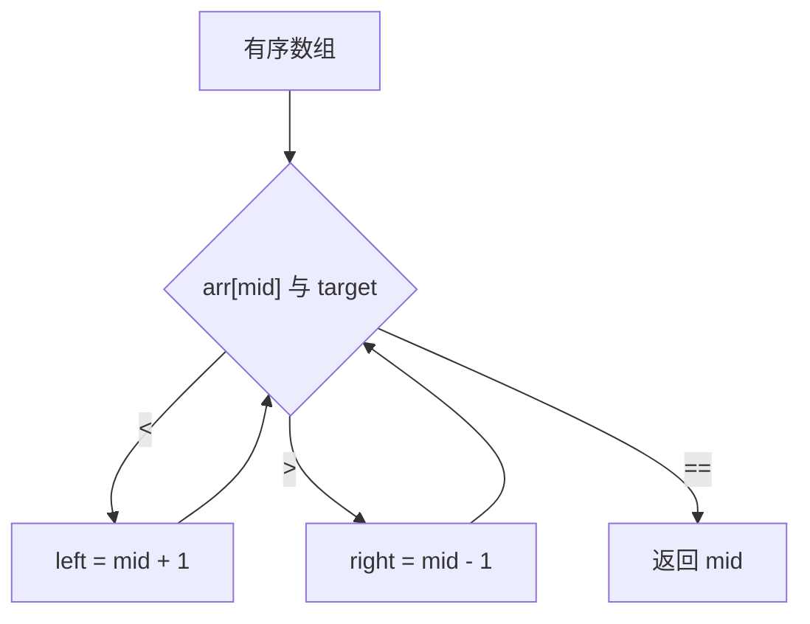
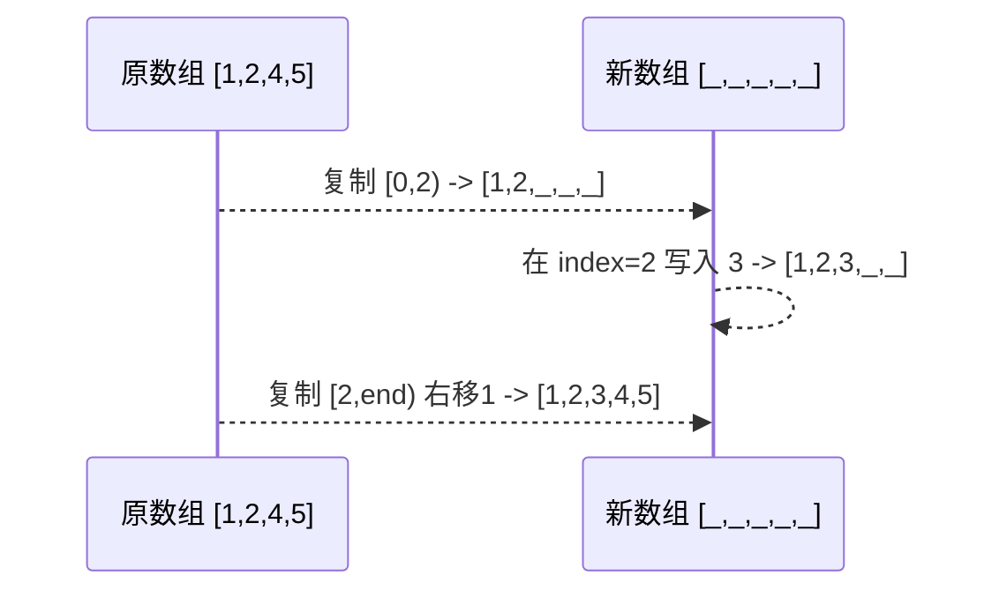
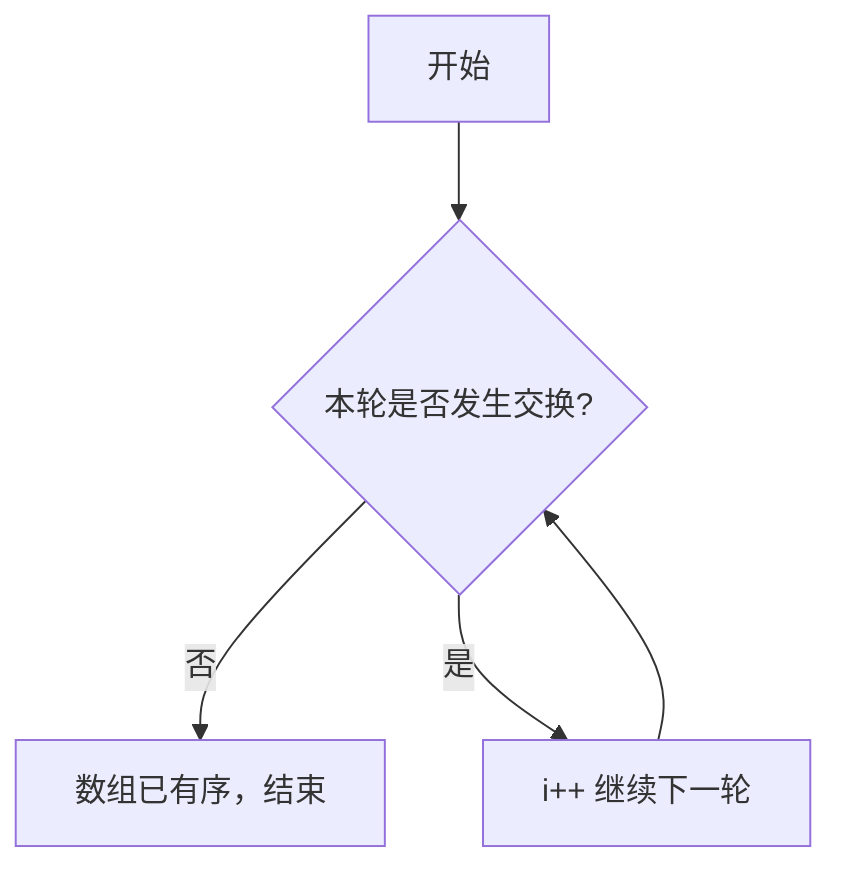
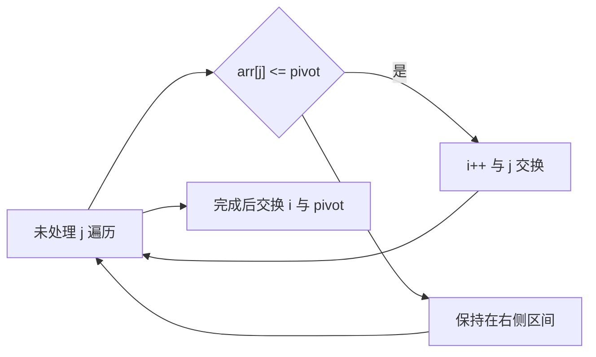

# 数组常见操作详解

## 1. 查找操作

### 1.1 线性查找（顺序查找）

```java
/**
 * 线性查找 - 时间复杂度: O(n)
 */
public static int linearSearch(int[] arr, int target) {
    for (int i = 0; i < arr.length; i++) {
        if (arr[i] == target) {
            return i;  // 返回找到的索引
        }
    }
    return -1;  // 未找到
}

// 使用示例
int[] arr = {3, 7, 1, 9, 2};
int index = linearSearch(arr, 9);  // 返回 3
```

### 1.2 二分查找（适用于有序数组）

```java
/**
 * 二分查找 - 时间复杂度: O(log n)
 * 前提：数组必须是有序的
 */
public static int binarySearch(int[] arr, int target) {
    int left = 0;
    int right = arr.length - 1;
    
    while (left <= right) {
        int mid = left + (right - left) / 2;  // 避免溢出
        
        if (arr[mid] == target) {
            return mid;
        } else if (arr[mid] < target) {
            left = mid + 1;
        } else {
            right = mid - 1;
        }
    }
    return -1;  // 未找到
}

// 使用示例
int[] sortedArr = {1, 3, 5, 7, 9, 11, 13};
int index = binarySearch(sortedArr, 7);  // 返回 3
```

#### 1.2.1 二分查找边界图解与易错点



注意：
- 循环条件通常写作 left <= right；
- mid 计算使用 left + (right - left) / 2 防止溢出；
- 重复元素需改用 lowerBound/upperBound 才能拿到边界。

### 1.3 查找最大值和最小值

```java
/**
 * 查找最大值 - 时间复杂度: O(n)
 */
public static int findMax(int[] arr) {
    if (arr.length == 0) throw new IllegalArgumentException("数组为空");
    
    int max = arr[0];
    for (int i = 1; i < arr.length; i++) {
        if (arr[i] > max) {
            max = arr[i];
        }
    }
    return max;
}

/**
 * 查找最小值 - 时间复杂度: O(n)
 */
public static int findMin(int[] arr) {
    if (arr.length == 0) throw new IllegalArgumentException("数组为空");
    
    int min = arr[0];
    for (int i = 1; i < arr.length; i++) {
        if (arr[i] < min) {
            min = arr[i];
        }
    }
    return min;
}
```

## 2. 插入操作

### 2.1 在指定位置插入元素

```java
/**
 * 在指定位置插入元素 - 时间复杂度: O(n)
 * 由于数组大小固定，需要创建新数组
 */
public static int[] insertAt(int[] arr, int index, int value) {
    // 参数检查
    if (index < 0 || index > arr.length) {
        throw new IndexOutOfBoundsException("索引越界");
    }
    
    // 创建新数组，长度+1
    int[] newArr = new int[arr.length + 1];
    
    // 复制插入位置之前的元素
    for (int i = 0; i < index; i++) {
        newArr[i] = arr[i];
    }
    
    // 插入新元素
    newArr[index] = value;
    
    // 复制插入位置之后的元素
    for (int i = index; i < arr.length; i++) {
        newArr[i + 1] = arr[i];
    }
    
    return newArr;
}

// 使用示例
int[] arr = {1, 2, 4, 5};
int[] newArr = insertAt(arr, 2, 3);  // 在索引2处插入3
// 结果: {1, 2, 3, 4, 5}
```

插入过程图解：



### 2.2 在数组末尾插入（模拟动态扩容）
```java
/**
 * 在数组末尾插入元素
 */
public static int[] insertAtEnd(int[] arr, int value) {
    int[] newArr = new int[arr.length + 1];
    System.arraycopy(arr, 0, newArr, 0, arr.length);
    newArr[arr.length] = value;
    return newArr;
}

/**
 * 模拟ArrayList的动态扩容机制
 */
public class DynamicArray {
    private int[] arr;
    private int size;
    private int capacity;
    
    public DynamicArray(int initialCapacity) {
        this.capacity = initialCapacity;
        this.arr = new int[capacity];
        this.size = 0;
    }
    
    public void add(int value) {
        if (size >= capacity) {
            resize();  // 扩容
        }
        arr[size++] = value;
    }
    
    private void resize() {
        capacity *= 2;  // 容量翻倍
        int[] newArr = new int[capacity];
        System.arraycopy(arr, 0, newArr, 0, size);
        arr = newArr;
    }
}
```

## 3. 删除操作

### 3.1 删除指定位置的元素
```java
/**
 * 删除指定位置的元素 - 时间复杂度: O(n)
 */
public static int[] deleteAt(int[] arr, int index) {
    if (index < 0 || index >= arr.length) {
        throw new IndexOutOfBoundsException("索引越界");
    }
    
    int[] newArr = new int[arr.length - 1];
    
    // 复制删除位置之前的元素
    for (int i = 0; i < index; i++) {
        newArr[i] = arr[i];
    }
    
    // 复制删除位置之后的元素
    for (int i = index + 1; i < arr.length; i++) {
        newArr[i - 1] = arr[i];
    }
    
    return newArr;
}

// 使用示例
int[] arr = {1, 2, 3, 4, 5};
int[] newArr = deleteAt(arr, 2);  // 删除索引2的元素
// 结果: {1, 2, 4, 5}
```

复杂度提示：
- 删头最贵（移动 n-1 个元素），删尾最便宜（移动 0 个），删中间平均 ~ n/2。

### 3.2 删除指定值的元素
```java
/**
 * 删除第一个匹配的指定值
 */
public static int[] deleteValue(int[] arr, int value) {
    int index = linearSearch(arr, value);
    if (index != -1) {
        return deleteAt(arr, index);
    }
    return arr;  // 如果没找到，返回原数组
}

/**
 * 删除所有匹配的指定值
 */
public static int[] deleteAllValues(int[] arr, int value) {
    // 先计算删除后的新长度
    int newLength = 0;
    for (int element : arr) {
        if (element != value) {
            newLength++;
        }
    }
    
    // 创建新数组并复制不等于value的元素
    int[] newArr = new int[newLength];
    int index = 0;
    for (int element : arr) {
        if (element != value) {
            newArr[index++] = element;
        }
    }
    
    return newArr;
}
```

## 4. 排序操作

### 4.1 冒泡排序
```java
/**
 * 冒泡排序 - 时间复杂度: O(n²)
 */
public static void bubbleSort(int[] arr) {
    int n = arr.length;
    for (int i = 0; i < n - 1; i++) {
        boolean swapped = false;
        for (int j = 0; j < n - 1 - i; j++) {
            if (arr[j] > arr[j + 1]) {
                // 交换元素
                int temp = arr[j];
                arr[j] = arr[j + 1];
                arr[j + 1] = temp;
                swapped = true;
            }
        }
        // 如果没有发生交换，说明数组已经有序
        if (!swapped) break;
    }
}
```

冒泡排序迭代示意：


### 4.2 选择排序
```java
/**
 * 选择排序 - 时间复杂度: O(n²)
 */
public static void selectionSort(int[] arr) {
    int n = arr.length;
    for (int i = 0; i < n - 1; i++) {
        int minIndex = i;
        // 找到未排序部分的最小元素
        for (int j = i + 1; j < n; j++) {
            if (arr[j] < arr[minIndex]) {
                minIndex = j;
            }
        }
        // 交换最小元素到正确位置
        if (minIndex != i) {
            int temp = arr[i];
            arr[i] = arr[minIndex];
            arr[minIndex] = temp;
        }
    }
}
```

### 4.3 插入排序
```java
/**
 * 插入排序 - 时间复杂度: O(n²)，最好情况: O(n)
 */
public static void insertionSort(int[] arr) {
    for (int i = 1; i < arr.length; i++) {
        int key = arr[i];
        int j = i - 1;
        
        // 移动比key大的元素
        while (j >= 0 && arr[j] > key) {
            arr[j + 1] = arr[j];
            j--;
        }
        arr[j + 1] = key;
    }
}
```

### 4.4 快速排序
```java
/**
 * 快速排序 - 平均时间复杂度: O(n log n)
 */
public static void quickSort(int[] arr, int low, int high) {
    if (low < high) {
        int partitionIndex = partition(arr, low, high);
        quickSort(arr, low, partitionIndex - 1);
        quickSort(arr, partitionIndex + 1, high);
    }
}

private static int partition(int[] arr, int low, int high) {
    int pivot = arr[high];  // 选择最后一个元素作为基准
    int i = low - 1;
    
    for (int j = low; j < high; j++) {
        if (arr[j] <= pivot) {
            i++;
            // 交换元素
            int temp = arr[i];
            arr[i] = arr[j];
            arr[j] = temp;
        }
    }
    
    // 将基准元素放到正确位置
    int temp = arr[i + 1];
    arr[i + 1] = arr[high];
    arr[high] = temp;
    
    return i + 1;
}

// 使用示例
public static void main(String[] args) {
    int[] arr = {64, 34, 25, 12, 22, 11, 90};
    quickSort(arr, 0, arr.length - 1);
    System.out.println(Arrays.toString(arr));
}
```

分区过程示意：


## 5. 数组反转和旋转

### 5.1 数组反转
```java
/**
 * 反转数组 - 时间复杂度: O(n)
 */
public static void reverse(int[] arr) {
    int left = 0;
    int right = arr.length - 1;
    
    while (left < right) {
        int temp = arr[left];
        arr[left] = arr[right];
        arr[right] = temp;
        left++;
        right--;
    }
}
```

### 5.2 数组左旋转
```java
/**
 * 左旋转数组 k 位 - 时间复杂度: O(n)
 */
public static void leftRotate(int[] arr, int k) {
    int n = arr.length;
    k = k % n;  // 处理k大于数组长度的情况
    
    // 方法1：使用额外空间
    int[] temp = new int[k];
    System.arraycopy(arr, 0, temp, 0, k);
    System.arraycopy(arr, k, arr, 0, n - k);
    System.arraycopy(temp, 0, arr, n - k, k);
}

/**
 * 数组右旋转 k 位（原地算法）
 */
public static void rightRotate(int[] arr, int k) {
    int n = arr.length;
    k = k % n;
    
    // 反转整个数组
    reverse(arr, 0, n - 1);
    // 反转前k个元素
    reverse(arr, 0, k - 1);
    // 反转后n-k个元素
    reverse(arr, k, n - 1);
}

private static void reverse(int[] arr, int start, int end) {
    while (start < end) {
        int temp = arr[start];
        arr[start] = arr[end];
        arr[end] = temp;
        start++;
        end--;
    }
}
```

右旋转 3 位示例（n=7）：
```
原:        [a b c d e f g]
全反转:    [g f e d c b a]
反转前k=3: [e f g d c b a]
反转后n-k: [e f g a b c d]
```

## 6. 实用工具方法

### 6.1 数组拷贝
```java
// 方法1：System.arraycopy
int[] source = {1, 2, 3, 4, 5};
int[] dest = new int[5];
System.arraycopy(source, 0, dest, 0, source.length);

// 方法2：Arrays.copyOf
int[] copy1 = Arrays.copyOf(source, source.length);

// 方法3：clone方法
int[] copy2 = source.clone();

// 方法4：手动拷贝
int[] copy3 = new int[source.length];
for (int i = 0; i < source.length; i++) {
    copy3[i] = source[i];
}
```

### 6.2 数组比较
```java
int[] arr1 = {1, 2, 3};
int[] arr2 = {1, 2, 3};

// 引用比较（false）
boolean same1 = (arr1 == arr2);

// 内容比较（true）
boolean same2 = Arrays.equals(arr1, arr2);

// 多维数组深度比较
int[][] matrix1 = {{1, 2}, {3, 4}};
int[][] matrix2 = {{1, 2}, {3, 4}};
boolean same3 = Arrays.deepEquals(matrix1, matrix2);
```

### 6.3 数组填充
```java
int[] arr = new int[5];
Arrays.fill(arr, 10);  // 将数组所有元素设置为10

// 部分填充
Arrays.fill(arr, 1, 4, 20);  // 将索引1到3的元素设置为20
```