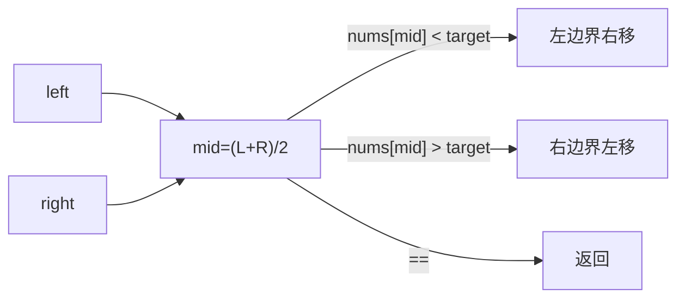
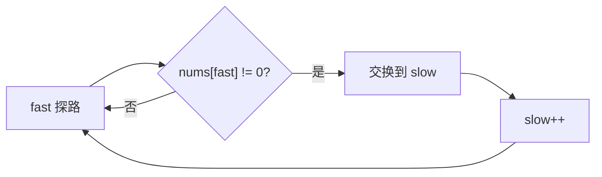
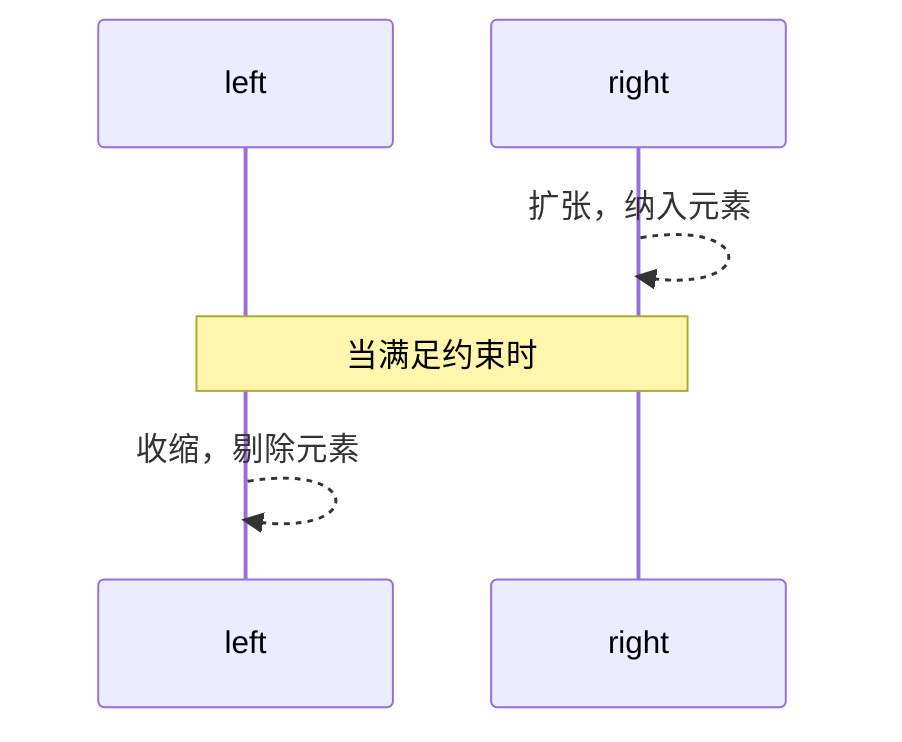
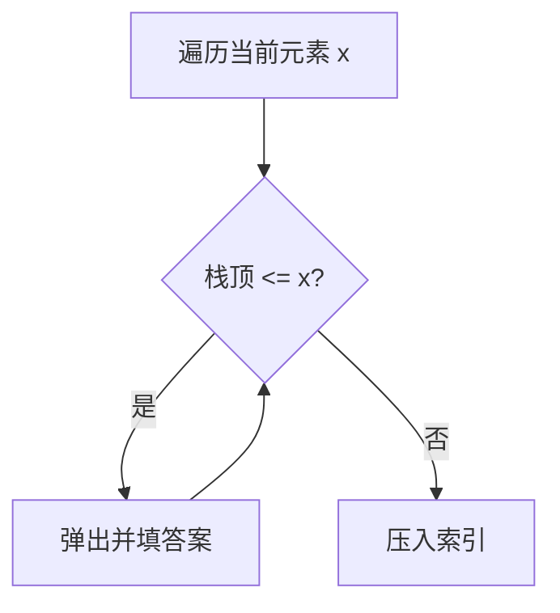
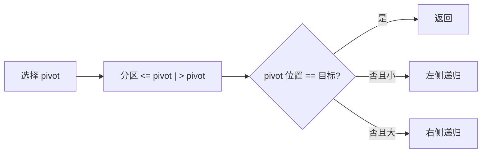

# 数组经典算法清单与模板（Java）

> 面向力扣/互联网面试的高频题型与可复用模板。按主题归档，附上思路要点与边界注意。

## 1. 二分查找（Binary Search）

### 1.1 基础模板（有序数组找目标）
```java
public static int binarySearch(int[] nums, int target) {
    int left = 0, right = nums.length - 1;
    while (left <= right) {
        int mid = left + ((right - left) >> 1);
        if (nums[mid] == target) return mid;
        if (nums[mid] < target) left = mid + 1; else right = mid - 1;
    }
    return -1;
}
```
- 注意：right = mid - 1 / left = mid + 1；避免死循环；mid计算防溢出

图解：


### 1.2 左边界/右边界（二分变体）
```java
// 左边界：第一个 >= target 的位置
public static int lowerBound(int[] nums, int target) {
    int l = 0, r = nums.length; // [l, r)
    while (l < r) {
        int m = l + ((r - l) >> 1);
        if (nums[m] >= target) r = m; else l = m + 1;
    }
    return l;
}

// 右边界：最后一个 <= target 的位置
public static int upperBound(int[] nums, int target) {
    int l = 0, r = nums.length; // [l, r)
    while (l < r) {
        int m = l + ((r - l) >> 1);
        if (nums[m] <= target) l = m + 1; else r = m;
    }
    return l - 1;
}
```
- 高频题：搜索插入位置、有重复元素找左右边界、山脉数组找峰值、旋转数组查找

## 2. 双指针（Two Pointers）

### 2.1 同向双指针：去重/合并/移动零
```java
// 原地去除重复（已排序）返回新长度
public static int removeDuplicates(int[] nums) {
    int slow = 0;
    for (int fast = 0; fast < nums.length; fast++) {
        if (slow == 0 || nums[fast] != nums[slow - 1]) {
            nums[slow++] = nums[fast];
        }
    }
    return slow;
}

// 移动零到末尾，保持相对顺序
public static void moveZeroes(int[] nums) {
    int slow = 0;
    for (int fast = 0; fast < nums.length; fast++) {
        if (nums[fast] != 0) {
            int tmp = nums[slow];
            nums[slow++] = nums[fast];
            nums[fast] = tmp;
        }
    }
}
```

同向双指针示意：


### 2.2 对向双指针：两数之和、三数之和
```java
// 两数之和（已排序）
public static int[] twoSumSorted(int[] nums, int target) {
    int l = 0, r = nums.length - 1;
    while (l < r) {
        int sum = nums[l] + nums[r];
        if (sum == target) return new int[]{l, r};
        if (sum < target) l++; else r--;
    }
    return new int[0];
}
```
- 高频题：盛最多水的容器、三数之和/四数之和（排序+去重）

## 3. 滑动窗口（Sliding Window）

### 3.1 变长窗口：最长/最短子数组满足条件
```java
// 最长无重复子串（字符串版同理）
public static int lengthOfLongestSubstring(String s) {
    int[] freq = new int[256];
    int l = 0, ans = 0;
    for (int r = 0; r < s.length(); r++) {
        char c = s.charAt(r);
        freq[c]++;
        while (freq[c] > 1) {
            freq[s.charAt(l++)]--;
        }
        ans = Math.max(ans, r - l + 1);
    }
    return ans;
}

// 和至少为target的最短子数组（正数）
public static int minSubArrayLen(int target, int[] nums) {
    int l = 0, sum = 0, ans = Integer.MAX_VALUE;
    for (int r = 0; r < nums.length; r++) {
        sum += nums[r];
        while (sum >= target) {
            ans = Math.min(ans, r - l + 1);
            sum -= nums[l++];
        }
    }
    return ans == Integer.MAX_VALUE ? 0 : ans;
}
```
- 高频题：包含/覆盖子串、最多k个不同字符的最长子串

窗口扩张/收缩图解：


## 4. 前缀和与差分（Prefix Sum & Difference）

### 4.1 前缀和：区间和、等和子数组、和为k的子数组
```java
// 和为k的子数组个数（可含负数）
public static int subarraySum(int[] nums, int k) {
    Map<Integer, Integer> cnt = new HashMap<>();
    cnt.put(0, 1);
    int pre = 0, ans = 0;
    for (int x : nums) {
        pre += x;
        ans += cnt.getOrDefault(pre - k, 0);
        cnt.put(pre, cnt.getOrDefault(pre, 0) + 1);
    }
    return ans;
}
```

### 4.2 差分数组：区间增量高效处理
```java
// 区间加法操作（差分）
public static int[] rangeAddition(int length, int[][] updates) {
    int[] diff = new int[length + 1];
    for (int[] u : updates) {
        int l = u[0], r = u[1], inc = u[2];
        diff[l] += inc;
        diff[r + 1] -= inc;
    }
    int[] res = new int[length];
    int cur = 0;
    for (int i = 0; i < length; i++) {
        cur += diff[i];
        res[i] = cur;
    }
    return res;
}
```

## 5. 单调栈 / 单调队列（Monotonic Stack/Deque）

### 5.1 单调栈：下一个更大元素、柱状图最大矩形
```java
// 下一个更大元素（循环数组可用模运算二遍）
public static int[] nextGreaterElements(int[] nums) {
    int n = nums.length;
    int[] ans = new int[n];
    Arrays.fill(ans, -1);
    Deque<Integer> st = new ArrayDeque<>(); // 存索引，保持递减
    for (int i = 0; i < n; i++) {
        while (!st.isEmpty() && nums[i] > nums[st.peek()]) {
            ans[st.pop()] = nums[i];
        }
        st.push(i);
    }
    return ans;
}
```

单调栈维护示意：


### 5.2 单调队列：滑动窗口最大值
```java
public static int[] maxSlidingWindow(int[] nums, int k) {
    Deque<Integer> dq = new ArrayDeque<>(); // 存索引，保持值递减
    int n = nums.length;
    int[] ans = new int[n - k + 1];
    for (int i = 0; i < n; i++) {
        while (!dq.isEmpty() && nums[dq.peekLast()] <= nums[i]) dq.pollLast();
        dq.offerLast(i);
        if (dq.peekFirst() <= i - k) dq.pollFirst();
        if (i >= k - 1) ans[i - k + 1] = nums[dq.peekFirst()];
    }
    return ans;
}
```

## 6. 扫描线与区间题（Intervals & Sweep Line）

```java
// 合并区间
public static int[][] mergeIntervals(int[][] intervals) {
    Arrays.sort(intervals, Comparator.comparingInt(a -> a[0]));
    List<int[]> res = new ArrayList<>();
    int[] cur = intervals[0];
    for (int i = 1; i < intervals.length; i++) {
        if (intervals[i][0] <= cur[1]) {
            cur[1] = Math.max(cur[1], intervals[i][1]);
        } else {
            res.add(cur);
            cur = intervals[i];
        }
    }
    res.add(cur);
    return res.toArray(new int[0][]);
}
```
- 高频题：最小会议室数量（按起止时间排序+计数）、区间交集

## 7. 排序与选择（Sorting & Selection）

### 7.1 TopK：快速选择/堆
```java
// 快速选择：找第k大（k从1起）
public static int findKthLargest(int[] nums, int k) {
    int target = nums.length - k;
    int l = 0, r = nums.length - 1;
    while (l <= r) {
        int p = partition(nums, l, r);
        if (p == target) return nums[p];
        if (p < target) l = p + 1; else r = p - 1;
    }
    return -1;
}

private static int partition(int[] a, int l, int r) {
    int pivot = a[r], i = l;
    for (int j = l; j < r; j++) {
        if (a[j] <= pivot) swap(a, i++, j);
    }
    swap(a, i, r);
    return i;
}

private static void swap(int[] a, int i, int j) {
    int t = a[i]; a[i] = a[j]; a[j] = t;
}
```

快速选择与分区示意：


### 7.2 计数/桶/基数排序（适合受限范围）
- 计数排序：O(n + k)，适合值域小
- 桶排序：均匀分布假设
- 基数排序：对位数进行稳定排序

## 8. 位运算技巧（Bit Manipulation）

```java
// 只出现一次的数字（其余出现两次）
public static int singleNumber(int[] nums) {
    int x = 0; for (int v : nums) x ^= v; return x;
}

// 只出现一次，其余出现三次
public static int singleNumber3(int[] nums) {
    int ones = 0, twos = 0;
    for (int x : nums) {
        ones = (ones ^ x) & ~twos;
        twos = (twos ^ x) & ~ones;
    }
    return ones;
}
```

## 9. 分治与数组题（Divide & Conquer）

- 逆序对计数：归并排序过程中计数 O(n log n)
- 计算“右侧小于当前”的个数：树状数组/归并变体

## 10. 经典综合题型清单（高频）
- **二分变体**：搜索插入位置、找左右边界、旋转数组查找、寻找峰值
- **双指针**：盛水容器、三数/四数之和、颜色分类、最短可排序子数组
- **滑动窗口**：最长无重复、最小覆盖子串、至多K个不同字符
- **前缀和/哈希**：和为K的子数组、等和/可被K整除子数组、连续数组
- **单调栈/队列**：每日温度、柱状图最大矩形、滑动窗口最大值
- **区间题**：合并区间、会议室数量、区间交集
- **TopK/选择**：第K大、出现频率前K元素
- **位运算**：只出现一次（多种次数变体）
- **分治/归并**：逆序对计数

易错点总览：
- **二分**：边界条件、mid 溢出、重复元素边界
- **窗口**：何时扩张/收缩、计数维护一致性
- **双指针**：排序前置与去重逻辑
- **单调结构**：栈/队列维护的“单调性”方向
- **分区**：i/j 指针与 pivot 交换时机

---

使用建议：
- 优先记忆模板与判定条件（窗口扩张/收缩、二分边界、单调结构维护）
- 刷题时按主题分块训练，每类至少10-20题，形成肌肉记忆
- 记录每题的“错因标签”（边界、数据范围、复杂度、溢出、去重）以复盘提效